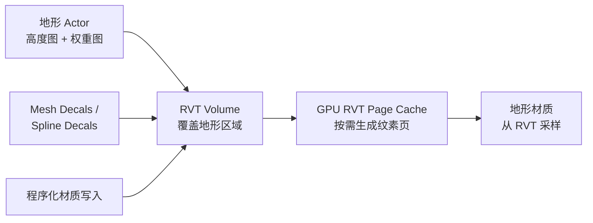

# 现代大型开放世界地形系统 —— 技术概述

> **日期:** 2026-07-28
> **来源:** Epic Games 官方文档、GDC/SIGGRAPH 演讲、学术论文、开源项目、开发者技术博客
> **相关研究报告:** [open-world-terrain-resource-index.md](./open-world-terrain-resource-index.md)

---

## 目录

1. [引言](#1-引言)
2. [核心概念：2.5D 高度场 vs 真 3D 地形](#2-核心概念25d-高度场-vs-真-3d-地形)
3. [地形纹理混合：如何处理数十种纹理](#3-地形纹理混合如何处理数十种纹理)
4. [LOD 与网格密度：远处山脉的渲染方案](#4-lod-与网格密度远处山脉的渲染方案)
5. [海洋系统：集成方式与技术选型](#5-海洋系统集成方式与技术选型)
6. [洞穴与地下地形：突破高度场限制](#6-洞穴与地下地形突破高度场限制)
7. [跨引擎/跨游戏方案对比](#7-跨引擎跨游戏方案对比)
8. [架构设计建议（针对 KairosEngine）](#8-架构设计建议针对-kairosengine)

---

## 1. 引言

现代大型开放世界游戏（如《刺客信条：英灵殿》、《地平线》系列、《对马岛之魂》等）对地形系统提出了四个核心挑战：

1. **纹理多样性**——一个场景可能需要 20+ 种地表材质（岩石、苔藓、雪、泥土、沙地、草地……），如何在不耗尽 GPU 采样器的情况下混合它们？
2. **视距极远**——远处山脉从数十公里外可见，如何在保持视觉质量的同时控制面数？
3. **海洋与水体**——大面积水面与地形如何衔接？Ocean 网格是地形系统的一部分还是独立系统？
4. **地下空间**——洞穴、隧道、地下城如何突破传统高度场的限制？

本文从技术原理出发，分析主流商业引擎和 AAA 游戏的实际方案，为 KairosEngine 的地形系统设计提供参考。

---

## 2. 核心概念：2.5D 高度场 vs 真 3D 地形

理解现代地形系统的起点是认识到：**绝大多数游戏引擎使用 2.5D 高度场（Heightfield）** 而非真 3D 体素地形。

### 2.5D 高度场

- **定义：** 一张 2D 纹理或数组，每个像素存储一个高度值 `z = height(x, y)`。
- **特性：** 每个 (x, y) 坐标只有一个高度值——**不支持悬挑、洞穴、拱门、多层结构**。
- **优势：** 存储紧凑（单通道纹理）、渲染高效（可视为规则网格）、LOD 和裁剪简单、编辑工具成熟（笔刷雕刻）。
- **使用引擎：** UE5 Landscape、Unity Terrain、Godot Terrain3D（底层）、几乎所有 3A 游戏的户外地形。

### 真 3D 体素地形

- **定义：** 每个 3D 坐标存储密度或 SDF 值，通过 Marching Cubes、Dual Contouring 或 Transvoxel 等算法提取等值面。
- **特性：** 支持任意拓扑——洞穴、悬挑、拱门、多层世界。
- **劣势：** 存储量大、渲染复杂、LOD 困难、编辑工具不成熟。
- **使用案例：** 《塞尔达传说：王国之泪》（cell-based 3D 地形）、UE5 Voxel Plugin（第三方）、《无人深空》（程序化体素星球）。

> **关键结论：** 如果 KairosEngine 以传统开放世界为目标，**高度场 + 静态网格洞穴** 是唯一经过 3A 验证的方案。体素地形适合特殊需求（全可破坏地形、星球级生成），但复杂度极高。

---

## 3. 地形纹理混合：如何处理数十种纹理

### 3.1 传统方案：Splat Map（权重图混合）

**原理：** 在地形的每个顶点存储 N 个权重值（每个对应一种地表材质），GPU 使用这些权重在纹理间插值。

```
finalColor = weight_0 * tex_0(uv) + weight_1 * tex_1(uv) + ... + weight_N * tex_N(uv)
```

**限制：**
- GPU 纹理采样器数量有限（通常 16-32 个），每个像素对 N 个纹理采样 = N 次显存读取。
- 权重图存储成本随层数线性增长：4 层 = 1 张 RGBA 纹理，8 层 = 2 张 RGBA 纹理。
- **实际天花板：约 4-8 层**（UE5 传统模式、Unity Terrain、Godot Terrain3D 的 splat 模式）。

**使用案例：** 《对马岛之魂》使用 8 层 atlas 混合；《塞尔达传说：旷野之息》使用 4 层 splat。

### 3.2 核心突破：虚拟纹理（Virtual Texturing）

**虚拟纹理是突破纹理数量限制的关键技术**，几乎所有现代 3A 开放世界游戏都使用它。

**原理：**
1. **间接寻址（Indirection）：** 不直接采样纹理，而是先查一张"页表纹理（Page Table）"，确定所需纹素在物理缓存中的位置。
2. **按需加载（On-Demand）：** 只将当前可见的纹素页面加载到 GPU 缓存中。
3. **预先混合（Pre-baking）：** 多种地表材质在实际采样前就被"烘焙"到虚拟纹理中——材质种数不再受 GPU 采样器数量限制。

**两种变体：**

| 变体 | 说明 | 代表 |
|------|------|------|
| **Sparse Virtual Texturing (SVT)** | 离线预计算低 mip 级别，运行时只加载高 mip 页面 | id Tech 5（RAGE）、RDR2 |
| **Runtime Virtual Texturing (RVT)** | 全部页面由 GPU 运行时生成，支持动态变化 | UE5 RVT、Horizon ZD/FW |

**RVT 工作流程（以 UE5 为例）：**



**关键优势：**
- 纹理层数无限——渲染成本与可见纹素数挂钩，而不与材质种类挂钩。
- 支持"贴花"式混合——用 mesh/spline 向 RVT 写入，而非在 shader 中混合。
- 与流式加载天然结合——RVT + SVT 混合：低 mip 离线烘焙，高 mip 运行时生成。

**使用案例：**
- **《刺客信条：英灵殿》** ——全 VT 架构，材质 ID + 间接寻址
- **《地平线：零之曙光/西之绝境》** ——VT + 材质 ID + 混合权重
- **《荒野大镖客：救赎 2》** ——离线烘焙 VT 页面（材质在页面生成时融合，非运行时）
- **《死亡搁浅》** ——继承 Decima 引擎的 VT 管线
- **UE5 官方推荐** ——RVT 作为 Landscape 的主流纹理方案

> 注：并非所有游戏都用 VT。《对马岛之魂》就没有使用 VT，而是用多层 atlas 混合（8 层），因为其美术风格不需要极多材质种类。

### 3.3 技术对比

| 方案 | 纹理上限 | 显存占用 | 运行时开销 | 动态性 | 使用场景 |
|------|---------|---------|-----------|--------|---------|
| Splat Map | 4-8 | 中等 | 低 | 静态 | 小场景、风格化游戏 |
| Texture Array + Splat | 8-16 | 较高 | 低-中 | 静态 | 中型开放世界 |
| Virtual Texturing (SVT) | 无限 | 较低（按需） | 低（预烘焙） | 不支持 | 大型开放世界 |
| Virtual Texturing (RVT) | 无限 | 低（按需） | 中 | 完全动态 | 大型开放世界，需要动态变化 |
| RVT + SVT 混合 | 无限 | 最低 | 中 | 动态 | UE5 推荐方案 |

---

## 4. LOD 与网格密度：远处山脉的渲染方案

### 4.1 地形 LOD 的核心技术

现代地形 LOD 系统需要处理从脚下（厘米级细节）到地平线（公里级宏观形状）的跨度。主流方案有四种：

#### Geometry Clipmaps（几何裁剪图）

**原理：** 用一组以摄像机为中心的嵌套规则网格环（rings）覆盖地形。内环分辨率最高，外环分辨率递减，环间过渡区做几何渐变（morphing）。

```
摄像机位置 (cx, cy)
  ├── 环 0: 最近，最高分辨率（如 127×127），覆盖 ~100m
  ├── 环 1: 分辨率 ×2 步长，覆盖 ~200m
  ├── 环 2: 分辨率 ×4 步长，覆盖 ~400m
  └── 环 N: 最远，最低分辨率，覆盖 ~数公里
```

**优点：**
- 完全 GPU 驱动——所有顶点在 vertex shader 中从高度图纹理采样计算位置。
- 视距几乎无限——只需增加环数。
- LOD 过渡平滑（morphing 消除 popping）。

**重要论文/章节：**
- Hoppe (2004): *Geometry Clipmaps: Terrain Rendering Using Nested Regular Grids*（SIGGRAPH 2004）
- Asirvatham & Hoppe (2005): *GPU Gems 2*, Chapter 2 — "Terrain Rendering Using GPU-Based Geometry Clipmaps"

**使用案例：**
- 《巫师 3》（CD Projekt Red，GDC 2014）
- Godot Terrain3D 插件——直接基于该技术
- 《刺客信条》系列（Anvil 引擎）——GPU clipmap 变体

#### CDLOD（Continuous Distance-Dependent LOD）

**原理：** 使用四叉树（quadtree）划分地形，每个节点的细节级别随距离连续变化。不同于 clipmap 的嵌套环结构，CDLOD 更灵活地分配三角形密度。

**论文：**
- Strugar (2010): *Continuous Distance-Dependent Level of Detail for Rendering Heightmaps*（Journal of Graphics, GPU, and Game Tools）
- 开源实现：`github.com/fstrugar/CDLOD`

**优点：**
- 自适应——地形平坦区域自动降低面数，崎岖区域保持细节。
- LOD 过渡无缝（morphing）。
- GPU 友好——所有 LOD 计算在 vertex shader 中完成。

#### 自适应四叉树（Adaptive Quadtree）

**原理：** 将地形递归分为四块，每块根据到摄像机的距离和地形复杂度决定是否继续细分。

**挑战：** T 型接头（T-Junction）——相邻不同 LOD 级别的块之间会出现裂缝。解决方案：
- **Stitching（缝合）：** 高 LOD 边界的顶点对齐到低 LOD 边界的边上。
- **Skirts（裙边）：** 在块边缘垂直延伸"裙边"填补空隙。
- **Restricted Quadtree：** 强制相邻块 LOD 级别差 ≤ 1。

**使用案例：**
- 《地平线：零之曙光》——GPU 四叉树
- Unity Terrain——内置的四叉树 LOD 系统

#### GPU 驱动地形（Mesh Shader / Compute Shader）

**现代趋势（2018+）：** 将更多地形处理迁移到 GPU。

- **Compute-based culling + indirect draw：** GPU 计算可见块列表，通过 `DrawIndirect` 提交。
- **Mesh Shader（DX12 Ultimate / Vulkan 1.3）：** 每个 meshlet 由 GPU 动态生成和裁剪，极大减少 CPU 端的 draw call。

**使用案例：**
- 《地平线：西之绝境》——SDF 光线步进结合 GPU 驱动地形
- 《微软模拟飞行 2020》——全球尺度地形流式加载
- 现代引擎逐步向该方向演进

### 4.2 远处山脉的特殊处理

**核心问题：** 即使最好的地形 LOD，最远级别的地形仍然包含大量三角形（clipmap 最外环可能有数十万面）。对于从 20-50 公里外可见的山脉，需要更激进的简化。

#### 方案 A：静态 Impostor Mesh（山体替身）

最高 LOD 的 clipmap 环之外的区域，用**预生成的极低面数 mesh**替代。

- **流程：** 美术在离线工具中将远处山脉抽取为数百到数千面的简化 mesh，手工调整轮廓。
- **融合：** 通过大气散射/距离雾遮蔽 LOD 切换。
- **使用：** 《刺客信条》系列、《对马岛之魂》、《荒野大镖客：救赎 2》

#### 方案 B：SDF 光线步进（Signed Distance Field）

- **原理：** 远处地形用有符号距离场表示，GPU 通过光线步进（raymarch）直接渲染。
- **优点：** 极低存储成本（3D 纹理），无限细节感。
- **使用：** 《地平线：西之绝境》——用于最远距离的地形渲染。

#### 方案 C：天际线集成到天空盒

- 最远的地形直接烘焙到天空盒/天空球纹理中，在渲染远距离天空时一并绘制。
- 适合不需要与远处地形互动的游戏。

#### 方案 D：大气散射遮蔽

**几乎所有游戏都共用的技巧：** 利用大气散射（Rayleigh/Mie scattering）和距离雾，让远处的 LOD 切换在雾气中完全不可见。

> **《塞尔达传说：王国之泪》是个特例——** 它不使用 impostor。远处的山就是地形 cell grid 的低 LOD 版本。Switch 有限的性能反而使这种简单方案可行，加上风格化渲染和大片云层遮挡。

### 4.3 Nanite 与地形的真相

**UE5 的 Nanite 不适用于 Landscape。**

Nanite 是虚拟化几何系统，其核心技术（微三角形集群、按需流式加载）依赖于**刚性静态网格**。地形的本质是高度图顶点位移——它需要：
- 顶点在 shader 中动态变形（World Position Offset）
- 与 RVT 采样交互
- 支持编辑时的动态修改

这些都与 Nanite 的假设冲突。因此 **UE5 的 Landscape 仍然使用传统 mip-based LOD**，只是 World Partition 改进了流式加载方式。

然而，**放置在地形上的 Nanite 静态网格（岩石、山体模型）** 可以受益于 Nanite：将主要的山脉几何用 Nanite static mesh 表示，地形高度场只提供基础形状。

---

## 5. 海洋系统：集成方式与技术选型

### 5.1 Ocean Mesh 的本质问题

**海洋网格不是地形系统的一部分——所有主流引擎和游戏都将其作为独立系统处理。**

原因：
- 海洋需要**动画顶点**（波动画），而地形是静态的。
- 海洋需要**屏幕空间自适应 LOD**（Projected Grid），与地形的世界空间 LOD 不同。
- 海洋与地形的交互发生在**边界（海岸线）**，而非共享同一网格。

### 5.2 海洋渲染技术

#### Projected Grid（投影网格）

**原理（Claes Johanson 2004）：** 在屏幕空间创建一个均匀网格，然后投影到世界空间的海平面上。

- **自适应细节：** 近处三角形密集，远处自动稀疏——完美匹配透视投影。
- **视距无限（近似）：** 投射到地平线，无需单独的地平线方案。
- **起源：** 《孤岛惊魂》（Crytek 2004），Johanson 的硕士论文。

```
NDC 空间均匀网格 → 逆投影到世界空间海平面 → 每个顶点采样高度场（FFT/Gerstner）
```

#### FFT 海洋模拟（Tessendorf Waves）

**原理（Jerry Tessendorf 2004）：** 在频域中模拟海洋表面。

1. 生成 Phillips 频谱（描述不同频率波的振幅）。
2. 对频谱施加时间相位 → 反 FFT 变换回空间域 → 得到高度场 + 法线场。
3. 对高度场额外施加水平 displacement → 产生"尖峰波"（choppy waves）。

**GPU 实现：**
- 海浪频谱在 CPU 生成（一次性），每帧更新相位纹理。
- 反 FFT 在 Compute Shader 中执行（多 pass butterfly 算法）。
- 高度图输入 Projected Grid 顶点着色器。

**使用案例：**
- **《刺客信条：黑旗》**（GDC 2014）——开创性的 FFT 海洋
- **《盗贼之海》**（Rare，GDC 2018）——多层 FFT + 程序化泡沫
- **《刺客信条：英灵殿》**（GDC 2021）——区域可调的 FFT 参数
- **《对马岛之魂》**——FFT + tessellated grid
- **《地平线：西之绝境》**——FFT + Gerstner wave 混合

#### 简化方案：Gerstner Waves

在顶点着色器中叠加多个正弦波（Gerstner 波），无需 FFT。

- 计算量小，但不具备 FFT 的统计真实感。
- **使用：** UE5 Water Plugin 默认、Switch 平台（塞尔达系列）

### 5.3 海洋与地形的交界处理

这是渲染中最困难的细节之一。核心问题是：**在海岸线处，水网格从"高于地形"过渡到"低于地形"**。

#### 方案 1：基于深度的岸边效果

```glsl
float depth = terrainDepth - waterDepth;
float shoreFactor = saturate(depth / maxShoreDepth);
// shoreFactor = 0 → 深海, shoreFactor = 1 → 岸边
// 用于：透明度、泡沫、颜色混合
```

几乎所有游戏都使用这个方法。**深度信息来自场景深度缓冲。**

#### 方案 2：湿地图（Wet Map）

额外维护一张"湿润度"纹理，记录哪些区域被水覆盖过。
- GPU Gems 1, Chapter 1（Mark Finch）
- 用于实现波浪退去后的湿润沙滩效果

#### 方案 3：自动地形雕刻（UE5 Water Plugin）

Water Body Actor 通过 Edit Layer 系统**自动修改地形高度图**，在水体下方降低地形。这意味着：
- 不需要手动雕刻河床。
- 水体和地形保持一致的边界。

### 5.4 水面 LOD 层次

| LOD Level | 范围 | 技术 | 说明 |
|-----------|------|------|------|
| Level 0 | 近距离（~500m） | Projected Grid + FFT | 完整波浪模拟 |
| Level 1 | 中距离（~2km） | 较粗网格 + 低频 FFT | 减少 FFT 分辨率 |
| Level 2 | 远距离（~10km） | 简单位移网格 | 仅大尺度波浪 |
| Level 3 | 地平线（>10km） | 平坦着色 / 颜色过渡 | 最简方案 |

---

## 6. 洞穴与地下地形：突破高度场限制

### 6.1 为什么高度场不支持洞穴？

**根本原因：** 高度场中每个 (x, y) 坐标只有一个 z 值。
- 洞穴需要两个 z 值——洞顶和洞底（同一 (x, y) 有两个高度）。
- 悬挑和拱门同理。

### 6.2 业界主流方案

#### 方案 A：静态网格洞穴（Static Mesh Caves）⭐ 最主流

**原理：** 洞穴使用**独立于地形高度场的静态网格**表示，放置在地形中预先挖好的空洞里。

**流程：**
1. 在高度场上**打洞**（heightfield hole / visibility mask）。
2. 将洞穴的 static mesh（洞口、隧道、大厅）放置到打洞位置。
3. 洞口与地形之间的视觉缝隙用 mesh decal、粒子效果或植被遮挡。
4. 洞穴内部作为**独立流式加载层级**，通过 portal/触发器在玩家接近时加载。

**支持/使用：**
- UE5：Landscape Visibility 工具打孔 + Static Mesh 洞穴
- Unity：Terrain Holes + 独立 mesh
- 《刺客信条》系列：大规模地下墓穴和洞穴
- 《对马岛之魂》：神社洞窟
- 《荒野大镖客：救赎 2》：洞穴和矿坑

**优点：**
- 成熟可靠，所有引擎都支持。
- 洞穴可以有任意复杂的几何形状。
- Nanite/LOD 在 mesh 上正常工作。

**缺点：**
- 洞穴与地形是两个系统，需要手动对齐。
- 打洞边缘需要额外处理（decal 过渡）。

#### 方案 B：多层高度场

**原理：** 用多张高度图分别表示不同深度的表面。

- 地面层：正常高度场。
- 洞穴层：另一张高度场（或反转高度场），在更低的 Z 坐标渲染。

**局限：** 仍然无法表示真正的悬挑和拱门，但支持简单的双层世界。

**使用：** 《塞尔达传说：王国之泪》——地表 + 天空 + 地底（The Depths）三层独立地形。

#### 方案 C：体素地形（Voxel Terrain）

**原理：** 用真正的 3D 体积数据表示地形。

**核心算法：**

| 算法 | 说明 |
|------|------|
| **Marching Cubes** | 从体素网格中提取等值面，产生三角形网格。简单但产生大量三角形。 |
| **Dual Contouring** | 保留尖锐特征，适合人造结构。实现复杂。 |
| **Transvoxel** | Lengyel (2010) 提出的方案，在不同 LOD 级别间无缝过渡（解决 Marching Cubes 的 LOD 裂缝问题）。 |

**使用案例：**
- 《无人深空》（Hello Games）——全程序化体素星球
- UE5 Voxel Plugin（第三方）——将 UE5 的 Landscape 替换为体素地形
- 《地平线：西之绝境》——在部分洞穴区域使用 mesh/voxel blocks

**挑战：**
- 存储量巨大（O(N³) vs 高度场的 O(N²)）。
- 渲染复杂，LOD 困难。
- 编辑工具不成熟（传统笔刷雕刻不适用）。
- 碰撞检测更复杂。

#### 方案 D：Voxel Plugin for UE5（第三方社区方案）

提供完整的 3D 体素地形替代方案，支持：
- 洞穴、隧道、悬挑
- 程序化和手动编辑
- 运行时修改

但是：与 UE5 的 Landscape/World Partition/Nanite 集成不完美，性能开销大。

### 6.3 《塞尔达传说：王国之泪》——独特的多层世界方案

TOTK 是极少数使用**真 3D 地形**的商业游戏之一：

- **三层世界：** 地表（Surface）、天空群岛（Sky Islands）、地底（The Depths，覆盖整个地图范围）。
- **每层是独立的 cell-based 地形系统**，不同层之间通过"深穴"（chasms）垂直连接。
- 玩家通过深穴从地表坠入地底，过程中经历流式加载切换——这是对 Switch 硬件约束的巧妙规避。
- 地底世界与地表共享相同的世界坐标系统 XY，但 Z 坐标完全不同。

**对 KairosEngine 的启发：** 如果未来需要多层世界，可以考虑"独立层"架构——每层是完整的地形系统，层间通过垂直 portal 切换——而非试图用一个地形系统表示所有层。

---

## 7. 跨引擎/跨游戏方案对比

### 7.1 引擎对比

| 维度 | UE5 | Unity 6.5 | Godot 4.7 | Bevy 0.15+ |
|------|-----|-----------|-----------|------------|
| 地形系统 | Landscape（内置） | Terrain（内置） | Terrain3D 插件 | 无内置 |
| 核心技术 | 高度场 + RVT + World Partition | 四叉树高度场 + Splat Map | Geometry Clipmap（GPU 驱动） | ECS chunk 流式加载 |
| 纹理上限 | 无限（RVT） | 8-16（splatmap） | 32（splat） | 无限制（自定义） |
| LOD | Mip 级别（4 级/组件） | 四叉树 LOD | Clipmap（最多 10 级） | 无内置 |
| 洞穴支持 | 打洞 + Mesh（无原生） | 打洞 + Mesh（无原生） | 不支持 | 自定义 |
| 海洋系统 | Water Plugin（内置） | Asset Store（Crest 等） | 无内置 | 无 |
| 世界大小上限 | PB 级（World Partition） | ~100km²/块（多块拼接） | 65.5×65.5km²（稀疏区域） | 理论无限 |
| 产品成熟度 | ⭐⭐⭐⭐⭐ | ⭐⭐⭐⭐ | ⭐⭐⭐ | ⭐ |

### 7.2 3A 游戏方案矩阵

| 游戏 | 纹理混合 | 地形 LOD | 海洋 | 洞穴 |
|------|---------|---------|------|------|
| 刺客信条：英灵殿 | VT + 材质 ID | GPU clipmap | FFT 区域可调 | Mesh + 打洞 |
| 地平线：零之曙光 | VT + 材质 ID | GPU 四叉树 | FFT + Gerstner | 无（独立关卡） |
| 地平线：西之绝境 | VT + blend weights | GPU 驱动 + SDF | FFT + Gerstner | Mesh/Voxel blocks |
| 对马岛之魂 | 8 层 atlas | Chunk 5 级 LOD | FFT tessellated | Mesh 嵌入 |
| 荒野大镖客：救赎 2 | VT（离线烘焙） | 四叉树 + 手工调整 | 有限（内陆为主） | 手工室内关卡 |
| 死亡搁浅 | VT（Decima 共享） | GPU 四叉树 | 有限（沿海） | 无 |
| 塞尔达：王国之泪 | Splat + 程序化 | Cell 3-4 LOD | 正弦波 | **真 3D 多层世界** |

---

## 8. 架构设计建议（针对 KairosEngine）

基于以上研究，针对 KairosEngine 的地形系统设计提出以下建议：

### 8.1 分阶段路线

**Phase 1（MVP——验证核心玩法）：**
- 高度场地形（CPU-driven quadtree LOD）
- 4-8 层 Splat Map 纹理混合
- 无海洋系统，无洞穴
- **目标：** 快速验证地形基础能力

**Phase 2（生产可用）：**
- 引入 Geometry Clipmap（GPU 驱动）替代四叉树
- 实现 Runtime Virtual Texturing（突破纹理数量限制）
- 添加水系统（Gerstner waves + Projected Grid）
- 支持 terrain hole + static mesh 洞穴
- **目标：** 达到 UE4 级别的户外地形能力

**Phase 3（3A 级别）：**
- GPU 驱动地形（mesh shader / compute draw indirect）
- FFT 海洋模拟
- World streaming（世界分块流式加载）
- 多层世界支持（参考 TOTK 架构）
- **目标：** 挑战 3A 级开放世界需求

### 8.2 关键架构决策

1. **地形与场景的关系：** 地形应该是一个独立的 ECS 资源（类似 Bevy 的 `Terrain` component），支持多个地形实例共存（为多层世界架构做准备）。

2. **Clipmap 天然适合 ECS：** Geometry Clipmap 只需要摄像机位置、高度图纹理、少量参数——非常适合作为数据驱动组件。

3. **RVT 需要 wgpu 的 bindless 或 texture array 支持：** Virtual Texturing 的页表需要 GPU 端的间接纹理查找，需要提前验证 wgpu 的能力边界。

4. **海洋作为独立系统是正确的：** 不要试图在同一个 mesh 中混合地形和水——它们是正交的渲染系统，只在海岸线处通过深度缓冲交互。

5. **洞穴系统预留 portal 机制：** 即使 Phase 1 不做洞穴，也应该在架构中预留"空间门户"概念（不同空间区域的无缝切换），这同时适用于洞穴、室内场景和垂直分层。

---

## 致谢

本文综合自四份独立研究报告：
- `docs/research/ue5-terrain-landscape-system.md`
- `docs/research/aaa-terrain-systems-analysis.md`
- `docs/research/terrain-ocean-cave-technical-reference.md`
- `docs/research/open-world-terrain-engines.md`

完整的资源链接列表请参见 [open-world-terrain-resource-index.md](./open-world-terrain-resource-index.md)。
