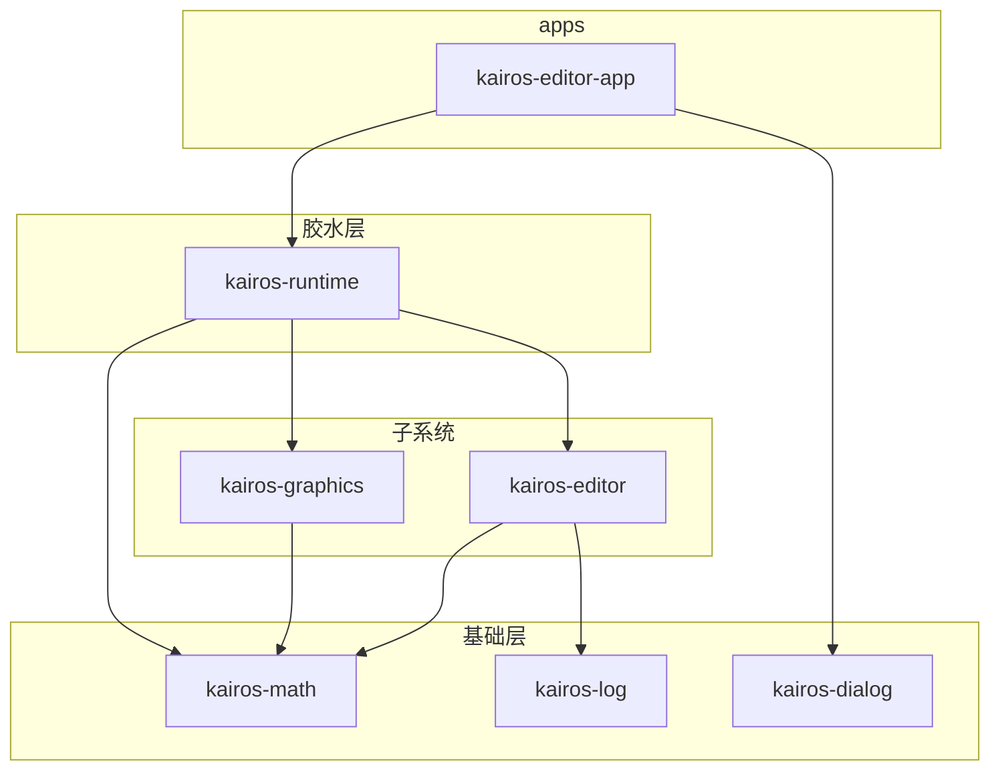

# Rust 依赖门面、IDE 补全与 Workspace 拆 crate 方案

> 由 AI 辅助整理，基于 KairosEngine 对话记录（2026-05）。实现前请以仓库内实际代码为准。

## 目录

1. [问题背景](#问题背景)
2. [上层统一 Color 与底层转换](#上层统一-color-与底层转换)
3. [项目内已有实践](#项目内已有实践)
4. [为何门面仍无法干净 IDE 补全](#为何门面仍无法干净-ide-补全)
5. [缓解 IDE 噪音的手段](#缓解-ide-噪音的手段)
6. [Workspace 与拆 crate 详尽方案](#workspace-与拆-crate-详尽方案)
7. [分阶段迁移清单](#分阶段迁移清单)
8. [成功标准](#成功标准)

---

## 问题背景

引擎同时依赖多个底层库（如 `egui`、`wgpu`、`image`），各自带有名称相近的类型（如 `Color` / `Color32`）。目标：

- **对上**：开发者只使用引擎自己的类型（如 `kairos_math::Color32`）。
- **对下**：各子系统在调用底层 API 前，将统一类型转换为依赖库类型。
- **对 IDE**：上层模块输入颜色相关符号时，尽量不弹出各依赖库的类型。

---

## 上层统一 Color 与底层转换

Rust 无法像 C++ 那样从「符号表」抹掉第三方类型，但可用 **模块边界 + 自有类型 + 边界 `From`/`Into`** 达到 API 层面的统一。

### 核心思路

```text
上层 / 编辑器 API  →  math::Color32（引擎唯一颜色概念）
        ↓
   UI 适配层        →  impl From<Color32> for egui::Color32
   GPU 适配层       →  impl From<Color32> for wgpu::Color
        ↓
   egui::Color32 / wgpu::Color
```

### 推荐规则

| 手段 | 作用 |
|------|------|
| 自有 `Color32` + 只对外 `pub use` 它 | 单一颜色概念 |
| `converts` 子模块 + `From`/`Into` | 边界一次转换 |
| 转换 `impl` 放在**对应子系统** crate/模块 | 避免 `math` 依赖 `wgpu`/`egui` |
| 公开 API 参数/字段只用 `Color32` | 调用方无需 `use` 底层 Color |
| **不要** `pub use wgpu::*` / `pub use egui::*` | 减少误用与文档污染 |

### 依赖铁律：谁依赖谁，谁写 `From`

- `math` **不应**依赖 `wgpu` → `wgpu::Color` 的转换放在 **`graphics`**。
- `math` **不应**依赖 `egui` → `egui::Color32` 的转换放在 **`kairos-editor`**（或独立 bridge crate）。
- 孤儿规则：不能在外部 crate 为 `egui::Color32` 实现自定义 trait；标准做法是在**本 crate** 写 `impl From<YourColor> for egui::Color32`。

### 公开 API 示例（graphics）

```rust
// graphics/color.rs
use kairos_math::Color32;

impl From<Color32> for wgpu::Color {
    fn from(c: Color32) -> Self {
        Self {
            r: c.r as f64 / 255.0,
            g: c.g as f64 / 255.0,
            b: c.b as f64 / 255.0,
            a: c.a as f64 / 255.0,
        }
    }
}

// render_pipeline.rs
load: LoadOp::Clear(clear_color.into()),  // clear_color: Color32
```

### 色彩空间

若 UI 用 8 位 sRGB、GPU 用线性 `f64`，可：

- 保持一个 `Color32` + 在 `graphics` 内归一化；或
- 区分 `Color32` / `LinearColor4f`，用 `From` / `TryFrom` 标明是否有损。

### 类型命名

避免在上层再定义 `pub type Color = Color32` 并全项目打 `Color`——会与 `wgpu::Color` 等产生模糊补全。优先统一 **`Color32`** 或 **`KairosColor`**。

---

## 项目内已有实践

（对话时仓库状态）

- `src/math/color.rs`：`Color32` 定义。
- `src/math/color/converts.rs`：`Color32` ↔ `egui::Color32`（**迁移时应移到 editor crate**，避免 math 依赖 egui）。
- `src/math/vec/converts.rs`：`Color32` → `float4`。
- `src/math.rs`：`pub use color::Color32`。
- `src/graphics/render_pipeline.rs`：仍直接使用 `wgpu::Color` 字面量——待改为 `Color32` 入参 + graphics 内转换。
- `src/kairos_editor/ui/docking_tab.rs` 等：部分文件 `use egui::Color32`，与 `math::Color32` 混用——应逐步统一。

---

## 为何门面仍无法干净 IDE 补全

**门面类型 + `From` 只影响类型检查，不影响 rust-analyzer 的 flyimport 索引。**

只要当前 **Cargo package** 的 `[dependencies]` 同时包含 `egui`、`wgpu`、`image` 等，任意 `.rs` 文件输入 `Color` 时，仍可能弹出：

- `egui::Color32`
- `wgpu::Color`
- 其他依赖中的 `Color` / `Rgba` 等

原因：补全来自 **当前 crate 的依赖图**，不是来自「是否写了转换」。

```text
kairos_engine（单 package）
├── 依赖 egui / wgpu / image / …
└── 任意 .rs
    └── rust-analyzer：可 flyimport 所有依赖的公开类型
```

---

## 缓解 IDE 噪音的手段

### 1. 拆 crate（最根本）

上层逻辑放在**不直接依赖** `wgpu` / `egui` 的 crate（如 `kairos-math`）。在该 crate 内输入 `Color32` 时，依赖图中无 `wgpu::Color` / `egui::Color32`。

### 2. 不易撞名的类型名

统一 `kairos_math::Color32`，避免泛名 `Color`。

### 3. rust-analyzer 配置（过渡期）

`.vscode/settings.json` 或 Cursor 用户设置：

```json
{
  "rust-analyzer.completion.autoimport.enable": true,
  "rust-analyzer.completion.autoimport.exclude": [
    { "path": "wgpu::Color", "type": "always" },
    { "path": "egui::Color32", "type": "always" }
  ]
}
```

或关闭 flyimport（自动 `use` 变弱，噪音减少）：

```json
{
  "rust-analyzer.completion.autoimport.enable": false
}
```

注意：`exclude` 按**具体路径**排除，非整模块；graphics 适配层仍可用全路径 `use`。

### 4. 模块边界约定

- **适配层**（`graphics/`、`kairos_editor/ui/`）：允许底层类型。
- **上层模块**：只 `use kairos_math::Color32`，禁止 `use egui::...` / `use wgpu::...`。

### 5. Optional 依赖 + feature

无头工具 / 未开 `egui` feature 的构建下，egui 类型不进索引；**不能**替代「同一 crate 既 UI 又 GPU」时的拆包。

---

## Workspace 与拆 crate 详尽方案

### 目标架构



**依赖铁律：**

| 允许 | 禁止 |
|------|------|
| `kairos-runtime` → graphics + editor | `kairos-editor` → `kairos-graphics` |
| `kairos-graphics` → math + wgpu | `kairos-graphics` → editor |
| `kairos-editor` → math + egui | `kairos-math` → egui / wgpu |

未来游戏逻辑 crate：只依赖 `kairos-math`（+ 可选 `kairos-log`）。

### 推荐目录（workspace 根：`KairosEngine/`）

```text
KairosEngine/
├── Cargo.toml                 # [workspace]
├── crates/
│   ├── kairos-math/           # Color32, vec, simd；无 egui/wgpu
│   ├── kairos-log/
│   ├── kairos-dialog/
│   ├── kairos-graphics/       # render_pipeline + res/shaders + wgpu 转换
│   ├── kairos-editor/         # UI + egui 转换
│   └── kairos-runtime/        # 原 runtime.rs，粘合 winit/egui-wgpu/wgpu
├── apps/
│   └── kairos-editor-app/     # main.rs
└── benches/                   # 可挂 kairos-math
```

可选：`crates/kairos-engine` 门面 crate，`pub use kairos_math as math` 等，兼容旧 `use kairos_engine::...`。

### 文件映射

| 新 crate | 迁入内容 |
|----------|----------|
| **kairos-math** | `src/math/**`；删除 `color/converts.rs` 中的 egui |
| **kairos-log** | `src/log.rs` |
| **kairos-dialog** | `src/kairos_dialog.rs` |
| **kairos-graphics** | `graphics/**`，`res/shaders/**`，`impl From<Color32> for wgpu::Color` |
| **kairos-editor** | `kairos_editor/**`，`impl From<Color32> for egui::Color32` |
| **kairos-runtime** | `runtime.rs`，`load_icon`（image） |
| **kairos-editor-app** | `main.rs` |

### 根 `Cargo.toml` 模板（节选）

```toml
[workspace]
resolver = "2"
members = [
    "crates/kairos-math",
    "crates/kairos-log",
    "crates/kairos-dialog",
    "crates/kairos-graphics",
    "crates/kairos-editor",
    "crates/kairos-runtime",
    "apps/kairos-editor-app",
]
default-members = ["apps/kairos-editor-app"]

[workspace.dependencies]
serde = "1.0.228"
wgpu = "29.0.3"
egui = "0.33.3"
# … 其他版本集中管理 …
kairos-math = { path = "crates/kairos-math" }
kairos-graphics = { path = "crates/kairos-graphics" }
# …
```

### 各 crate 依赖要点

**kairos-math**

```toml
[dependencies]
serde = { workspace = true }
# 无 egui、wgpu
```

```rust
// lib.rs — nightly SIMD 仅在此 crate
#![feature(portable_simd)]
```

**kairos-graphics**

```toml
[dependencies]
kairos-math = { workspace = true }
wgpu = { workspace = true }
winit = { workspace = true }
pollster = { workspace = true }
```

Shader 路径：

```rust
include_str!(concat!(env!("CARGO_MANIFEST_DIR"), "/res/shaders/shader.wgsl"))
```

**kairos-editor**

```toml
[dependencies]
kairos-math = { workspace = true }
kairos-log = { workspace = true }
egui = { workspace = true }
# 无 kairos-graphics、无 wgpu
```

**kairos-runtime**

```toml
[dependencies]
kairos-math = { workspace = true }
kairos-graphics = { workspace = true }
kairos-editor = { workspace = true }
egui-winit = { workspace = true }
egui-wgpu = { workspace = true }
winit = { workspace = true }
image = { workspace = true }
# …
```

### 转换归属（迁移后）

| 转换 | 所在 crate |
|------|------------|
| `Color32` ↔ `egui::Color32` | **kairos-editor** |
| `Color32` → `wgpu::Color` | **kairos-graphics** |
| `Color32` → `float4` | **kairos-math** |

### import 迁移对照

| 旧 | 新 |
|----|-----|
| `crate::math::Color32` | `kairos_math::Color32` |
| `crate::log::Log` | `kairos_log::Log` |
| `crate::graphics::...` | `kairos_graphics::...` |
| `crate::kairos_editor::...` | `kairos_editor::...` |

### 开发者可见性（拆分后）

| 场景 | depend | IDE 中的 Color |
|------|--------|----------------|
| 游戏逻辑、数学 | `kairos-math` |  mainly `Color32` |
| UI 面板 | `kairos-editor` | `Color32` + 边界 `egui::Color32` |
| 渲染 | `kairos-graphics` | `Color32` + `wgpu::Color` |
| 主循环 | `kairos-runtime` | 全部（少数人维护） |

可选 `kairos-prelude`：只 `pub use kairos_math::{Color32, ...}`，不 re-export egui/wgpu。

### 与 monorepo 其他部分

Git 根 `D:\KairosEngine` 含 Beef/DX12 等；**Rust workspace 仅管理 `KairosEngine/`**，与 Beef 构建并行即可。

### 资源与工作目录

- `paths::PATH_*` 为运行时相对路径 → 文档约定从 repo 根或 app 目录启动，或在 app 中 `set_current_dir`。
- 图标等可后续改为 `include_bytes!` 放入 app crate。

---

## 分阶段迁移清单

| 阶段 | 动作 | 验证 |
|------|------|------|
| **0** | 新建 workspace `Cargo.toml`，members 含 path crate | `cargo check` |
| **1** | 抽出 `kairos-math`，删 math 内 egui converts | `cargo test -p kairos-math` |
| **2** | 抽出 `kairos-log`、`kairos-dialog` | 编译通过 |
| **3** | 抽出 `kairos-graphics`，挪 shader，`wgpu::Color` 转换 | pipeline 可用 |
| **4** | 抽出 `kairos-editor`，egui converts 入 editor | UI 编译 |
| **5** | 抽出 `kairos-runtime` + `kairos-editor-app` | 编辑器可运行 |
| **6** | 删除旧单体 `src/` 或改为门面 `kairos-engine` | CI / 清理 |

过渡期可在门面 crate 使用 `pub use kairos_math as math` 保持旧路径。

---

## 成功标准

- [ ] `cargo build -p kairos-editor-app` 通过
- [ ] `cargo tree -p kairos-math` 不含 egui、wgpu
- [ ] 仅依赖 math 的示例 crate 中，IDE 输入 `Color32` 无 wgpu/egui flyimport
- [ ] editor 业务 struct 字段均为 `kairos_math::Color32`
- [ ] `docking_tab` 等不再以 `egui::Color32` 作为默认业务类型
- [ ] `render_pipeline` 清除色使用 `Color32` 公开 API
- [ ] 文档写明编辑器启动时工作目录（资源路径）

---

## 相关文档

- [runtime-code-walkthrough.md](./runtime-code-walkthrough.md) — 自有 runtime 走读
- [wgpu-learning-roadmap.md](./wgpu-learning-roadmap.md) — wgpu 学习路线
- [scene-window-wgpu-integration.md](./scene-window-wgpu-integration.md) — Scene 窗口与 wgpu 集成
