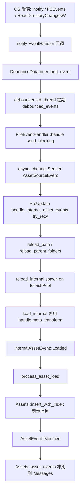

# 资产热重载的文件监听后端选型与 bevy_asset watcher 路径（外部事实清点）

> Wayfinder research ticket: [延后项研究：热重载的文件监听后端选型与 bevy_asset watcher 路径](https://github.com/WhitePetal/KairosEngine/issues/222)（map #214）。
> 日期：2026-09-13。上游依据：`bevyengine/bevy` tag **`v0.19.1`**（直接读取已发布的 0.19.1 crate 源码，行号以该 crate 为准）、`notify-debouncer-full` 0.7.0、`notify` 8.2.0、`notify-types` 2.0.0、`file-id` 0.2.3（均直接读取 crates.io 发布包源码）；本地依据：`kairos_asset` / `kairos_tasks`（行号以当时磁盘为准）。
> 目的：本票**只做外部事实清点，不做设计决策**。为后续决策票 (map 上的 #220) 建立"源变更 → `AssetEvent::Modified`"端到端链路与后端选型的可引用事实。

---

## 0. 结论速览

- **bevy 的 watcher 是"每 source 一个槽 + 一个 `async_channel`"**：`AssetSourceBuilder::watcher` / `processed_watcher` 各持一个构造函数 `FnMut(Sender<AssetSourceEvent>) -> Option<Box<dyn AssetWatcher>>`，`AssetSourceBuilder::build` 在 `watch` 为真时建 unbounded channel 并把 sender 交给构造函数、receiver 存进 `AssetSource`（`bevy_asset-0.19.1/src/io/source.rs:125-144,196-224,390-405`）。
- **`AssetWatcher` 是空 trait**（`Send + Sync + 'static`，无方法），只作为"句柄"存在——watcher 线程随该句柄 drop 而停（`io/mod.rs:595-597`；`file_watcher.rs:27-52`；`notify-debouncer-full-0.7.0/src/lib.rs:628-632`）。
- **事件消费点在 `PreUpdate` 的独占系统 `handle_internal_asset_events`**：它 `try_recv` 各 source 的 receiver，按 `AssetSourceEvent` 调 `reload_path` / `reload_parent_folders`，最后丢给 `AssetServer::reload_internal`（`server/mod.rs:2056,2179-2210`）。本地 `kairos_asset` 已有同名系统，但**只 drain 加载结果，不读任何 source 事件**（`kairos_asset/src/server.rs:827-867`）。
- **端到端链路**：watcher 线程 →（debounce）→ `FileEventHandler` → `async_channel` → `PreUpdate` drain → `reload_internal`（spawn 到 `IoTaskPool`）→ `load_internal`（复用 handle 上的 `MetaTransform`）→ `InternalAssetEvent::Loaded` → `process_asset_load` → `Assets::insert_with_index` 覆盖旧值 → `AssetEvent::Modified`（`file_watcher.rs:266-271`；`server/mod.rs:767-769,956-1001,2056-2071`；`info.rs:426`；`assets.rs:383-397`）。`AssetEvent::Modified` 来自"store 覆盖已有 slot"，不是 watcher 直接发的。
- **去抖是内建的**：bevy 不自己防抖，全部交给 `notify-debouncer-full`。默认窗口 300ms、`tick_rate = timeout/4`，debouncer 自己起一条 `std::thread`（`source.rs:303-323`；`file_watcher.rs:39-47,82-90`；`notify-debouncer-full-0.7.0/src/lib.rs:639-688`）。
- **join/合并能力**：debouncer 对同一 path 的同 kind 事件去重、跳过 create 后的重复 modify、并用 tracker 或 file-id 把 rename 的 From/To 合成一条 `Rename(Both)`；Linux 上 `RecommendedCache = NoCache`（不做 file-id 拼接），macOS/Windows 上 `RecommendedCache = FileIdMap`（`lib.rs:215-264,358-490,514-540`；`cache.rs:60-65`）。
- **`notify` 后端**：Linux/Android = inotify、macOS = FSEvents（默认）、Windows = ReadDirectoryChangesW、BSD/iOS = kqueue、其余 = PollWatcher（`notify-8.2.0/src/lib.rs:402-447`）。各平台已知坑集中在网络盘/容器/`inotify` watch 上限/大目录丢事件/编辑器保存差异（`notify-8.2.0/src/lib.rs:30-84`）。
- **`kairos_tasks::IoTaskPool` 足够承接"重载任务派发"**，但**不承接监听本身**：watcher/debouncer 需要一条（或每条 watch 一条）独立 OS 线程，`notify` 系列内部直接用 `std::thread::Builder`；事件靠 channel 回主线程，与 `IoTaskPool` 无耦合（`notify-debouncer-full-0.7.0/src/lib.rs:668-688`；`notify-8.2.0/src/inotify.rs:123-126`、`windows.rs:102-119`）。
- **热重载不依赖 `AssetProcessor`**：`AssetMode::Unprocessed` 下默认 source 自己带 watcher（`lib.rs:369-379`）。processor 只是另一种布局：`AssetProcessor::new` 用 `build_sources(true, watch_processed)`，processor 监听**未处理** source，主 server 在 `Processed` 模式监听**成品** source（`processor/mod.rs:158-173,306-330`；`server/mod.rs:2188-2194`）。
- **一个易踩的上游事实**：主 `AssetServer` 的 `handle_event` 处理 `AddedAsset` / `ModifiedAsset` / `ModifiedMeta` / `RenamedFolder` / `Removed*` / `AddedFolder`，**但对 `RenamedAsset` 和 `RenamedMeta` 落入 `_ => {}`**；因此单靠一次纯 rename 事件不会触发主 server 重载（rename 的处理器在 `AssetProcessor` 侧）（`server/mod.rs:2155-2177` vs `processor/mod.rs:515-535`）。此点对"编辑器原子保存（临时文件 + rename）"的行为判断很关键。

---

## 1. bevy 侧实现

### 1.1 feature 门控与依赖

- `file_watcher = ["notify-debouncer-full", "watch", "multi_threaded"]`，`embedded_watcher = ["file_watcher"]`（`bevy_asset-0.19.1/Cargo.toml:37-44`）。
- 依赖：`[target.'cfg(not(target_arch = "wasm32"))'.dependencies.notify-debouncer-full] version = "0.7.0", optional = true, default-features = false`（`Cargo.toml:202-205`）。
- 运行时开关：`watch = watch_for_changes_override.unwrap_or(cfg!(feature = "watch"))`，`AssetPlugin::build` 用它决定 `build_sources(watch, false)`（Unprocessed）或 `build_sources(false, watch)`（Processed 无 processor）或把 watch 交给 `AssetProcessor::new`（`lib.rs:364-411`）。
- `watch` 单独打开但无 watcher 后端时，会给 `watch_warning`；desktop + `file_watcher` 的默认 warning 是 "Consider adding an \"assets\" directory."（`source.rs:504-521`）。
- WASM / Android 不支持 watch：`get_default_watcher` 直接返回 `None`（`source.rs:540-576`），`android.rs:13-14` 亦注明 "Watching for changes is not supported"。

### 1.2 `AssetSourceBuilder` / `AssetSource` 的 watcher 槽

- `AssetSourceBuilder` 有 8 个槽：`reader`、`writer`、`watcher`、`processed_reader`、`processed_writer`、`processed_watcher`、`watch_warning`、`processed_watch_warning`（`source.rs:119-149`）。其中：
  - `watcher: Option<Box<dyn FnMut(async_channel::Sender<AssetSourceEvent>) -> Option<Box<dyn AssetWatcher>> + Send + Sync>>`（`:125-131`）
  - `processed_watcher` 同型（`:138-144`）
- 便捷构造：`with_watcher` / `with_processed_watcher`（`:247-256,277-286`）。
- `build(id, watch, watch_processed)`：`watch` 为真时 `async_channel::unbounded()`，把 sender 交给构造函数；返回 `Some` 则把 watcher 与 receiver 存进 `AssetSource`，返回 `None` 且有 warning 则打印（`:196-224`）。
- `AssetSource` 字段：`watcher: Option<Box<dyn AssetWatcher>>`、`processed_watcher`、`event_receiver: Option<Receiver<AssetSourceEvent>>`、`processed_event_receiver`（`:390-405`）；访问器 `event_receiver()` / `processed_event_receiver()`（`:455-465`）。
- `platform_default` 给未处理 + 成品两侧都装默认 watcher，debounce 300ms（`:303-323`）；`get_default_watcher` 对 feature/平台做 `cfg` 分派，path 不存在时 `warn!` 并返回 `None`（`:540-576`）。
- `AssetSourceBuilders::build_sources(watch, watch_processed)` 把两个 bool 透传给每个 builder（`:358-379`）。

### 1.3 `FileWatcher` 与 `AssetSourceEvent` 的产生

- `FileWatcher { _watcher: Debouncer<RecommendedWatcher, RecommendedCache> }`；`new` 先 `make_absolute_path`（`normalize` + `std::path::absolute`，刻意不 `canonicalize`，这样已删除/已重命名的旧路径也能变绝对），再建 `new_asset_event_debouncer`，最后 `impl AssetWatcher for FileWatcher {}`（`io/file/file_watcher.rs:27-60`）。
- `new_asset_event_debouncer(root, debounce_wait_time, handler)`（`:82-250`）：
  - `new_debouncer(debounce_wait_time, None, closure)` —— `tick_rate = None`（`:88-90`）。
  - `debouncer.watch(&root, RecursiveMode::Recursive)`（`:248`）。
  - 把 `notify::EventKind` 映射成 `AssetSourceEvent`：`Create(File)`→`AddedAsset`/`AddedMeta`、`Create(Folder)`→`AddedFolder`、`Access(Close(Write))`→`ModifiedAsset`/`ModifiedMeta`、`Remove(Any)` 与 `Modify(Name(From))`→`RemovedUnknown`、`Create(Any)` 与 `Modify(Name(To))`→`AddedFolder/AddedAsset/AddedMeta`、`Modify(Name(Both))`→`RenamedFolder/RenamedAsset/RenamedMeta`（含 meta↔asset 互换的 error 分支）、`Modify(_)`→`Modified*`、`Remove(File)`→`RemovedAsset`/`RemovedMeta`、`Remove(Folder)`→`RemovedFolder`（`:107-239`）。
  - 对 dangling 的 `Rename(From)` 的注释：因为已经过合理时长的 debounce，孤立的 From 视为"移除"（`:133-136`）。
- `FileEventHandler`：`begin()` 每批重置 `last_event`，`handle()` 只在与上一条完全相同时丢弃，然后 `sender.send_blocking(event).unwrap()`（`:252-272`）。即除 debouncer 外还有一层"连续重复事件"抑制。
- `get_asset_path(root, absolute_path)`：`strip_prefix(root)`，`is_meta = extension == "meta"`，meta 路径去掉扩展名（`:62-77`）。

### 1.4 事件如何被消费回资产栈

- `AssetServer` 持 `crossbeam_channel` 的 `asset_event_sender/receiver: Sender/Receiver<InternalAssetEvent>`（加载任务回传，`server/mod.rs:71-80,139-153`）；**source 事件走的是 `AssetSource` 上的 `async_channel`，与这个 `InternalAssetEvent` 通道是两条独立通道**。
- 唯一的 drain 点是 `handle_internal_asset_events(world)`（`server/mod.rs:2056`）。前半段处理 `InternalAssetEvent::{Loaded, LoadedWithDependencies, Failed}`（`:2056-2108`），后半段做热重载：
  - 若 `!infos.watching_for_changes` 直接 return（`:2110-2114`）。
  - `queue_ancestors`：沿 `infos.loader_dependents` 把依赖该路径的资产也加入重载集合（`:2116-2127`）。
  - `reload_parent_folders`：向上遍历 ancestor，对匹配的 folder handle 触发 folder 重载（`:2129-2145`）。
  - `reload_path`：`queue_ancestors(&path)` 后插入 `paths_to_reload`（`:2147-2153`）。
  - `handle_event`：`AddedAsset`→(folder + path)、`ModifiedAsset|ModifiedMeta`→path、`RenamedFolder`→两侧 folder、`RemovedAsset|RemovedFolder|AddedFolder`→folder，其余 `_ => {}`（`:2155-2177`）。
  - 按 `server.data.mode` 选择读 `event_receiver()`（Unprocessed）或 `processed_event_receiver()`（Processed），`while let Ok(event) = receiver.try_recv()`（`:2179-2196`）。
  - 最后 `server.load_folder_internal(...)` 与 `server.reload_internal(path, true)`（`:2203-2209`）。
- `reload_internal`：`IoTaskPool::get().spawn(async move { ... }).detach()`；先对 `infos.get_path_handles(&path)` 的每个 handle 调 `load_internal(Some(handle), path, true, None)`，若都没成功且 `should_reload(&path)` 再尝试一次 untyped load（`server/mod.rs:956-1001`）。注意重载只对"还活着的 handle"生效（`:963-968,988`）。
- `AssetInfos` 为 watch 额外维护的数据：`watching_for_changes`、`loader_dependents: HashMap<AssetPath, HashSet<AssetPath>>`、`living_labeled_assets`、`get_path_handles`、`should_reload`（`server/info.rs:81-91,118-160,···`）。这些是 hot reload 的存储成本，只在 watch 打开时维护。
- `handle_internal_asset_events` 在 `AssetPlugin::build` 里挂到 `PreUpdate`，`.ambiguous_with_all()`，且 `AssetTrackingSystems.after(handle_internal_asset_events)`（`lib.rs:418-435`）。

### 1.5 `MetaTransform` 在重载路径中的复用

- `MetaTransform = Box<dyn Fn(&mut dyn AssetMetaDyn) + Send + Sync>`（`meta.rs`；`loader_settings_meta_transform`/`meta_transform_settings` 提供从 settings 构造的方式，`:236-256`）。
- 它**存在 handle 上**：`StrongHandle` 的注释明确写 "configuration that must be repeatable when the asset is hot-reloaded"（`handle.rs:84-94`）；`AssetHandleProvider::get_handle` / `reserve_handle_internal` 接收并存入 `meta_transform`（`handle.rs:53-78`）；`AssetInfos::create_handle_internal` 在创建 handle 时把 `meta_transform` 交给 provider（`info.rs:154-157`）。
- 重载时 `reload_internal` 传的显式 `meta_transform` 是 `None`，但 `load_internal` 会从 `input_handle.meta_transform()` 取回并应用：`if let Some(meta_transform) = input_handle.as_ref().and_then(|h| h.meta_transform()) { (*meta_transform)(&mut *meta); }`（`server/mod.rs:767-769`）。**这就是"重载后 loader settings 覆盖不丢"的机制。**
- 本地 `kairos_asset`：`MetaTransform` 类型与 `meta_transform_settings`/`loader_settings_meta_transform` 都在（`kairos_asset/src/meta.rs:33-37,343-359`），但在 `load_internal` 里作为**显式参数**应用一次（`server.rs:336-338`），`StrongHandle` **不存** `meta_transform`（`handle.rs:53-57`），且 `reload` 明确传 `None`（`server.rs:567-574`）。即本地无法在重载时自动复现 settings 覆盖。

### 1.6 源变更 → `AssetEvent::Modified` 端到端链路

- 关键落点：`process_asset_load` 里 `loaded_asset.value.insert(loaded_asset_index.index, world)`（`server/info.rs:426`）；对应 `Assets::insert_with_index`：`let replaced = self.dense_storage.insert(index, asset)?; if replaced { queued_events.push(AssetEvent::Modified { id }) } else { ... Added }`（`assets.rs:383-397`）。`insert_with_uuid` 同型（`assets.rs:372-382`）。
- 事件先入 store 内部的 `queued_events`，由 `Assets::asset_events`（bevy 的 `PostUpdate`，本地对应 `AssetEventSystems`）统一冲刷进 `Messages<AssetEvent<A>>`（`assets.rs:605-610`）。
- 顺带：直接可变借用的 `AssetMut` 在 drop 时也会 push `AssetEvent::Modified`（`assets.rs:627-628,686-687`）；本地同语义（`kairos_asset/src/assets.rs:630-631`）。

---

## 2. 后端选型：notify 家族事实

### 2.1 版本 / feature 关系

- `notify-debouncer-full 0.7.0` 依赖 `notify 8.2.0`、`notify-types 2.0.0`、`file-id 0.2.3`、`walkdir 2.4`、`log`（`notify-debouncer-full-0.7.0/Cargo.toml:61-78`）。
- `notify-debouncer-full` 自身 feature：`default = ["macos_fsevent"]`、`macos_fsevent = ["notify/macos_fsevent"]`、`macos_kqueue`、`crossbeam-channel`、`flume`、`serde`、`web-time`、`serialization-compat-6`（`Cargo.toml:37-51`）。它的 `serde/web-time` 透传给 `notify-types`（其 lib.rs doc `:48-58`）。
- `notify 8.2.0` 自身 feature：`default = ["macos_fsevent"]`，其余 `macos_kqueue`、`serde`、`serialization-compat-6`（`notify-8.2.0/Cargo.toml:68-76`）。
- **feature 解析上的一处细节（由清单直读推断，见"未验证项"）**：bevy 对 `notify-debouncer-full` 用 `default-features = false`，关掉的是 debouncer 自身的默认；而 debouncer 对 `notify` 的依赖边**未**设 `default-features = false`，`notify` 的默认 feature `macos_fsevent` 因此仍被启用。按 Cargo feature 是可加并集，macOS 上最终仍是 FSEvents 后端。是否含 `file-id`/异步变体：**含 `file-id` 0.2.3**（debouncer 直接依赖）；**不含"异步 watcher 变体"**（`notify` 的 `Watcher` 是同步 trait，回调线程模型由各后端自己起线程）。

### 2.2 各平台后端与行为

- `RecommendedWatcher` 的平台类型（`notify-8.2.0/src/lib.rs:402-447`）：
  - Linux/Android → `INotifyWatcher`（inotify，`inotify 0.11` + `mio` 事件循环，`Cargo.toml:85-91`）。
  - macOS（未开 `macos_kqueue`）→ `FsEventWatcher`（FSEvents）。
  - Windows → `ReadDirectoryChangesWatcher`。
  - FreeBSD/OpenBSD/NetBSD/DragonFly/iOS 及 mac+`macos_kqueue` → `KqueueWatcher`。
  - 其余 → `PollWatcher`。
- `WatcherKind` 枚举：`Inotify`/`Fsevent`/`Kqueue`/`PollWatcher`/`ReadDirectoryChangesWatcher`（`lib.rs:281-291`）。
- 线程模型：每个后端自己起 OS 线程——inotify `"notify-rs inotify loop"`（`inotify.rs:123-126`）、Windows `"notify-rs windows loop"`（`windows.rs:102-119`）、debouncer `"notify-rs debouncer loop"`（`notify-debouncer-full-0.7.0/src/lib.rs:668-688`）。macOS FSEvents 用 CFRunLoop 线程（`fsevent.rs:64-72,435-443`）。
- macOS FSEvents：`latency = 0.0`，flags = `FileEvents | NoDefer`（`fsevent.rs:295-305`）；FSEvents 是"按目录批量通知"，语义上更适合"重扫目录"而非精确逐文件事件（`fsevent.rs:1-13`）。它有自己的 dropped 事件标志 `UserDropped`/`KernelDropped`/`MustScanSubDirs`（`fsevent.rs:37-39`）。
- Windows：`BUF_SIZE = 16384`，用 `ReadDirectoryChangesW` + `OVERLAPPED` + 信号量；重命名拆成 `FILE_ACTION_RENAMED_OLD_NAME`→`RenameMode::From`、`FILE_ACTION_RENAMED_NEW_NAME`→`RenameMode::To`（`windows.rs:40,423-437`）。
- Linux inotify：递归目录通过 `WalkDir` 展开、每个目录一个 watch descriptor（`inotify.rs:20,39-44,60-76`）。
- `PollWatcher`：纯 stdlib 轮询；`poll_interval` 默认 **30 秒**、`compare_contents` 默认 **关**（`poll.rs:1-5,506-560`；`config.rs:49-98`）。
- `file-id 0.2.3`：Linux/macOS 取 `(dev, inode)`，Windows 取 `(volume_serial, file_index)`（低/高分辨率两档）（`file-id-0.2.3/src/lib.rs:1-6,38-83,114-192`）。

### 2.3 已知坑（notify 官方 Known Problems，`notify-8.2.0/src/lib.rs:30-84`）

- **网络文件系统**：NFS 等可能完全不发事件（含 WSL 监听 Windows 路径，issue #254）；workaround 用 `PollWatcher`（`:32-37`）。
- **macOS M1 上的 Docker**：抛 `Function not implemented (os error 38)`，需手动 `PollWatcher`（`:39-42`）。
- **macOS FSEvents 与"不属于你的文件"**：FSEvents 的安全模型导致部分事件观测不到，退回 `PollWatcher` 可解（`:44-49`）。
- **编辑器行为差异**：精确事件（Write/Delete/Create）在编辑器间差异极大，有的截断、有的新建再替换（issue #247、#113）；这与"原子保存"直接相关（`:51-55`）。
- **父目录删除**：要收到 `/a/b/..` 的删除事件必须监听父目录 `/a`（issue #403）（`:57-60`）。
- **伪文件系统**（`/proc`、`/sys`）：不发变更或时间戳不可靠，需 `PollWatcher` + `compare_contents`（`:62-65`）。
- **Linux 句柄/空间上限**：`Bad File Descriptor` / `No space left on device` 常因 `fs.inotify.max_user_instances` / `max_user_watches` 触顶，递归监听下每个文件/目录都计数（`:67-79`）。
- **大目录**：notify 可能收不齐事件，Linux 后端文档上本就不是 100% 可靠（issue #412）（`:81-84`）。
- **`notify` 不是异步库**：事件回调运行在后端/ debouncer 线程上，使用者需自己转到主线程（bevy 用 `async_channel`，见 1.3/1.4）。

---

## 3. 去抖与合并

### 3.1 `notify-debouncer-full 0.7.0` 语义

- 设计目标（`src/lib.rs:1-9`）：只在 From/To 能配对时发一条 Rename；合并多条 Rename；把 rename 前未发的事件路径改写；可选地用文件系统 ID 拼接 rename（macOS FSEvents、Windows）；删除目录只发一条 Remove（inotify）；不发重复 create；不发 create 之后的 modify。
- `new_debouncer(timeout, tick_rate, handler)`：`tick_rate = None` 时取 `timeout / 4`；tick 大于 timeout 会报错（`lib.rs:639-664,719-731`）。bevy 的调用点：`new_debouncer(debounce_wait_time, None, closure)`（`file_watcher.rs:88-90`），debounce 默认 300ms（`source.rs:308,317`）。
- `DebounceDataInner`：`queues: HashMap<PathBuf, Queue>`、`roots`、`cache`、`rename_event`、`rescan_event`、`errors`、`timeout`（`lib.rs:191-199`）。
- `debounced_events()`：按 `now - event.time >= timeout` 判过期；同一 path、同一 `kind` 只保留一条（后到者取代，移除前一条）；最后 `sort_events`（`lib.rs:215-264`）。
- `add_event()`：`need_rescan` 时重扫 roots；`Create`→加 cache 后 push；`Modify(Name)`→按 `RenameMode::{Any,To,From,Both,Other}` 分派（`Both` 被刻意忽略，改用 To/From）；`Remove`→`push_remove_event`；`Other`→忽略（`lib.rs:279-343`）。
- rename 配对：`handle_rename_from` 记下 `(event, file_id)`、删 cache、push；`handle_rename_to` 比较 tracker（通知自带的 attrs）或 cache 里的 file-id，匹配则 `push_rename_event`（合成 `Rename(Both)`），否则视为"移入"`push_event`（`lib.rs:358-411`）。
- `push_event`：同 path 已存在队列时，跳过"重复 create"和"create 后紧跟的 Modify(Any/Data/Metadata/Other)"（`lib.rs:514-540`）。
- `RecommendedCache`：Linux/Android/WASM = `NoCache`，其余 = `file_id_map::FileIdMap`（`cache.rs:60-65`）。即 **Linux 不做 file-id 拼接**，rename 依赖 inotify 自身的 From/To 语义。
- `Debouncer` drop 只 `set_stop`，不 join；`stop()` 才 join（`lib.rs:545-565,628-632`）。

### 3.2 编辑器原子保存 / 事件风暴

- 典型原子保存 = 写临时文件 + rename 覆盖目标。经过 debouncer：临时文件的 Create 与目标/临时文件的 rename 会被合成/重写；bevy 的 `FileWatcher` 会把 `Rename(Both)` 映射成 `RenamedAsset`（`file_watcher.rs:159-209`）。
- **但主 server 不处理 `RenamedAsset`/`RenamedMeta`**（`server/mod.rs:2155-2177` 的 `_ => {}`）。也就是"纯 rename 事件"对主 server 的重载不产生作用；实际触发重载的是随后的 `AddedAsset`/`ModifiedAsset`（debouncer 也会在 rename 时改写队列并可能补发 `Remove(Any)`/`Added`，见 `lib.rs:413-490`）。这一行为差异是 #220 在评估"原子保存是否可靠触发重载"时必须验证的点。
- 连续写入风暴：debouncer 会把窗口内同 kind 事件压成一条；窗口外仍会产生多次 `ModifiedAsset`，每次都走一次 `reload_path` → `reload_internal`（可能多次 spawn）。bevy **没有**在此之上再做"合并/节流"。
- `FileEventHandler` 的 `last_event` 只抑制"相邻完全相同"的一条，不能替代 debounce（`file_watcher.rs:252-272`）。

### 3.3 bevy 有无内建去抖

- 有，且**只在 watcher 实现层**：Linux/macOS/Windows 的默认 `FileWatcher` 与 `EmbeddedWatcher` 都调用同一个 `new_asset_event_debouncer`（`file_watcher.rs:82-90`；`io/embedded/embedded_watcher.rs:26-43`；`io/embedded/mod.rs:123-139`，embedded 也固定 300ms）。
- `AssetServer` 层没有任何时间窗去抖，只有"按 path 去重到 `HashSet<AssetPath>`"（`server/mod.rs:2147-2153`），即同一批 drain 内同 path 只重载一次。

---

## 4. `kairos_tasks` 契合度

### 4.1 线程模型：监听不在 task pool 里

- watcher/debouncer/后端都自起 OS 线程，且这些线程是"长期阻塞/循环"的，不适合放进 `TaskPool`（`TaskPool` 面向可调度的异步任务）：
  - debouncer 循环：`std::thread::Builder::new().name("notify-rs debouncer loop").spawn(...)`（`notify-debouncer-full-0.7.0/src/lib.rs:668-688`）。
  - 后端循环：inotify（`inotify.rs:123-126`）、Windows（`windows.rs:102-119`）、FSEvents CFRunLoop（`fsevent.rs:64-72`）。
- 结论：watcher 需要**独立线程**（或后端自管线程），不能仅靠 `IoTaskPool`。`IoTaskPool` 承接的是"事件到达主线程后派发的重载任务"（`server/mod.rs:959-1000`）。
- 本地 `kairos_tasks`：`IoTaskPool` 是 `OnceLock<TaskPool>` 惰性自建，`get_or_init` / `try_get` / `get` / `Deref<TaskPool>`（`kairos_tasks/src/usages.rs:52-76`）；本地 `kairos_asset` 已用 `io_task_pool()` = `IoTaskPool::get_or_init(TaskPool::default)` 跑加载与重载（`kairos_asset/src/server.rs:869-875,308-313,567-575`）。因此"重载任务派发"这一半已经就绪。

### 4.2 接入点

- 事件从 watcher 线程到主线程：bevy 用 `async_channel`（unbounded）在 `AssetSource` 上传递（`source.rs:196-201,403-404`）；本地 `kairos_asset` 目前用 `crossbeam_channel` 传 `InternalAssetEvent`（`kairos_asset/src/server.rs:129,92-93`），但**没有** source 级 channel。若沿用上游形态，需要新增 source 事件通道（类型选择由 #220 决定）。
- 主线程消费点：bevy 是 `PreUpdate` 的独占系统。本地对应 `kairos_asset::install` 的 tracking 阶段 + 独占 `handle_internal_asset_events`（`kairos_asset/src/install.rs:91-110,15-23`），调用方传入 `PreUpdate`/`PostUpdate` 等价 label。扩展点已经存在。
- `tick_global_task_pools_on_main_thread`（`kairos_tasks/src/usages.rs:84-105`）可用来在主线程推进 pool，对 watcher 事件本身无影响。

---

## 5. 与 processor 的关系

- 三种布局（`lib.rs:364-411`）：
  1. `AssetMode::Unprocessed`（默认）：`build_sources(watch, false)`，主 server 直接监听**未处理** source 的 `event_receiver()`（`server/mod.rs:2181-2187`）。**不需要 `AssetProcessor`**。
  2. `AssetMode::Processed` + 无 processor：`build_sources(false, watch)`，主 server 监听**成品** source 的 `processed_event_receiver()`（`server/mod.rs:2188-2194`）。
  3. `AssetMode::Processed` + `use_asset_processor`：`AssetProcessor::new(&mut builders, watch)` → 内部 `build_sources(true, watch_processed)`（`processor/mod.rs:158-173`），processor 用 `spawn_source_change_event_listeners` 监听**未处理** source 的 `event_receiver()` 并 spawn 处理任务到 `IoTaskPool`（`processor/mod.rs:306-330`）；主 server 再监听成品侧。
- 因此 **watcher 槽有两个语义位**：`watcher`（未处理/源）与 `processed_watcher`（成品）。bevy 通过 `build_sources(watch, watch_processed)` 把两种模式接起来；`AssetProcessor` 复用同一个未处理 watcher 槽。
- 本地 `kairos_asset` 的 processor 尚未落地（`io/source.rs:123-127` 注明 writer 槽"until the asset processor lands"），所以本地当前只涉及布局 1 对应的"未处理 watcher"。

---

## 6. 本地现状与上游差距

已核实的 `kairos_asset` 事实（"本地依据"）：

- `AssetSourceEvent` 已是 **12 变体**，与 bevy 0.19.1 **逐变体一致**（`AddedAsset`/`ModifiedAsset`/`RemovedAsset`/`RenamedAsset`/`AddedMeta`/`ModifiedMeta`/`RemovedMeta`/`RenamedMeta`/`AddedFolder`/`RemovedFolder`/`RenamedFolder`/`RemovedUnknown{path,is_meta}`）（`kairos_asset/src/io.rs:543-580` vs `bevy_asset-0.19.1/src/io/mod.rs:557-593`）。doc 亦自述"Nothing emits these yet"（`io.rs:543-547`）。
- `pub trait AssetWatcher: Send + Sync + 'static {}` 存在且为空（`kairos_asset/src/io.rs:582-586`），与上游同型（`io/mod.rs:595-597`）。**更正一处已知事实**：该 trait **没有**从 `src/lib.rs` re-export——本地 `lib.rs` 只导出 `AssetSourceEvent`，不导出 `AssetWatcher`（`kairos_asset/src/lib.rs:73-77`）；且全仓库仅此一处出现 `AssetWatcher`，无任何 impl/使用。
- `AssetSourceBuilder` 只有 `reader` / `writer` / `processed_reader` 三个槽（`kairos_asset/src/io/source.rs:128-135`），**缺 `watcher`、`processed_watcher`、两个 watch_warning 槽**；`AssetSource` 只有 `id/reader/writer/processed_reader`（`io/source.rs:326-331`），**缺 `watcher`/`processed_watcher`/`event_receiver`/`processed_event_receiver`**。即上游 `watcher` 槽整条链路在本地缺失。
- `AssetInfos` 有 `watching_for_changes` 字段，但没有 `loader_dependents`、`living_labeled_assets`，也没有 `get_path_handles`/folder 重载所需的映射（`kairos_asset/src/server/info.rs:87-108,282-289`）；只有 `should_reload` = `is_path_alive`（`:374-390`）。
- `handle_internal_asset_events` 存在，但只 drain `InternalAssetEvent::{Loaded,LoadedWithDependencies,Failed}`，**不遍历 source、不读任何 `AssetSourceEvent`**（`kairos_asset/src/server.rs:827-867`）；`InternalAssetEvent` 也只有这三个变体（`:877-900`）。
- `reload` 已实现（spawn 到 `IoTaskPool`，只在 `should_reload` 时执行，对每个 handle 调 `load_internal(..., None)`）（`server.rs:561-576`），即"上游事件 → reload"的**下游**已具备；缺的是**上游事件源**（watcher 槽 + source 事件通道 + drain 分发）。
- `MetaTransform` 类型/工具函数已在（`meta.rs:33-37,343-359`），但 `StrongHandle` 不存 `meta_transform`（`handle.rs:53-57`），重载传 `None`，因此**重载不会复用 handle 上的 settings 覆盖**（对照上游 `server/mod.rs:767-769`）。
- `AssetEvent` / `AssetMut` drop 语义本地与上游一致：覆盖插入时 push `Modified`（`assets.rs:345-346`），可变借用 drop 时 push `Modified`（`:630-631`）；`process_asset_load` 的 `value.insert(index, world)`（`server/info.rs:451`）即覆盖入口。
- 本地 `kairos_asset` 无 `notify` 依赖（`kairos_asset/Cargo.toml`），也没有任何 watcher 线程/去抖实现。

差距小结（供 #220 决策，不在本票定夺）：watcher 槽缺失、source 事件通道缺失、`handle_internal_asset_events` 无源事件分发、`AssetInfos` 无 dependency/folder 重载数据、handle 不持久化 `MetaTransform`。

---

## 7. 留给 #220 的决策问题

以下均为**决策**，本票不回答：

1. **后端与 crate 选型**：直接复用 `notify-debouncer-full 0.7.0`（+ `notify 8.2.0`），还是只依赖 `notify` 自建去抖，或保持 feature `cfg` 门控（对应 bevy 的 `file_watcher`）？是否要保留 `macos_kqueue` 备选？
2. **feature / 平台矩阵**：是否照搬 `file_watcher = [notify-debouncer-full, watch, multi_threaded]` 与 `embedded_watcher`；WASM/Android 是否明确不支持；默认是否在 dev profile 打开。
3. **`AssetSourceBuilder` 扩展形态**：watcher 槽是复刻上游的 `FnMut(Sender<AssetSourceEvent>) -> Option<Box<dyn AssetWatcher>>`，还是改成更贴合本地的构造签名；`processed_watcher` 是否随 processor 一起延后。
4. **source 事件通道类型**：`async_channel`（上游）还是 `crossbeam_channel`（本地加载回传已在用）；unbounded 还是 bounded。
5. **drain 与分发落点**：是扩大现有 `handle_internal_asset_events`（独占系统）还是新开一个系统/阶段；`watching_for_changes` 的数据成本（`loader_dependents`、folder path 映射）是否引入。
6. **去抖参数与策略**：debounce 窗口（上游默认 300ms）、是否要在 bevy 之外再加一层节流/合并以对抗"连续写入/原子保存"风暴；`RenamedAsset`/`RenamedMeta` 是否纳入重载触发（上游主 server 未纳入，processor 纳入，这一差异必须表态）。
7. **`MetaTransform` 持久化**：是否把 `meta_transform` 存到 `StrongHandle` 以在重载时复用（上游做法），还是用别的机制保证重载后 settings 不丢。
8. **线程归属**：接受 watcher 起独立 OS 线程（上游做法），还是约束到某类 executor；`IoTaskPool` 只承接重载派发这一分工是否固化。
9. **processor 相关性**：热重载是否要求 `AssetProcessor` 存在（上游不要求），以及将来 processor 落地时是否复用同一 watcher 槽。
10. **错误/边界策略**：watcher 创建失败（path 不存在、权限、macOS 无权限、Linux watch 上限）是 warning 降级还是 fail-fast；`settings` 类 API 是否在 watch 打开时强制可用。

---

## 未决 / 未验证项（source-access caveats）

- `notify` 在 bevy 依赖图中的**最终 feature 集**（尤其 macOS 是否因 `notify-debouncer-full` 对 `notify` 的默认 feature 而仍启用 `macos_fsevent`）由各 `Cargo.toml` 直读推断，**未**在真实 bevy 工程跑 `cargo tree -e features` 验证；最终 feature 解析请以目标平台实际构建为准。
- `notify-debouncer-full` 的 rename/file-id 拼接在 macOS FSEvents 与 Windows 上的**实际事件序列**（是否一定产出 `Rename(Both)`、是否补发 Remove）未做运行时实验，仅依据源码语义与官方 doc。
- bevy "纯 rename 不触发主 server 重载"是**代码直读结论**（`server/mod.rs:2155-2177`），未跑 bevy 样例复现；实际编辑器原子保存是否仍因随附的 `Added/Modified` 事件而重载，需运行时验证。
- 各后端在真实编辑器（VS Code / Rider 等）原子保存下的具体事件序列，`notify` 官方只给出 issue 链接（#247、#113），本票未逐一跟踪。
- `notify-types 2.0.0`、`file-id 0.2.3` 的其余内部细节未展开（仅涉及其在 debouncer 中的作用）。
