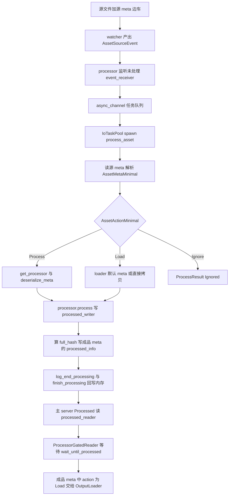

# bevy_asset 0.19.1 的 AssetProcessor：处理管线 / 调度 / processed_info 回写（外部事实清点）

> Wayfinder research ticket：[延后项研究：bevy_asset 0.19.1 的 AssetProcessor 实现 — 处理管线 / 调度 / processed_info 回写](https://github.com/WhitePetal/KairosEngine/issues/221)（map #214）。
> 日期：2026-09-13。上游依据：`bevyengine/bevy` tag **`v0.19.1`**（checksum commit `b56fc29d3016e641754765244b5ba3f9cc504671`；直接读取该 tag 下 `crates/bevy_asset` 源码，行号以 `bevy_asset-0.19.1` 发布 crate 为准）。凡引用 `bevy_tasks-0.19.1` 处单独标注。本地依据：`kairos_asset` / `kairos_graphics` / `kairos_tasks` / `kairos_engine`（行号以当前磁盘为准）。
> 姊妹票：[热重载的文件监听后端选型与 bevy_asset watcher 路径](asset-hot-reload-watcher.md)（#222）已完成 watcher / 热重载侧清点；本票聚焦 processor 本体，二者在「成品侧 source event / 槽位 / 调度」处交叉引用，不重复其结论。
> 目的：本票**只做外部事实清点，不做设计决策**。为决策票 #218（延后项决议：AssetProcessor 本体）建立可引用事实。

---

## 0. 结论速览

- **`AssetProcessor` 不是 App 里的系统，而是「后台任务 + 自带 AssetServer」的组合体。** `AssetProcessor { server: AssetServer, data: Arc<AssetProcessorData> }`（`bevy_asset-0.19.1/src/processor/mod.rs:97-101`）。它只在 `Startup` 阶段被 `AssetProcessor::start` 启动一次，之后整条管线都跑在 `IoTaskPool` 上（`lib.rs:398`；`processor/mod.rs:253-290`）。**没有** `PreUpdate`/`PostUpdate`/独立 stage 的 processor 系统。

- **`AssetProcessor` 无泛型参数。** 工单描述的 `AssetProcessor<FileReader, FileWriter, MetaTransform>` 在 0.19.1 源码中不存在；`AssetProcessor` 是 `#[derive(Resource, Clone)]` 的具体类型，泛型只出现在 `Process` trait 与 `LoadTransformAndSave` 上（`processor/mod.rs:97-101`；`processor/process.rs:31-46`,`66-74`）。

- **构造签名 `new(sources: &mut AssetSourceBuilders, watch_processed: bool) -> (Self, Arc<AssetSources>)`**（`processor/mod.rs:160-179`）。用 `build_sources(true, watch_processed)` 冻结 sources（processor 监听**未处理**侧），再 `sources.gate_on_processor(state)` 把成品 reader 包成 `ProcessorGatedReader`，最后建一个自带 `AssetServerMode::Processed` + `AssetMetaCheck::Always` 的内部 server。

- **上游三种布局由 `AssetPlugin::build` 按 `AssetMode` 选择**（`lib.rs:364-411`）：① `AssetMode::Unprocessed` → 主 server `Unprocessed`、`build_sources(watch, false)`；② `AssetMode::Processed` + `use_asset_processor`（默认 = `cfg!(feature = "asset_processor")`，`lib.rs:382-384`）→ `AssetProcessor::new(&mut builders, watch)`，主 server 与 processor **共用同一份 `Arc<AssetSources>`** 与 loaders，但 id 空间 / `AssetInfos` 独立；③ `AssetMode::Processed` + 无 processor → 主 server 直接读**成品** source（`build_sources(false, watch)`），假定成品已被提前生成。

- **`AssetAction` 只有三个变体：`Load` / `Process` / `Ignore`**（`meta.rs:58-75`）；`AssetMeta` 的 `asset` 字段是 `AssetAction<L::Settings, P::Settings>`，另有 `processed_info: Option<ProcessedInfo>`（`meta.rs:27-39`）。

- **`ProcessedInfo` 在磁盘上写在「成品 `.meta`」，在内存里存在 processor 的 `ProcessorAssetInfos`。** 结构 `hash` / `full_hash` / `process_dependencies`（`meta.rs:82-92`,`94-100`）。内存位置 `ProcessorAssetInfos.infos: HashMap<AssetPath, ProcessorAssetInfo>`，每条 `ProcessorAssetInfo.processed_info: Option<ProcessedInfo>`（`processor/mod.rs:1520-1537`,`1569-1580`）；回写时机 `finish_processing`（`processor/mod.rs:1615-1693`），落盘在 `process_asset_internal` 末尾（`processor/mod.rs:1216-1223`）。

- **「成品已就绪」由 `ProcessorGatedReader` 判定，不靠 `ProcessedInfo`。** 成品 reader 的 `read`/`read_meta` 先 `wait_until_processed(path)`，`Processed` 才放行，`Failed`/`NonExistent` 直接返回 `NotFound`（`io/processor_gated.rs:44-88`；`processor/mod.rs:1448-1463`）。`ProcessedInfo` 只被 **processor 自己**用于「是否跳过重复加工」（`processor/mod.rs:1122-1143`），主 server 代码中不引用它。

- **槽位：`AssetSourceBuilder` 有 8 槽**（reader/writer/watcher/processed_reader/processed_writer/processed_watcher/两个 watch_warning，`io/source.rs:119-149`）。processor 读**未处理** `event_receiver()`/`reader()`/`writer()`，写**成品** `processed_writer()`；主 server（`Processed`）读**成品** `processed_reader()`/`processed_event_receiver()`。`gate_on_processor` 把 `processed_reader` 换成 gated 版本、把原 reader 存进 `ungated_processed_reader` 供 processor 自用（`io/source.rs:390-405`,`580-589`）。

- **`.meta` → `AssetAction::Process` → 加工 → 落盘 → 回写 `processed_info`**：读源 `.meta` → `AssetMetaMinimal` → `AssetActionMinimal::Process { processor }` → `get_processor` → `deserialize_meta` → `processor.process(context, settings, writer)`；产出的成品 `.meta` 的 action 恒为 `Load`（指向 `OutputLoader`）并带 `processed_info`（`processor/process.rs:247-264`；`processor/mod.rs:1052-1073`,`1164-1223`）。

- **事务日志（WAL）**：`ProcessorTransactionLog` / `FileTransactionLogFactory`，默认写 `imported_assets/log`；启动时 `validate_transaction_log_and_recover` 校验未完成事务并重加工（`processor/log.rs:19-41`,`114-130`；`processor/mod.rs:1246-1338`）。

- **所需设施（上游）**：`bevy_tasks::IoTaskPool`（`processor/mod.rs:65`,`253-290`,`395-404`）、`async_channel`（`processor/mod.rs:262`,`365`；`io/source.rs:196-224`）、`async_broadcast`（`processor/mod.rs:124-128`,`1535-1536`）、`async_lock`、`futures_util::select_biased`、`async_fs`、`notify-debouncer-full`（feature 门控）；cargo features `asset_processor`/`watch`/`file_watcher`/`multi_threaded`（`bevy_asset-0.19.1/Cargo.toml:13-22`,`42-70`,`96-100`）。

- **kairos 现状**：`kairos_asset` **完全没有 processor 模块**（`kairos_asset/src/lib.rs:37-39` 明说 processor 延后）。类型面已就地铺好（`AssetAction::Process`、`ProcessedInfo`、`ProcessedInfoMinimal`、`AssetMetaDyn` 均在 `meta.rs`），但缺 `Process` trait、`AssetProcessor`、事务日志、`ProcessingState`/`ProcessorGatedReader`、成品 writer 槽、成品 watcher 槽、source 事件通道与 drain（详见 §8.1）。当前 `.mesh_bin`/`.texture_bin` 由**手动/编辑器触发**的函数式加工产出，与 asset 系统解耦（详见 §8.2）。

---

## 1. 处理管线形态

### 1.1 结构体与类型面

- `AssetProcessor`（`processor/mod.rs:97-101`）：`server: AssetServer` + `pub(crate) data: Arc<AssetProcessorData>`；`Clone` 共享 `Arc`。
- `AssetProcessorData`（`processor/mod.rs:104-117`）：`processing_state: Arc<ProcessingState>`、`log_factory`、`log`、`processors: RwLock<Processors>`、`sources: Arc<AssetSources>`。
- `ProcessingState`（`processor/mod.rs:120-131`）：`state`、`initialized_sender/receiver`、`finished_sender/receiver`、`asset_infos: RwLock<ProcessorAssetInfos>`。
- `Processors`（`processor/mod.rs:134-142`）：`type_path_to_processor`、`short_type_path_to_processor`（`ShortTypeProcessorEntry::Unique/Ambiguous`，`:144-156`）、`file_extension_to_default_processor`。注册/查询：`register_processor`/`set_default_processor`/`get_default_processor`/`get_processor`（`processor/mod.rs:746-831`）。
- `Process` trait（`processor/process.rs:31-46`）：`type Settings`、`type OutputLoader`、`process(&self, &mut ProcessContext, &Settings, &mut Writer) -> Result<OutputLoader::Settings, ProcessError>`；高层实现 `LoadTransformAndSave<L, T, S>`（`processor/process.rs:66-74`,`172-216`）与其 settings `LoadTransformAndSaveSettings`（`:93-100`）。类型擦除 `ErasedProcessor`（`processor/process.rs:220-237`，`impl ErasedProcessor for P`：`:247-289`），`MetaTypePathKind::Short/Long`（`:240-245`），错误 `ProcessError`（`:119-170`），作用域 `ProcessContext`（`:293-330`，`load_source_asset`：`:336+`）。

### 1.2 一个源文件从 `AssetAction::Process` 到成品落盘

核心是 `process_asset_internal`（`processor/mod.rs:1032-1244`）：

1. 读源 `.meta`（`reader.read_meta_bytes`）→ `AssetMetaMinimal`；`Process { processor }` → `self.get_processor` + `processor.deserialize_meta`；`Load { loader }` → loader 的 meta；`Ignore` → 返回 `ProcessResult::Ignored`（`processor/mod.rs:1052-1073`）。
2. 无 `.meta` 时：按扩展名找默认 processor，否则退回 loader 默认 meta，再否则 `Ignore`（`processor/mod.rs:1074-1095`）。
3. `new_hash = get_asset_hash(meta_bytes, source_bytes)`（`processor/mod.rs:1107-1120`；`meta.rs:261`）；与内存 `processed_info.hash` + 各依赖 `full_hash` 比较，未变 → `SkippedNotChanged`（`processor/mod.rs:1122-1143`）。
4. 取每资产 `file_transaction_lock`（`processor/mod.rs:1146-1158`）。
5. `log_begin_processing`（WAL）（`processor/mod.rs:1163`）。
6. `processed_writer.write(path)` 开成品 writer → `processor.process(&mut ProcessContext, settings, &mut *writer)` → `writer.flush()`（`processor/mod.rs:1178-1207`）。
7. 算 `full_hash`，把 `new_processed_info` 写进产出的成品 meta（`*processed_meta.processed_info_mut() = Some(...)`），`processed_writer.write_meta_bytes(path, meta_bytes)` 落盘（`processor/mod.rs:1209-1223`）。
8. `log_end_processing`（`processor/mod.rs:1241`）→ `Ok(ProcessResult::Processed(new_processed_info))`。
9. `process_asset` 把结果交给 `ProcessorAssetInfos::finish_processing` 更新内存并触发依赖重加工（`processor/mod.rs:1018-1030`,`1615-1693`）。
- 分支：无 processor（`Load` 或默认 loader）时不做加工，把源字节 `futures_lite::io::copy` 到成品，并把 `processed_info` 写进源 meta 副本后落盘（`processor/mod.rs:1224-1240`）。

### 1.3 任务 / 线程池模型

- `AssetProcessor::start`（`processor/mod.rs:253-290`）在 `IoTaskPool` 上 spawn 总任务：`initialize()` → `queue_initial_processing_tasks()` → 再 spawn `execute_processing_tasks()`（任务消费循环）→ `wait_until_finished()` → `spawn_source_change_event_listeners()`。
- 任务队列是一条 `async_channel::unbounded::<(AssetSourceId, PathBuf)>`（`processor/mod.rs:262`）。`execute_processing_tasks`（`processor/mod.rs:338-423`）用 `select_biased!` 同时等「新任务」与「任务完成」，每个任务再 spawn 到 `IoTaskPool` 执行 `process_asset`；`pending_tasks` 计数归零才进入 `Finished`。
- 初扫：`initialize()` 递归列出每个可处理 source 的**未处理**与**成品**文件，为未处理文件 `get_or_insert`，为成品文件回填 `processed_info`/依赖；顺手清理空目录与解析失败的成品（`processor/mod.rs:837-970`）。`queue_initial_processing_tasks` 对每个可处理 source 递归入队（`processor/mod.rs:293-302`,`727-743`）。
- 单资产入口 `process_asset`（`processor/mod.rs:1018-1030`）→ `process_asset_internal` → `finish_processing`。

### 1.4 事务日志（WAL）

- `ProcessorTransactionLog`：`begin_processing`/`end_processing`/`unrecoverable`（`processor/log.rs:48-72`）；`ProcessorTransactionLogFactory`：`read`/`create_new_log`（`processor/log.rs:29-41`）。默认 `FileTransactionLogFactory` 写 `imported_assets/log`（`processor/log.rs:114-130`），条目为行文本 `Begin <path>`/`End <path>`/`UnrecoverableError`（`processor/log.rs:213-235`）。
- 启动时 `validate_transaction_log_and_recover`：重复/缺尾/未完成事务触发对应资产重加工；日志整体不可用时清空成品目录重建（`processor/mod.rs:1246-1338`；校验逻辑 `processor/log.rs:76-111`）。

### 1.5 端到端路径图

---

## 2. 调度落点

- `AssetProcessor` **不是** `PreUpdate`/`PostUpdate` 里的系统；唯一挂载点是 `AssetPlugin::build` 的 `.add_systems(bevy_app::Startup, AssetProcessor::start)`（`lib.rs:398`）。`start` 内部把一切交给 `IoTaskPool`（`processor/mod.rs:253-290`）。
- processor 的「推进」靠事件循环而非 ECS 帧：`spawn_source_change_event_listeners` 为每个可处理 source 起一个 async 监听循环，`while let Ok(event) = receiver.recv().await` 持续把事件转成加工任务（`processor/mod.rs:306-330`）。
- `AssetServer` 与 `AssetProcessor` 的关系：
  - processor **拥有**一个「内部」`AssetServer`（`AssetServerMode::Processed`、`AssetMetaCheck::Always`），用于加工时用 loader 读源资产 / 解析 `.meta`（`processor/mod.rs:170-178`）；`AssetProcessor::server()` 暴露它（`processor/mod.rs:186-190`）。
  - 主 App 的 server 是**另一个**实例；`AssetMode::Processed + processor` 时主 server 用 processor 返回的同一份 `Arc<AssetSources>`，并共享 processor server 的 loaders（`lib.rs:387-397`），但二者 id 空间与 `AssetInfos` 独立。
  - 主 server 的 `AssetServerMode::Processed` 决定三件事：读 `processed_reader` 而非 `reader`（`server/mod.rs:1560-1563`，folder 加载 `1184-1196`）、drain `processed_event_receiver` 而非 `event_receiver`（`server/mod.rs:2179-2196`）、以及 `mode()` 查询（`server/mod.rs:1498-1500`）。
- 主 server 的事件 drain 仍在 `PreUpdate`：`handle_internal_asset_events`（`lib.rs:418-435`；`server/mod.rs:2056`,`2179-2210`）。热重载侧详见姊妹票 §1.4。

---

## 3. `processed_info`

- 定义：`ProcessedInfo { hash: AssetHash, full_hash: AssetHash, process_dependencies: Vec<ProcessDependencyInfo> }`（`meta.rs:82-92`）；`ProcessDependencyInfo { full_hash, path }`（`meta.rs:94-100`）；`AssetHash = [u8; 32]`（`meta.rs:258`）。哈希 `get_asset_hash` / `get_full_asset_hash`（`meta.rs:261`,`280`）。
- 序列化位置：`AssetMeta.processed_info` 字段，`#[serde(skip_serializing_if = "Option::is_none")]`（`meta.rs:27-39`）；`AssetMetaDyn::processed_info()/processed_info_mut()` 提供类型擦写访问（`meta.rs:128-141`）。精简读法 `ProcessedInfoMinimal`（`meta.rs:122-124`），最小 meta `AssetMetaMinimal`/`AssetActionMinimal`（`meta.rs:106-120`）。
- 内存存储：`ProcessorAssetInfo.processed_info: Option<ProcessedInfo>`（`processor/mod.rs:1520-1524`），集合 `ProcessorAssetInfos.infos: HashMap<AssetPath<'static>, ProcessorAssetInfo>` + `non_existent_dependents`（`processor/mod.rs:1569-1580`）；读用 `get`（`:1594-1596`），写用 `get_or_insert`/`insert`（`:1583-1592`）。
- 回写时机：
  - **磁盘**：加工成功后写进**成品** `.meta`（`processed_writer.write_meta_bytes`，`processor/mod.rs:1217-1223`）；非加工（拷贝）分支写进源 meta 副本（`1234-1239`）。
  - **内存**：`finish_processing` 收到 `ProcessResult::Processed` 后 `get_or_insert(path).processed_info = Some(info)`，`update_status(ProcessStatus::Processed)`，并对其 `dependents` 重发加工任务（`processor/mod.rs:1621-1646`）。
- 读取侧如何判断「成品已就绪」：**不读 `ProcessedInfo`**，而是经过 `ProcessorGatedReader`：
  - `read`/`read_meta`：`wait_until_processed(asset_path)` → `Processed` 放行；`Failed`/`NonExistent` 返回 `NotFound`；随后持 `file_transaction_lock` 读，保证不读到半写状态（`io/processor_gated.rs:44-88`；`processor/mod.rs:1448-1463`）。
  - `read_directory`/`is_directory`：`wait_until_finished()`（`io/processor_gated.rs:90-113`）。
  - `ProcessStatus`：`Processed` / `Failed` / `NonExistent`（`processor/mod.rs:1512-1516`）。
  - `ProcessedInfo` 的真实用途在 processor 内部分支：`hash` 相同且依赖 `full_hash` 未变 → `SkippedNotChanged`（`processor/mod.rs:1122-1143`）。

---

## 4. 成品侧 source event

- 事件类型 `AssetSourceEvent` 共 12 变体：`AddedAsset`/`ModifiedAsset`/`RemovedAsset`/`RenamedAsset`/`AddedMeta`/`ModifiedMeta`/`RemovedMeta`/`RenamedMeta`/`AddedFolder`/`RemovedFolder`/`RenamedFolder`/`RemovedUnknown{path,is_meta}`（`io/mod.rs:559-593`）。
- 产出：watcher 后端把事件写进各自 `async_channel::Sender`——`watcher` 槽给未处理侧、`processed_watcher` 槽给成品侧（`io/source.rs:196-224`）。watcher 本体与事件映射详见姊妹票 §1.3。
- 消费：
  - processor 监听**未处理**侧 `source.event_receiver()`（`processor/mod.rs:311`）；`handle_asset_source_event` 把 `Added/Modified` 转成加工任务、`Removed*` 转成删除成品、`Renamed*` 转成 rename 成品（`processor/mod.rs:486-589`,`625-725`）。注意主 server 把 `RenamedAsset`/`RenamedMeta` 落到 `_ => {}`，processor 则处理它们——姊妹票 §1.4 已记录该差异。
  - 主 server 按 mode 监听：`Unprocessed` 用 `event_receiver()`，`Processed` 用 `processed_event_receiver()`（`server/mod.rs:2179-2196`）。
- 与 watcher 的关系：watcher 是事件源，processor 与主 server 是两条独立消费者；二者不共享 channel，只共享 `AssetSource` 上的两个 receiver 槽。

---

## 5. 槽位接线

- `AssetSourceBuilder` 8 槽（`io/source.rs:119-149`）：`reader`、`writer`、`watcher`、`processed_reader`、`processed_writer`、`processed_watcher`、`watch_warning`、`processed_watch_warning`；便捷构造 `with_*`（`io/source.rs:229-298`）；`platform_default` 给未处理/成品两侧都装 reader/writer/watcher（debounce 300ms）（`io/source.rs:303-323`）；`build(id, watch, watch_processed)` 在 `watch` 为真时建 `async_channel::unbounded()` 并把 sender 交给构造器（`io/source.rs:170-226`）。
- `AssetSource` 字段（`io/source.rs:390-405`）：`reader`、`writer`、`processed_reader`、**`ungated_processed_reader`**、`processed_writer`、`watcher`、`processed_watcher`、`event_receiver`、`processed_event_receiver`；访问器 `io/source.rs:414-471`。
- processor 的使用：
  - 读/写**未处理**：`source.reader()`/`source.writer()`（`processor/mod.rs:464`,`478`,`733`,`886`）。
  - 读/写**成品**：`source.processed_writer()`（`processor/mod.rs:657`,`704`,`975`,`1105`,`1220`）；探测成品存在用 `source.ungated_processed_reader()`（`processor/mod.rs:553`,`630`,`878`），避免自己 gate 自己造成死锁（`io/source.rs:395-399`）。
  - 初扫 / 删除直接读成品目录，绕过 gating。
- 主 server 的使用：`Processed` 时 `source.processed_reader()`（`server/mod.rs:1562`；folder `1186`）。
- `gate_on_processor`（`io/source.rs:580-589`）：把 `processed_reader` 取出存 `ungated_processed_reader`，再换成 `ProcessorGatedReader`；`AssetProcessor::new` 在 `build_sources` 后立刻调用（`processor/mod.rs:165-166`）。
- `AssetServerMode::Processed` 的「切换点」：唯一构造入口是 `AssetPlugin::build` 按 `AssetMode` 分支（`lib.rs:368-411`）；processor 内部 server 在 `AssetProcessor::new` 里直接指定 `Processed`（`processor/mod.rs:171-177`）。server 运行时按 `data.mode` 选 reader / receiver（`server/mod.rs:1184-1196`,`1560-1563`,`2179-2196`）。
- `should_process()` = `processed_writer.is_some()`（`io/source.rs:469-471`），`iter_processed()` 据此过滤（`io/source.rs:624-625`）——processor 遍历的是「有成品 writer 的 source」，不是「有成品 reader」。

---

## 6. `AssetAction::Process` 生效路径

- `.meta` 是 RON 序列化的 `AssetMeta`；`asset` 是 `AssetAction`（`meta.rs:27-39`,`58-75`）。
- 默认 meta：`write_default_meta_file_for_path` 按扩展名找默认 processor → `processor.default_meta(kind)` → 写未处理侧 `writer.write_meta_bytes`；无默认 processor 时退回 loader 默认 meta；已存在则报 `MetaAlreadyExists`（`processor/mod.rs:432-484`）。
- 加工路径（`processor/mod.rs:1052-1073`）：
  1. 读源 `.meta` 字节，解析 `AssetMetaMinimal`（只含 action 名）。
  2. `AssetActionMinimal::Process { processor }` → `self.get_processor(&processor)` → `processor.deserialize_meta(&meta_bytes)` 得到含 settings 的 `Box<dyn AssetMetaDyn>`。
  3. `source_meta.process_settings()` 取 settings（`processor/mod.rs:1167`）。
  4. `processor.process(&mut ProcessContext, settings, &mut writer)` 执行加工（`processor/mod.rs:1188`）。
- `ErasedProcessor::process` 产出的 meta 固定是 `AssetMeta::<P::OutputLoader, ()>::new(AssetAction::Load { loader: P::OutputLoader::type_path(), settings })`（`processor/process.rs:247-264`）——即**成品 meta 的 action 一定是 `Load`**，成品侧不再表现 `Process`。
- 主 server 解析成品 meta 时若仍见 `Process` 会报 `AssetLoadError::CannotLoadProcessedAsset`（`server/mod.rs:1593-1604`）。
- `AssetMetaCheck`：`Always`/`Paths`/`Never`（`lib.rs:319-327`；本地同名类型见 `kairos_asset/src/meta.rs:296-305`）；processor server 与 `Processed` 主 server 都固定 `Always`（`processor/mod.rs:174`；`lib.rs:393`,`405`）。

---

## 7. 所需设施

- **线程池**：`bevy_tasks::IoTaskPool`（`processor/mod.rs:65`）；start、任务消费、单资产加工、source 事件监听全部 spawn 到它（`processor/mod.rs:255`,`272`,`317`,`395`）。
- **任务/事件通道**：`async_channel`（unbounded）——任务队列与 source 事件（`processor/mod.rs:262`,`295`,`365`；`io/source.rs:196-224`）。
- **状态广播**：`async_broadcast`（`ProcessingState` 的 initialized/finished，`processor/mod.rs:124-128`；`ProcessorAssetInfo` 的 status，`:1535-1536`）。
- **异步锁**：`async_lock::RwLock`（`AssetProcessorData.log`、`ProcessingState`、`ProcessorAssetInfos`、每资产 `file_transaction_lock`，`processor/mod.rs:113`,`122`,`130`,`1534`）。
- **异步组合**：`futures_util::select_biased`（任务循环，`processor/mod.rs:68`,`372`）、`futures_lite`（`io::copy`，`:1228`）、`async_fs`（事务日志文件，`processor/log.rs:8`,`137`,`173`,`188`）。
- **文件监听**：`notify-debouncer-full 0.7.0`（feature `file_watcher` 门控，`bevy_asset-0.19.1/Cargo.toml:14`,`96-100`）；成品侧事件经 `processed_watcher` 槽。
- **元数据序列化 / 哈希**：`ron` + `blake3`（`get_asset_hash`，`meta.rs:261`；依赖 `Cargo.toml:61-62`）。
- **cargo features**：`asset_processor = []`（纯开关，`Cargo.toml:20`）、`watch`、`file_watcher`、`multi_threaded`（`Cargo.toml:13-22`）；`use_asset_processor_override` 默认 `None`，实际取 `cfg!(feature = "asset_processor")`（`lib.rs:382-384`）。
- **kairos 侧对应**：`kairos_tasks::IoTaskPool` 已是 `OnceLock<TaskPool>` 惰性自建，带 `get_or_init`/`try_get`/`get`/`Deref<TaskPool>`（`kairos_tasks/src/usages.rs:52-76`；`tick_global_task_pools_on_main_thread` `:84-105`）；`kairos_asset` 已用它 spawn 加载/重载（`kairos_asset/src/server.rs:10-12`,`305-314`,`873-875`）。缺 `async_channel`/`async_broadcast`/`async_lock`/`notify` 依赖（`kairos_asset/Cargo.toml:11-22` 只有 `crossbeam-channel`、`futures-lite`、`async-fs`）。

---

## 8. kairos 现状对照

### 8.1 `kairos_asset` 没有 processor：缺失清单

**已就位的类型面（可直接复用）**：

- `AssetAction::{Load, Process, Ignore}`（`kairos_asset/src/meta.rs:82-101`）、`AssetMeta.processed_info`（`meta.rs:132-142`）、`AssetMetaDyn::process_settings/processed_info/processed_info_mut`（`meta.rs:170-183`）、`ProcessedInfo`/`ProcessDependencyInfo`/`ProcessedInfoMinimal`（`meta.rs:264-290`）、`AssetHash`（`meta.rs:37-38`）、`MetaTransform` + `loader_settings_meta_transform`/`meta_transform_settings`（`meta.rs:33-35`,`343-358`）、`AssetMetaCheck`（`meta.rs:296-305`）。
- `AssetServerMode::{Unprocessed, Processed}` 已存在（`kairos_asset/src/server.rs:96-103`）；server 已按 `mode` 选 reader（`server.rs:465-470`）；`AssetServer::mode()`（`server.rs:746-750`）。
- `AssetSourceEvent` 12 变体与上游逐变体一致（`io.rs:548-580`）；`AssetWatcher` 空 trait（`io.rs:582-586`）；`AssetSources::iter_processed`（`io/source.rs:305-308`）。

**缺失项（对照上游）**：

- **无 `processor` 模块**：`lib.rs:37-39` 明列 processor 延后；全仓无 `AssetProcessor`、`Process` trait、`ErasedProcessor`、`ProcessContext`、`LoadTransformAndSave`、`MetaTypePathKind`、`ProcessError`、`ProcessResult`、`ProcessStatus`。
- **无事务日志**：无 `ProcessorTransactionLog`/`LogEntry`/`FileTransactionLogFactory`（对照 `processor/log.rs`）。
- **无 `ProcessingState`/`ProcessorAssetInfos`/`ProcessorAssetInfo`/`file_transaction_lock`**：无内存加工状态、无依赖图、无状态广播、无每资产读写锁（对照 `processor/mod.rs:104-131`,`1520-1590`）。
- **无 `ProcessorGatedReader`**：成品 reader 不会等待加工完成（对照 `io/processor_gated.rs`）；`AssetSource` 也没有 `ungated_processed_reader` 槽（`io/source.rs:326-331`）。
- **`AssetSourceBuilder` 缺槽**：只有 `reader`/`writer`/`processed_reader`（`io/source.rs:128-135`），**缺 `processed_writer`、`watcher`、`processed_watcher`、两个 watch_warning**；`build(id)` 不接受 `watch`/`watch_processed`（`io/source.rs:177-184`），`build_sources()` 也不接受（`io/source.rs:256-271`）。
- **`AssetSource` 缺槽**：只有 `id`/`reader`/`writer`/`processed_reader`（`io/source.rs:326-331`），**缺 `processed_writer`、`watcher`、`processed_watcher`、`event_receiver`、`processed_event_receiver`、`ungated_processed_reader`**；`should_process()` = `processed_reader.is_some()`（`io/source.rs:364-368`，上游是 `processed_writer.is_some()`）。
- **无 `gate_on_processor`**（对照 `io/source.rs:580-589`）。
- **无 processor 启动/调度**：`install()` 只挂 `handle_internal_asset_events` 与两个 set（`install.rs:91-110`）；无 `AssetProcessor::start` 的 Startup 挂载点。
- **无 `AssetMode`/`AssetPlugin`/`use_asset_processor`**：server 由 `AssetServer::new()` 固定 `Unprocessed` + 默认源（`server.rs:105-119`），`new_with_meta_check` 是 `pub(crate)`（`server.rs:121-128`）；没有按 mode 构建 sources 的分支（对照 `lib.rs:364-411`）。
- **`AssetInfos` 无热重载/依赖数据**：只有 `path_to_index`/`infos`/`handle_providers`/`watching_for_changes`/依赖事件 sender/`pending_tasks`（`server/info.rs:87-109`），无 `loader_dependents`、无 folder 重载映射（姊妹票 §6 已记录）。
- **无源事件 drain**：`handle_internal_asset_events` 只 drain `InternalAssetEvent::{Loaded,LoadedWithDependencies,Failed}`（`server.rs:827-867`），不遍历 source、不消费 `AssetSourceEvent`。
- **无成品 writer / 事件通道依赖**：`kairos_asset/Cargo.toml` 无 `async_channel`/`async_broadcast`/`async_lock`/`notify`。

### 8.2 现有手动 `.mesh_bin` / `.texture_bin` 加工管线（迁移对照）

**写入侧（加工产出）**：

| 调用点 | 函数 / 角色 |
|---|---|
| `kairos_graphics/src/mesh.rs:84-125` | `SerializedMeshAsset::save_from_glb_file(path)`：`gltf` 打开 `.glb` → `load_first_scene_mesh` → `rkyv::to_bytes::<Mesh>` → 写 `<name>.mesh_bin`，再写 `<name>.mesh`（TOML 描述符，仅含 `source_path`）。错误处理是 `println!` 后 `return`，无结果类型。 |
| `kairos_graphics/src/texture/serialize.rs:18-36`、`39-183` | `SerializedTexture::convert_img_to_asset(path)`：PNG → `image` 解码 → SDR（u8）/HDR（f16）分支 → 返回 `(SerializedTexture, Vec<PixelDatas>)`（含 mip 链）。 |
| `kairos_graphics/src/texture/serialize.rs:192-206` | `SerializedTexture::save_to_file(&data)`：写 `.texture_bin`（`serialize_pixel_datas`，无头拼接各 mip 级，`:217-223`），再写 `.texture` TOML。 |
| `kairos_engine/src/kairos_editor/ui/inspector/texture.rs:182-283` | `TextureInspector::save_texture`：inspector 改尺寸/格式/mip → resize + `format::encode` 生成 mip 链 → `ext.serialized.save_to_file(&mip_data)`（`:273`）→ 更新内存 `Assets<Texture>`。触发点 `ui.rs:696-703` 的 `Message::TextureInspectorApply`。 |
| `kairos_engine/src/kairos_game.rs:263` | `SerializedMeshAsset::save_from_glb_file(PathBuf::from("res/models/Ball.glb"))`：游戏启动路径里**直接再加工** Ball.glb（运行时副作用）。 |
| `kairos_graphics/src/mesh/test.rs:54-69` | 测试辅助：把 committed `.glb` 拷进临时目录再 `save_from_glb_file`，断言导出与 committed `.mesh_bin` 字节一致（`:61`）。 |
| `kairos_engine/src/kairos_editor/runtime.rs:102-105` | 已注释掉的 `convert_img_to_asset` + `save_to_file`（标「Temp」），说明历史上在 runtime 里手动重新导入纹理。 |

**读取侧（loader）**：

| 调用点 | 函数 / 角色 |
|---|---|
| `kairos_graphics/src/mesh.rs:32-69` | `MeshLoader`（扩展名 `mesh`）：读 `.mesh` TOML（仅校验）→ `async_fs::read(<path>.mesh_bin)` → `rkyv::from_bytes::<Mesh>`。 |
| `kairos_graphics/src/mesh.rs:75-78` | `mesh::install`：`init_asset_with_capacity::<Mesh>` + `register_asset_loader(MeshLoader)`。 |
| `kairos_graphics/src/texture.rs:97-150` | `TextureLoader`（扩展名 `texture`）：读 `.texture` TOML → `async_fs::read(<path>.texture_bin)` → `deserialize_pixel_datas`（`:128-136`）。 |
| `kairos_graphics/src/texture.rs:157-160` | `texture::install`：注册 `Texture` store + `TextureLoader`。 |
| `kairos_graphics/src/asset_events.rs:129-139` | `graphics::install_assets`：依次 `shader`/`texture`/`mesh`/`material::install`，并挂 Extract 的变更收集系统。 |
| `kairos_engine/src/kairos_editor.rs:74-110` | `build_world`：`crate::asset::install(...PreUpdate, PostUpdate)` → `graphics::install` → `graphics::install_assets(world, Extract)`，把上述 loader 接进 asset core。 |
| `kairos_engine/src/kairos_editor/editor_assets/texture_ext.rs:54-90` | `TextureExtLoader`（扩展名 `texture` 的编辑器 composite）：读 `.texture` TOML，`load_context.load::<Texture>(同一路径)` 声明运行时纹理依赖（`:73`）。 |
| `kairos_engine/src/kairos_game.rs:265-271`、`ui/inspector/material.rs`、`ui/inspector/texture.rs` 等 | 运行时 `AssetServer::load::<Mesh/Texture/...>`（read 侧最终消费者）。 |

**当前加工触发方式**：没有统一 asset processor / 构建脚本。产出发生在 ① 游戏启动代码（`kairos_game.rs:263`）、② 编辑器 inspector 保存（`texture.rs:273`）、③ 测试辅助（`mesh/test.rs:61`），以及历史上 runtime（现已注释）。`.glb → .mesh_bin` 与 `PNG → .texture_bin` 都是**函数式、同步、就地覆盖**，没有依赖图、哈希跳过、事务性、事件驱动。

**磁盘现状**：`res/` 下已有 committed 的 `Ball/Plane/Suzanne.mesh(.mesh_bin/.glb)` 与 `kairos_texture/white.texture(.texture_bin)`；**没有任何 `.meta` 边车**（`res/**/*.meta` 为 0）。编辑器 companion 关系（`.texture ↔ .texture_bin`、`.mesh ↔ .mesh_bin`）由 `kairos_engine/src/kairos_editor/asset_registry.rs:109-119`（`companion_extensions`）与 `project_path_tree.rs:393-397`,`473-477`（rename/delete 同步）维护；`asset_registry.rs:332-336` 明确 `.texture_bin` 属伴生文件、应被隐藏。

### 8.3 差距清单（供 #218 决策，本票不定夺）

- processor 本体、事务日志、`ProcessingState`/`ProcessorAssetInfos`、`ProcessorGatedReader` 全部缺失。
- 成品 `processed_writer` 槽、成品 `processed_watcher` 槽、两个 watcher 槽、`AssetSource` 的事件 receiver 槽全部缺失（watcher 槽缺失亦见姊妹票 §6）。
- `build_sources`/`AssetSourceBuilder::build` 的 `watch`/`watch_processed` 参数位缺失。
- `AssetMode`/`AssetPlugin`/`use_asset_processor` 概念缺失，`AssetServer::new` 硬编码 `Unprocessed`。
- 源事件通道与 drain 缺失；`AssetInfos` 缺依赖/文件夹重载数据。
- `Process`/`ErasedProcessor`/`ProcessContext`/`LoadTransformAndSave` 等 trait 与 `AssetSaver` 侧（上游 `saver.rs`，本地未见）缺失。
- 手动 `.mesh_bin`/`.texture_bin` 管线与 asset core 解耦，尚无 `.meta` 边车。

---

## 9. 留给 #218 的决策问题

以下均为**决策**，本票不回答：

1. **是否落地 `AssetProcessor` 本体**：照搬上游「后台 processor task + 自带 server」模型，还是只做「成品模式 + 离线/编辑器触发加工」？
2. **触发模型**：`AssetAction::Process` 由谁驱动——启动期全量、watcher 事件驱动、编辑器显式动作，还是构建脚本？是否引入 `Startup + IoTaskPool` 的 `start` 形态？
3. **调度落点**：processor 是否保持「无 ECS stage、纯 task 循环」（上游），还是约束到既有 `AssetTrackingSystems`/引擎 stage？`AssetServer` 与 processor 是否共享 `Arc<AssetSources>` 与 loaders？
4. **`processed_info` 的职责边界**：只用于「跳过重复加工」（上游），还是也作为「成品就绪」判据？是否引入内存侧 `ProcessorAssetInfos` + 依赖图？
5. **就绪判定**：是否复刻 `ProcessorGatedReader`（阻塞读 + `file_transaction_lock`），还是别的同步点？`Processed`/`Failed`/`NonExistent` 三态是否照搬？
6. **事务性**：是否引入 WAL（`ProcessorTransactionLog` / `imported_assets/log`）与崩溃恢复，还是接受「失败即重跑」的更弱保证？
7. **槽位扩展**：`AssetSourceBuilder` 是否补齐 `processed_writer`/`watcher`/`processed_watcher`/两个 warning 槽；`build_sources` 是否加 `watch`/`watch_processed`；`should_process` 是否从 `processed_reader` 改为 `processed_writer`？
8. **模式开关**：是否引入 `AssetMode`/`AssetPlugin` 等价物与 `use_asset_processor` feature；`Processed` 无 processor 的「离线成品」布局是否要支持？
9. **设施选型**：`async_channel` vs 现有 `crossbeam_channel`；`async_broadcast`/`async_lock` 是否引入；`kairos_tasks::IoTaskPool` 是否足够承载 processor 任务与事件循环（姊妹票 §4 已就「重载派发」给出契合度）。
10. **`.meta` 与侧车迁移**：`.mesh`/`.texture` TOML 描述符如何过渡到 `.meta` 边车（ADR 0002 已定为 RON 边车）；现有 committed `.mesh_bin`/`.texture_bin` 与新成品的目录/命名（`assets` vs `imported_assets/Default`）如何定。
11. **手动管线去留**：`save_from_glb_file`/`save_to_file`/`convert_img_to_asset` 与 inspector 保存路径，是包成 `Process`/`AssetSaver`、改调 processor，还是保留为编辑器工具？
12. **`AssetAction::Process` 的设置面**：processor settings 的类型/命名（本地无 `TypePath`，用 `loader_name` 的 `type_name` 约定，见 `kairos_asset/src/meta.rs:65-73`）如何在 `.meta` 中表达与消歧。

---

## 未验证 / 不确定

- 工单描述里 `AssetProcessor<FileReader, FileWriter, MetaTransform>` 的泛型签名在 0.19.1 源码中**不存在**；`AssetProcessor` 是具体类型（`processor/mod.rs:97-101`）。已按源码更正（§1.1）。
- `AssetProcessor::start` 内部各 async 任务的实际并行度/线程数取决于 `bevy_tasks-0.19.1` 的 `IoTaskPool` 实现；本票只读到 `IoTaskPool::get().spawn(...).detach()` 调用点（`processor/mod.rs:255`,`272`,`317`,`395`），**未**深入其 executor 细节，也未在 `bevy_tasks` 之外的工程做 `cargo tree` 验证。
- 「主 server 不读 `ProcessedInfo`」是代码检索结论（`bevy_asset-0.19.1/src/server/mod.rs`、`lib.rs` 中无 `processed_info` 引用），未运行 bevy 样例复现；就绪判定链路（gating 是否覆盖所有读取入口）未做运行时实验。
- `ProcessedInfo` 的哈希算法细节（`get_asset_hash`/`get_full_asset_hash` 内部拼接顺序）只读到签名与调用点（`meta.rs:261`,`280`），未逐行核对其内部实现；本票不需要该细节。
- `AssetSourceEvent` 在**成品侧**的实际产出序列依赖 watcher 后端与去抖，详见姊妹票「未决 / 未验证项」，本票未重复验证。
- kairos 侧行号以当前工作树为准；姊妹票结论（watcher 槽缺失、`AssetInfos` 无 dependency 数据、`handle_internal_asset_events` 无 source 事件分发）本票复核一致，但未重跑其测试。
- 本地 `res/` 无 `.meta` 边车、`kairos_game.rs:263` 启动时重写 `Ball.glb → Ball.mesh_bin` 属**代码直读**，未运行编辑器/游戏确认实际写盘行为。
