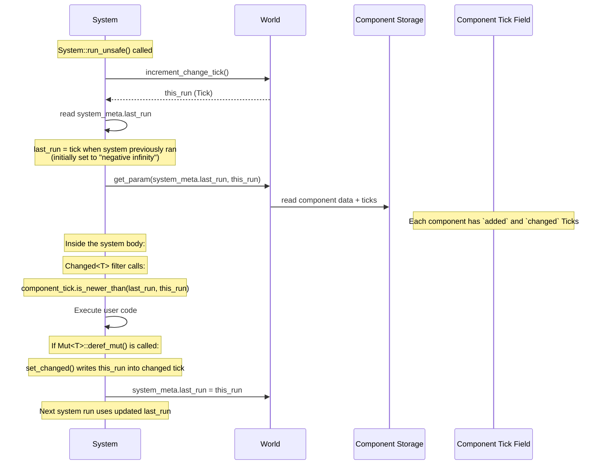
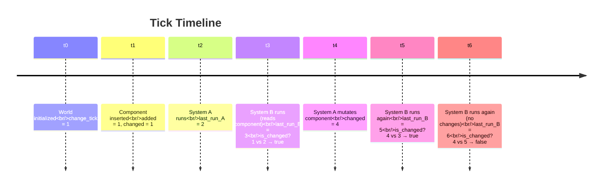

# Bevy ECS Change Detection

> Research compiled from Bevy's source code at commit `main` (July 2026).
> Primary files: `crates/bevy_ecs/src/change_detection/`, `crates/bevy_ecs/src/query/filter.rs`, `crates/bevy_ecs/src/system/`

---

## 1. Overview

Bevy's change detection answers the question: **"Has this component/resource been modified since my system last ran?"** It powers `Changed<T>`, `Added<T>`, and `Spawned` query filters, enabling systems to react only to fresh data without comparing values.

The system is **not value-based** — Bevy does **not** compare old and new component values. Instead, it tracks **when** a component was last modified using a monotonically increasing tick counter stored on the `World`. Each component stores two ticks (`added` and `changed`), and each system remembers the tick when it last ran. Comparing these ticks reveals whether a change occurred since the system's previous execution.

---

## 2. Core Concepts

### 2.1 World-level Tick Counter

Every `World` has an atomic tick counter and two reference ticks:

```rust
// In World (world/mod.rs)
pub(crate) change_tick: AtomicU32,
pub(crate) last_change_tick: Tick,
pub(crate) last_check_tick: Tick,
```

- **`change_tick`**: increments each time a **system** runs (via `world.increment_change_tick()`), or when `clear_trackers()` is called.
- **`last_change_tick`**: snapshot of `change_tick` taken at the last `clear_trackers()` call (or at the last exclusive system run). Used as the "last run" baseline for direct `World` access (outside systems).
- **`last_check_tick`**: snapshot taken at the last `check_change_ticks()` scan, used to decide when to scan again.

Default world starts with `change_tick = 1`, `last_change_tick = Tick::new(0)`, `last_check_tick = Tick::new(0)`.

### 2.2 `Tick` type

```rust
// change_detection/tick.rs
#[derive(Copy, Clone, Default, Debug, Eq, Hash, PartialEq)]
pub struct Tick {
    tick: u32,
}
```

A thin wrapper around `u32`. Two special constants:

```rust
// change_detection/mod.rs
pub const CHECK_TICK_THRESHOLD: u32 = 518_400_000;  // ~1 hour at 144fps
pub const MAX_CHANGE_AGE: u32 = u32::MAX - (2 * CHECK_TICK_THRESHOLD - 1);
```

```rust
// change_detection/tick.rs
impl Tick {
    pub const MAX: Self = Self::new(MAX_CHANGE_AGE);

    pub const fn new(tick: u32) -> Self { Self { tick } }
    pub const fn get(self) -> u32 { self.tick }
    pub fn set(&mut self, tick: u32) { self.tick = tick; }
}
```

### 2.3 `Tick::is_newer_than` — the heart of change detection

```rust
// change_detection/tick.rs
pub fn is_newer_than(self, last_run: Tick, this_run: Tick) -> bool {
    let ticks_since_insert = this_run.relative_to(self).tick.min(MAX_CHANGE_AGE);
    let ticks_since_system = this_run.relative_to(last_run).tick.min(MAX_CHANGE_AGE);
    ticks_since_system > ticks_since_insert
}
```

Where `relative_to` handles `u32` wraparound:

```rust
pub(crate) fn relative_to(self, other: Self) -> Self {
    let tick = self.tick.wrapping_sub(other.tick);
    Self { tick }
}
```

The logic: if the time elapsed since the system last ran (`ticks_since_system`) is **greater** than the time elapsed since the component was changed (`ticks_since_insert`), then the component must have been changed **after** the system last ran → **change detected**.

The `.min(MAX_CHANGE_AGE)` ensures determinism: once a component is older than `MAX_CHANGE_AGE` ticks, it stops being detected as changed, regardless of when the scan happens.

### 2.4 `ComponentTicks` — per-component tick storage

```rust
// change_detection/tick.rs
#[derive(Copy, Clone, Debug)]
pub struct ComponentTicks {
    pub added: Tick,
    pub changed: Tick,
}
```

Two ticks stored for **every** component instance (and resource):
- **`added`**: set to the current `change_tick` when the component is first inserted.
- **`changed`**: set to the current `change_tick` when the component is added **or** mutably dereferenced.

When a component is first added, **both** ticks are set to the same value (`ComponentTicks::new(change_tick)`).

### 2.5 System Lifecycle and Tick Propagation

Every system has a `SystemMeta`:

```rust
// system/system.rs (abbreviated)
pub struct SystemMeta {
    pub(crate) last_run: Tick,
    // ...
}
```

When a `FunctionSystem` is **initialized**:

```rust
// system/function_system.rs
self.system_meta.last_run = world.change_tick().relative_to(Tick::MAX);
```

This sets `last_run` to a value effectively equivalent to "negative infinity" — ensuring the first system run detects all existing components as added/changed.

When a `FunctionSystem` **runs**:

```rust
// system/function_system.rs (run_unsafe)
let change_tick = world.increment_change_tick();
// ... get_param is called with (world, system_meta.last_run, change_tick) ...
self.system_meta.last_run = change_tick;
```

The sequence is:
1. Increment the world's change tick → get `this_run`
2. Pass `(last_run, this_run)` to all `SystemParam::get_param(...)` calls
3. After the system body executes, update `last_run = this_run`

When a `SystemState` fetches parameters:

```rust
// system/function_system.rs (FunctionSystemState::fetch)
let change_tick = world.increment_change_tick();
let param = Param::get_param(&mut state.param, &meta, world, change_tick)?;
meta.last_run = change_tick;
Ok(param)
```

---

## 3. Key Types and Traits

### 3.1 `DetectChanges` trait (read-only change queries)

```rust
// change_detection/traits.rs
pub trait DetectChanges {
    fn is_added(&self) -> bool;
    fn is_changed(&self) -> bool;
    fn is_added_after(&self, other: Tick) -> bool;
    fn is_changed_after(&self, other: Tick) -> bool;
    fn last_changed(&self) -> Tick;
    fn added(&self) -> Tick;
    fn this_run(&self) -> Tick;
    fn last_run(&self) -> Tick;
    fn changed_by(&self) -> MaybeLocation;
}
```

The base implementation (via `change_detection_impl!` macro):

```rust
// change_detection/traits.rs
// (macro-expanded for clarity)
impl DetectChanges for SomeWrapper<T> {
    fn is_added(&self) -> bool {
        self.is_added_after(self.ticks.last_run)
    }
    fn is_changed(&self) -> bool {
        self.is_changed_after(self.ticks.last_run)
    }
    fn is_added_after(&self, other: Tick) -> bool {
        self.ticks.added.is_newer_than(other, self.ticks.this_run)
    }
    fn is_changed_after(&self, other: Tick) -> bool {
        self.ticks.changed.is_newer_than(other, self.ticks.this_run)
    }
}
```

Implemented by: `Res<'w, T>`, `Ref<'w, T>`, `Mut<'w, T>`, `ResMut<'w, T>`, `NonSend<'w, T>`, `NonSendMut<'w, T>`, `MutUntyped<'w>`.

### 3.2 `DetectChangesMut` trait — marking changes

```rust
// change_detection/traits.rs
pub trait DetectChangesMut: DetectChanges {
    type Inner: ?Sized;

    fn set_changed(&mut self);
    fn set_added(&mut self);
    fn set_last_changed(&mut self, last_changed: Tick);
    fn set_last_added(&mut self, last_added: Tick);
    fn bypass_change_detection(&mut self) -> &mut Self::Inner;

    // Provided methods:
    fn set_if_neq(&mut self, value: Self::Inner) -> bool where Self::Inner: Sized + PartialEq;
    fn replace_if_neq(&mut self, value: Self::Inner) -> Option<Self::Inner>;
    fn clone_from_if_neq<T>(&mut self, value: &T) -> bool;
}
```

The `DerefMut` implementation (via `change_detection_mut_impl!` macro) is the key automatic trigger:

```rust
// change_detection/traits.rs
impl DerefMut for SomeMutWrapper<T> {
    fn deref_mut(&mut self) -> &mut T {
        self.set_changed();
        self.value
    }
}
```

**Every** `&mut` dereference marks the component as changed, regardless of whether the value actually changed.

`set_changed` writes `this_run` into the `changed` tick:

```rust
fn set_changed(&mut self) {
    *self.ticks.changed = self.ticks.this_run;
    self.ticks.changed_by.assign(MaybeLocation::caller());
}
```

### 3.3 `Mut<T>` — mutable smart pointer

```rust
// change_detection/params.rs
pub struct Mut<'w, T: ?Sized> {
    pub(crate) value: &'w mut T,
    pub(crate) ticks: ComponentTicksMut<'w>,
}
```

Where `ComponentTicksMut` holds mutable references to the actual per-component ticks:

```rust
// change_detection/params.rs
pub(crate) struct ComponentTicksMut<'w> {
    pub(crate) added: &'w mut Tick,
    pub(crate) changed: &'w mut Tick,
    pub(crate) changed_by: MaybeLocation<&'w mut &'static Location<'static>>,
    pub(crate) last_run: Tick,
    pub(crate) this_run: Tick,
}
```

`Mut<T>` supports `map_unchanged`, `reborrow`, `as_deref_mut`, `into_inner`.

### 3.4 `Ref<T>` — immutable change-detection wrapper

```rust
// change_detection/params.rs
pub struct Ref<'w, T: ?Sized> {
    pub(crate) value: &'w T,
    pub(crate) ticks: ComponentTicksRef<'w>,
}
```

`Ref<T>` is `Copy + Clone`. It is used in queries to access change detection information on components **without** requiring `&mut` access. The ticks are read-only:

```rust
// change_detection/params.rs
pub(crate) struct ComponentTicksRef<'w> {
    pub(crate) added: &'w Tick,
    pub(crate) changed: &'w Tick,
    pub(crate) changed_by: MaybeLocation<&'w &'static Location<'static>>,
    pub(crate) last_run: Tick,
    pub(crate) this_run: Tick,
}
```

When querying, `Ref<T>` is the immutable counterpart to `Mut<T>` — use `Ref<T>` in a query when you only need to **read** a component but still want change detection information.

### 3.5 `Res<T>` and `ResMut<T>` — resource wrappers

Both wrap a reference to the resource along with tick information. `ResMut<T>` implements `DetectChangesMut`; `Res<T>` implements `DetectChanges`. Internally they use `ComponentTicksRef` and `ComponentTicksMut` respectively.

```rust
// change_detection/params.rs
pub struct Res<'w, T: ?Sized + Resource> {
    pub(crate) value: &'w T,
    pub(crate) ticks: ComponentTicksRef<'w>,
}

pub struct ResMut<'w, T: ?Sized + Resource<Mutability = Mutable>> {
    pub(crate) value: &'w mut T,
    pub(crate) ticks: ComponentTicksMut<'w>,
}
```

### 3.6 `MutUntyped` — type-erased mutable access

```rust
// change_detection/params.rs
pub struct MutUntyped<'w> {
    pub(crate) value: PtrMut<'w>,
    pub(crate) ticks: ComponentTicksMut<'w>,
}
```

Implements `DetectChangesMut` directly (not via macro). Used for dynamic component access.

### 3.7 Query Filters: `Added<T>` and `Changed<T>`

**`Changed<T>`** — defined in `query/filter.rs`:

```rust
pub struct ChangedFetch<'w, T: Component> {
    ticks: StorageSwitch<T,
        Option<ThinSlicePtr<'w, UnsafeCell<Tick>>>,   // Table storage
        Option<&'w ComponentSparseSet>,                // Sparse storage
    >,
    last_run: Tick,
    this_run: Tick,
}
```

The filter fetch checks the **changed** tick:

```rust
// query/filter.rs (Changed<T>::filter_fetch)
unsafe fn filter_fetch(..., entity, table_row) -> bool {
    fetch.ticks.extract(
        |table| { /* read changed tick from table column */ },
        |sparse_set| { /* read changed tick from sparse set */ },
    )
    .map(|tick| tick.deref().is_newer_than(fetch.last_run, fetch.this_run))
}
```

**`Added<T>`** — identical structure but reads the **added** tick column instead of the changed tick column.

Both filters are **not archetypal** (`IS_ARCHETYPAL = false`), meaning they must iterate over every matching entity even if none were changed/added.

### 3.8 `Spawned` filter

```rust
// query/filter.rs
pub struct SpawnedFetch<'w> {
    entities: &'w Entities,
    last_run: Tick,
    this_run: Tick,
}
```

Reads the entity's spawn/despawn tick from `Entities` metadata:

```rust
unsafe fn filter_fetch(...) -> bool {
    let (_, spawned) = fetch.entities.entity_get_spawned_or_despawned_unchecked(entity);
    spawned.is_newer_than(fetch.last_run, fetch.this_run)
}
```

### 3.9 `SystemChangeTick` — manual tick access

```rust
// system/system_param.rs
pub struct SystemChangeTick {
    last_run: Tick,
    this_run: Tick,
}
```

A `SystemParam` you can add to any system to manually compare ticks:

```rust
impl SystemChangeTick {
    pub fn this_run(&self) -> Tick { self.this_run }
    pub fn last_run(&self) -> Tick { self.last_run }
}
```

---

## 4. How It Works End-to-End



### Change detection timeline



### Concrete example

1. **World tick = 1**, system `last_run = 0` (initialized to `Tick::new(0)`).
2. A component `C` is spawned: `C.added = 1`, `C.changed = 1`.
3. System `S` runs for the first time: `this_run = 2`.
   - `C.changed.is_newer_than(0, 2)`: `ticks_since_insert = 2-1 = 1`, `ticks_since_system = 2-0 = 2`. Since `2 > 1`, change is detected.
   - System body runs. `S.last_run = 2`.
4. Another system `T` mutates `C` at tick 5: `C.changed = 5`.
5. System `S` runs again at tick 7:
   - `C.changed.is_newer_than(2, 7)`: `ticks_since_insert = 7-5 = 2`, `ticks_since_system = 7-2 = 5`. Since `5 > 2`, change is detected.
   - `S.last_run = 7`.
6. System `S` runs again at tick 9 (no mutations to C in between):
   - `C.changed.is_newer_than(7, 9)`: `ticks_since_insert = 9-5 = 4`, `ticks_since_system = 9-7 = 2`. Since `2 < 4`, change is **not** detected.

---

## 5. Edge Cases and Tradeoffs

### 5.1 Tick Overflow and Periodic Scanning

`u32` ticks will eventually wrap around. Bevy handles this with `check_change_ticks()`:

```rust
// world/mod.rs
pub fn check_change_ticks(&mut self) -> Option<CheckChangeTicks> {
    let change_tick = self.change_tick();
    if change_tick.relative_to(self.last_check_tick).get() < CHECK_TICK_THRESHOLD {
        return None;  // Not enough ticks have elapsed since last scan
    }
    // Scan all tables, sparse sets, non-sends, entities
    tables.check_change_ticks(check);
    sparse_sets.check_change_ticks(check);
    non_sends.check_change_ticks(check);
    entities.check_change_ticks(check);
    // Clamp ticks older than MAX_CHANGE_AGE
    self.last_check_tick = change_tick;
}
```

`Tick::check_tick` clamps values:

```rust
pub fn check_tick(&mut self, check: CheckChangeTicks) -> bool {
    let age = check.present_tick().relative_to(*self);
    if age.get() > Self::MAX.get() {
        *self = check.present_tick().relative_to(Self::MAX);
        true
    } else {
        false
    }
}
```

This ensures that component ticks never get older than `MAX_CHANGE_AGE` relative to the present, preventing wraparound false positives.

**Tradeoff**: Change detection stops working for components older than `MAX_CHANGE_AGE`. Bevy chooses `MAX_CHANGE_AGE ≈ u32::MAX - 2*CHECK_TICK_THRESHOLD ≈ 3.5 billion ticks`, which at 144fps is years of runtime.

### 5.2 `Commands` — Deferred Mutations

Changes made via `Commands` (e.g., `commands.entity(e).insert(...)`) are deferred. They are applied during `ApplyDeferred` (at sync points in the schedule). This means:

- If system A queues a component insertion via commands, system B running **in the same schedule stage** (before `ApplyDeferred`) will **not** see that change via `Changed<T>`.
- Change detection for commands only works **after** the deferred operations are applied.

The doc comments state:

> Note, that entity modifications issued with `Commands` (like entity creation or entity component addition or removal) are visible only after deferred operations are applied, typically after the system that queued them.

### 5.3 `Mut<T>` Drop — No special behavior

When a `Mut<T>` is dropped, there is **no** additional tick update. The tick update happens eagerly in `DerefMut`. Dropping without dereferencing leaves the tick unchanged. This is intentional — if you obtain a `Mut<T>` but never write to it, change detection is not triggered.

### 5.4 `bypass_change_detection`

```rust
fn bypass_change_detection(&mut self) -> &mut Self::Inner { self.value }
```

Allows mutation without updating the `changed` tick. Used for:
- Avoiding infinite recursion when synchronizing representations via change detection
- Performance optimization when you know the mutation doesn't affect downstream logic

### 5.5 `set_if_neq` — Conditional Change Detection

```rust
fn set_if_neq(&mut self, value: Self::Inner) -> bool
where Self::Inner: Sized + PartialEq {
    let old = self.bypass_change_detection();
    if *old != value {
        *old = value;
        self.set_changed();
        true
    } else {
        false
    }
}
```

Only marks as changed when the value actually differs. Requires `PartialEq`.

### 5.6 `UnsafeWorldCell`

When accessing the world directly (not through a system), `UnsafeWorldCell` provides the `last_run` tick:

```rust
impl UnsafeWorldCell<'_> {
    pub fn last_change_tick(&self) -> Tick { self.world.last_change_tick }
    pub fn change_tick(&self) -> Tick { self.world.change_tick() }
    pub fn increment_change_tick(&self) -> Tick { /* atomic increment */ }
}
```

Direct `World::get_mut()` uses `world.last_change_tick` as the `last_run` parameter in tick comparisons, and `world.change_tick()` as `this_run`. This means changes detected via direct world access persist until `clear_trackers()` is called.

### 5.7 `clear_trackers()`

```rust
pub fn clear_trackers(&mut self) {
    self.removed_components.update();
    self.last_change_tick = self.increment_change_tick();
}
```

Advances `last_change_tick` so that components changed/detected before this point are no longer detected as "new." Called automatically at the end of each `App::update()`.

### 5.8 Immediate vs. Changed

`is_changed()` returns `true` for both newly **added** components and components that were **mutated**. To distinguish:

```rust
if component.is_changed() && !component.is_added() {
    // Mutated but not newly added
}
```

### 5.9 Concurrency and Read-Only Access

`Ref<T>` is `Copy + Clone`, enabling shared reads. Since the underlying ticks are stored in `UnsafeCell`s, reading them through `Ref<T>` is safe because `Ref<T>` takes read-only access to the world. The scheduler ensures that no mutable access conflicts with these reads.

### 5.10 `ChangedBy` tracking

Every component also stores a `MaybeLocation<&'static Location<'static>>` tracking **where** (source location) the component was last changed. This is exposed via `DetectChanges::changed_by()` and is purely for debugging.

---

## 6. Key Source Code References

| Concept | File | Notable Lines |
|---|---|---|
| `Tick` struct | `crates/bevy_ecs/src/change_detection/tick.rs` | `struct Tick` (L18), `is_newer_than` (L55), `relative_to` (L71), `check_tick` (L82) |
| `CheckChangeTicks` event | `crates/bevy_ecs/src/change_detection/tick.rs` | `struct CheckChangeTicks` (L97) |
| `ComponentTickCells` | `crates/bevy_ecs/src/change_detection/tick.rs` | `struct ComponentTickCells` (L116) |
| `ComponentTicks` | `crates/bevy_ecs/src/change_detection/tick.rs` | `struct ComponentTicks` (L130), `is_added` (L141), `is_changed` (L147), `set_changed` (L171) |
| `CHECK_TICK_THRESHOLD`, `MAX_CHANGE_AGE` | `crates/bevy_ecs/src/change_detection/mod.rs` | L10, L16 |
| `DetectChanges` trait | `crates/bevy_ecs/src/change_detection/traits.rs` | `trait DetectChanges` (L36), all methods |
| `DetectChangesMut` trait | `crates/bevy_ecs/src/change_detection/traits.rs` | `trait DetectChangesMut` (L107), `set_changed` (L130), `set_if_neq` (L204) |
| `change_detection_impl!` macro | `crates/bevy_ecs/src/change_detection/traits.rs` | Macro generating `DetectChanges` + `Deref` |
| `change_detection_mut_impl!` macro | `crates/bevy_ecs/src/change_detection/traits.rs` | Macro generating `DetectChangesMut` + `DerefMut` |
| `Mut<T>` struct | `crates/bevy_ecs/src/change_detection/params.rs` | `struct Mut` (L458), `new()` (L478) |
| `Ref<T>` struct | `crates/bevy_ecs/src/change_detection/params.rs` | `struct Ref` (L290), `new()` (L326) |
| `Res<T>` / `ResMut<T>` | `crates/bevy_ecs/src/change_detection/params.rs` | `struct Res` (L251), `struct ResMut` (L291) |
| `MutUntyped` | `crates/bevy_ecs/src/change_detection/params.rs` | `struct MutUntyped` (L554) |
| `ComponentTicksMut` | `crates/bevy_ecs/src/change_detection/params.rs` | `struct ComponentTicksMut` (L131) |
| `ComponentTicksRef` | `crates/bevy_ecs/src/change_detection/params.rs` | `struct ComponentTicksRef` (L12) |
| `ContiguousComponentTicksRef/Mut` | `crates/bevy_ecs/src/change_detection/params.rs` | Batch tick operations for contiguous iteration |
| `Changed<T>` filter | `crates/bevy_ecs/src/query/filter.rs` | `struct Changed` (L340), `filter_fetch` (L484) |
| `Added<T>` filter | `crates/bevy_ecs/src/query/filter.rs` | `struct Added` (L215), `filter_fetch` (L352) |
| `Spawned` filter | `crates/bevy_ecs/src/query/filter.rs` | `struct Spawned` (L538), `filter_fetch` (L646) |
| `World::change_tick` | `crates/bevy_ecs/src/world/mod.rs` | `change_tick` field (L83), `increment_change_tick` (L760) |
| `World::last_change_tick` | `crates/bevy_ecs/src/world/mod.rs` | `last_change_tick` field (L84) |
| `World::clear_trackers` | `crates/bevy_ecs/src/world/mod.rs` | `clear_trackers()` (L990) |
| `World::check_change_ticks` | `crates/bevy_ecs/src/world/mod.rs` | `check_change_ticks()` (L848) |
| `SystemMeta` | `crates/bevy_ecs/src/system/function_system.rs` | `struct SystemMeta` (L55), `last_run` field (L59) |
| `System::run_unsafe` (tick management) | `crates/bevy_ecs/src/system/function_system.rs` | `run_unsafe()` (L309), change_tick increment (L322), last_run update (L345) |
| `System::initialize` (last_run init) | `crates/bevy_ecs/src/system/function_system.rs` | `initialize()` (L356), `last_run` = `change_tick.relative_to(Tick::MAX)` (L362) |
| `SystemChangeTick` param | `crates/bevy_ecs/src/system/system_param.rs` | `struct SystemChangeTick` (L610) |
| `SystemParam::get_param` with ticks | `crates/bevy_ecs/src/system/system_param.rs` | Query get_param passes `system_meta.last_run` and `change_tick` |
| `UnsafeWorldCell::get_resource_with_ticks` | `crates/bevy_ecs/src/world/unsafe_world_cell.rs` | Returns `(Ptr, ComponentTickCells)` for resource access |
