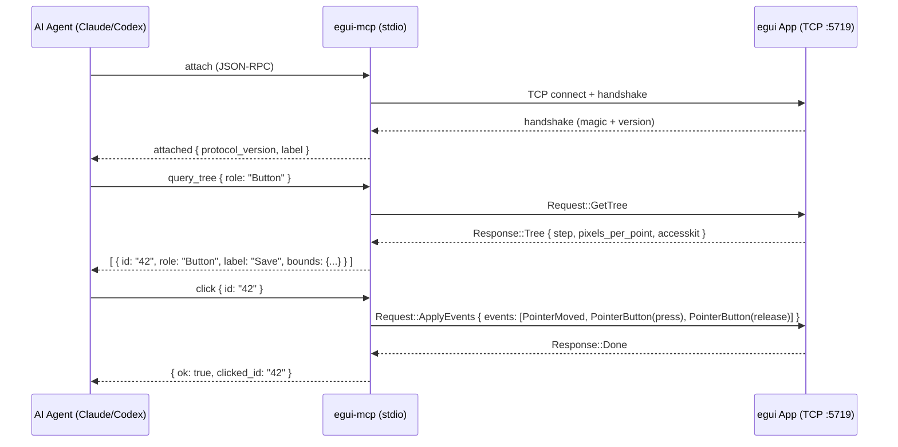

# egui_mcp Analysis for kairos_editor_mcp

**Date:** 2026-07-24
**Sources:** https://github.com/rerun-io/kittest_inspector/tree/main/crates/egui_mcp
**Status:** Complete

---

## 1. What is egui_mcp?

`egui_mcp` is an **MCP (Model Context Protocol) server** that lets an AI agent (Claude, Codex, etc.) **drive a live egui application**. It connects to a running egui app over the `egui_inspection` protocol and exposes MCP tools that let the agent:

- **Read** the app's AccessKit widget tree (`query_tree` / `get_node`)
- **Act** on widgets — click, type, scroll, drag, press keys (`click`, `type_text`, `scroll`, `drag`, `press_key`)
- **Observe** visual state via screenshots (`screenshot`)
- **Wait** for async/animating UI to settle (`wait_for`)
- **Resize** the viewport (`resize`)
- **Batch** multiple actions into one round-trip (`batch`)

It is distributed as a standalone binary (`egui-mcp`) that the agent spawns as a subprocess, communicating via JSON-RPC over stdio (the MCP transport). The binary connects to the target egui app over TCP (default `127.0.0.1:5719`).

The crate's library surface (`lib.rs`) is deliberately designed so **another MCP server** can reuse the UI-driving tools while providing its own connection logic — this is the primary integration path for `kairos_editor_mcp`.

### High-Level Data Flow



---

## 2. Architecture & API

### 2.1 Crate Structure

```
crates/egui_mcp/
├── Cargo.toml          # Binary + library, depends on rmcp, egui_inspection, accesskit
├── README.md           # User-facing setup instructions
├── CHANGELOG.md
└── src/
    ├── main.rs         # Thin binary: init tracing → run tokio runtime → server::run()
    ├── lib.rs          # Public API surface: re-exports bridge, server, tools, tree
    ├── server.rs       # MCP stdio entry point (rmcp serve on stdin/stdout)
    ├── tools.rs        # MCP tool definitions + dispatch (Server, UiServer, all tool handlers)
    ├── tree.rs         # AccessKit tree querying, node filtering, locator resolution
    └── bridge.rs       # Transport abstraction, TCP connect, request/response protocol
```

### 2.2 Transport Abstraction (bridge.rs)

The `Bridge` is the central integration point. It abstracts over **how** requests reach the app:

```rust
pub trait Transport: Send + Sync {
    fn request(&self, req: Request) -> BoxFuture<'_, Result<Response, String>>;
}

pub struct Bridge {
    transport: Box<dyn Transport>,
    pub peer_info: PeerInfo,
}
```

- **`FramedTransport`** — length-prefixed MessagePack frames over any `AsyncRead`/`AsyncWrite` pair (used by the standalone binary over TCP).
- **`Bridge::with_transport()`** — accepts any `Transport` impl, enabling a host with its own channel (e.g., gRPC, an in-process channel, or a tunneled connection) to drive the same tools.

The `egui_inspection` protocol defines these request/response variants:

| Request | Response | Purpose |
|---------|----------|---------|
| `GetTree` | `Tree { step, pixels_per_point, accesskit }` | Fetch the current AccessKit tree |
| `ApplyEvents { events }` | `Done` | Inject egui input events |
| `GetScreenshot { pixels_per_point }` | `Screenshot(EncodedPng)` | Capture a rendered frame |
| `Resize { width, height }` | `Done` | Resize the viewport |
| `GetInfo` | `Info { label, ... }` | Get app metadata |

### 2.3 Complete Tool Catalog

All tools are defined in `tools.rs` via the `#[tool]` attribute macro from `rmcp`. Input parameters are typed structs with `schemars::JsonSchema` derives, producing auto-generated JSON schemas for the MCP client.

#### Lifecycle Tools (on `Server`)

| Tool | Parameters | Returns | Description |
|------|-----------|---------|-------------|
| `attach` | `host` ("127.0.0.1"), `port` (5719), `timeout_secs` | `{ ok, attached: PeerInfo }` | Connect to a running egui app's inspection port. Retries until timeout. |
| `disconnect` | *(none)* | `{ ok }` | Disconnect from the attached app. |
| `status` | *(none)* | `{ state: "idle" \| "connected", peer }` | Report connection state. |

#### App-Driving Tools (on `UiServer`)

| Tool | Key Parameters | Returns | Description |
|------|---------------|---------|-------------|
| `query_tree` | `role`, `content_contains`, `label_contains`, `value_contains`, `visible_only` (default true), `limit` (default 200) | `{ nodes: [NodeView] }` | Walk the AccessKit tree; return matching nodes with id, role, label, value, bounds, focused, disabled, hidden, parent_id. |
| `get_node` | `id` | `{ node: NodeView \| null }` | Lookup a single node by exact id. Returns null (not error) for missing ids. |
| `click` | Target (`id` \| query \| `pos`), `button` (primary/secondary/middle/extra1/extra2), `count` (1=click, 2=double, 3=triple), `modifiers` | `{ ok, clicked_id, pos }` | Move pointer to widget center, press + release button (× count). |
| `hover` | Target | `{ ok, hovered_id, pos }` | Move pointer over widget without clicking. Useful before `wait_for` to trigger tooltips. |
| `scroll` | Target, `delta` (logical points), `modifiers` | `{ ok, scrolled_id, pos, delta }` | Send mouse wheel scroll. Positive Y = scroll down. |
| `drag` | `start` Target, `end` Target, `steps` (default 8), `modifiers` | `{ ok, start_id, end_id, start_pos, end_pos }` | Primary-button drag from start to end with interpolated pointer moves. |
| `type_text` | `text`, optional `id`/query for focus target | `{ ok, focused_id }` | Focus a widget (via AccessKit action, not click), then type. Omitting the target types into whatever is currently focused. |
| `press_key` | `key` (egui key name), `modifiers` | `{ ok, key }` | Send key down + up. Keys: `Backspace`, `Delete`, `Enter`, `Tab`, `A`–`Z`, `ArrowLeft`, etc. |
| `screenshot` | `pixels_per_point` (default 1.0), `save_path` (optional) | PNG image + metadata | Capture rendered frame as base64 PNG. Requires visible window. |
| `resize` | `width`, `height` (logical points) | `{ ok, width, height }` | Resize viewport dimensions. |
| `wait_for` | Query, `timeout_secs` (default 5), `min_matches` (default 1), `min_steps` (default 0) | `{ ok, matched, steps_waited }` | Poll the tree until conditions hold (≥ N visible matches AND ≥ M frames rendered). |
| `batch` | `actions: [{ name, args }]` | Array of step results + images | Execute multiple app-driving tools in one round-trip. Stops on first error. Cannot nest. |

#### Target Resolution

Tools that act on a widget (`click`, `hover`, `scroll`, `drag`) accept a `Target` that can be specified in three ways:

1. **`id`** — a node id from `query_tree` (most precise, survives layout changes)
2. **Query match** — `role`, `content_contains`, `label_contains`, `value_contains` (resolved to center of bounding box; must match exactly one node)
3. **`pos: { x, y }`** — raw logical-point coordinates (fallback when nothing else works)

The `content_contains` field is recommended over `label_contains`/`value_contains` because many egui widgets (Label, monospace text, counters) carry their text in `value` not `label`.

### 2.4 How It Simulates User Interactions

All interactions are synthesized as `egui::Event` vectors sent via `Request::ApplyEvents`:

```rust
// Click = PointerMoved + (PointerButton press + release) × count
let mut events = vec![Event::PointerMoved(center)];
for _ in 0..count {
    events.push(Event::PointerButton { pos: center, button, pressed: true, modifiers });
    events.push(Event::PointerButton { pos: center, button, pressed: false, modifiers });
}
bridge.apply_events(events).await?;

// Drag = PointerMoved(start) + PointerButton(press) + N interpolated PointerMoved + PointerButton(release)
// Type = AccessKitActionRequest(Focus) + Event::Text(...)
// Key = Event::Key(press) + Event::Key(release)
```

**Important:** The app-side plugin is intentionally low-level. All locator resolution (fetching the AccessKit tree, finding the node, computing the logical-point center of its bounding box) happens **MCP-side** in `tools.rs`. The app just receives raw `egui::Event` vectors and processes them in the next frame.

### 2.5 How It Handles egui's Immediate-Mode Nature

`egui_mcp` does **not** directly interact with egui's immediate-mode `Response` objects or `Ui` state. Instead, it interacts through two indirections:

1. **AccessKit tree** — egui builds an accessibility tree each frame. `egui_mcp` reads this tree via `GetTree` to discover widgets, their positions, labels, roles, focus state, etc. This is a **retained** snapshot — available even when a widget is not currently being drawn (unlike immediate-mode `Response` objects).

2. **Event injection** — `egui_mcp` pushes `egui::Event`s onto the input queue. In the next frame, egui processes them normally through its input system. The agent then reads back the updated tree or captures a screenshot to verify the result.

The `wait_for` tool handles the async gap — it polls `GetTree` in a loop (100ms intervals) until conditions hold, bridging the agent's synchronous reasoning with the app's frame-by-frame update cycle.

### 2.6 How It Exposes UI State

`query_tree` returns `NodeView` structs:

```rust
pub struct NodeView {
    pub id: String,          // u64 AccessKit NodeId, for targeting
    pub role: String,        // "Button", "Label", "TextInput", "Window", "CheckBox", ...
    pub label: Option<String>,  // Accessible name
    pub value: Option<String>,  // Text content / numeric value
    pub bounds: Option<RectF>,  // Logical-point bounding box (x, y, w, h)
    pub focused: bool,
    pub disabled: bool,
    pub hidden: bool,
    pub parent_id: Option<String>,
}
```

This is a flattened view of the hierarchical AccessKit tree. The agent uses `query_tree` to discover widgets, then targets them by id or content match.

Key limitation: **only what egui exposes to AccessKit is visible**. Custom-drawn content, GPU-rendered scene views, and raw `egui::Painter` calls are invisible to the tree. Screenshots fill this gap for visual verification but can't be used for targeting.

---

## 3. Integration Points

### 3.1 What the egui Application Must Provide

For `egui_mcp` (the standalone binary) to drive an app, the app needs:

1. **eframe's `inspection` feature** (or manual `egui_inspection` plugin registration):

```toml
# Cargo.toml
[dependencies]
eframe = { version = "0.35.0", features = ["inspection"] }
```

2. **`EGUI_INSPECTION` env var** set at runtime:
```sh
EGUI_INSPECTION=1 cargo run   # binds 127.0.0.1:5719
```

3. **Visible window** for screenshots (macOS limitation: occluded/minimized windows can't render frames).

For embedding `UiServer` directly (the library path `kairos_editor_mcp` would take), the app needs to:

1. Register `InspectionPlugin` with the egui context:
```rust
ctx.add_plugin(egui_inspection::InspectionPlugin::new(Some("KairosEngine".to_owned())));
```

2. Provide a `Transport` implementation that connects the MCP server to the app's inspection channel. This could be:
   - TCP (reusing `FramedTransport`)
   - An in-process channel (custom `Transport` impl over `tokio::sync::mpsc` or `crossbeam`)
   - A tunnel over the KairosEngine test harness protocol

### 3.2 How It Hooks Into egui's Rendering/Layout Cycle

The `InspectionPlugin` hooks into egui's plugin system at these points:

- **`on_events`** — receives input events from `ApplyEvents` and injects them into egui's input queue for the next frame.
- **Post-frame** — after each frame, the AccessKit tree is updated. `GetTree` reads this updated tree.
- **`Screenshot`** — captures the rendered frame buffer (requires GPU readback, which is why the window must be visible on macOS).

The MCP server does **not** participate in the rendering/layout cycle. It is an external observer/controller that sends commands between frames.

### 3.3 Dependencies on egui APIs

| egui API | Used by | Purpose |
|----------|---------|---------|
| `egui::Context` | App-side `InspectionPlugin` | Plugin registration, screenshot capture |
| `egui::Event` | `tools.rs` (MCP-side) | Synthesized input events (PointerMoved, PointerButton, Key, Text, MouseWheel, AccessKitActionRequest) |
| `egui::Pos2`, `egui::Vec2` | `tools.rs` | Coordinate math for targets |
| `egui::PointerButton` | `tools.rs` | Button enum mapping |
| `egui::Modifiers` | `tools.rs` | Keyboard modifier flags |
| `egui::Key` | `tools.rs` | Key name parsing (`Key::from_name`) |
| AccessKit (`accesskit::NodeId`, `accesskit::Role`, `accesskit::Action`, `accesskit::ActionRequest`) | `tree.rs`, `tools.rs` | Tree traversal, role validation, focus requests |
| `accesskit_consumer::Tree` | `tree.rs`, `bridge.rs` | Build queryable tree from AccessKit update |

### 3.4 ViewportId and Window Management

`egui_mcp` does **not** expose `ViewportId` or multi-window management. The `resize` tool resizes the **main viewport** only. There is no concept of multiple windows, viewport targeting, or per-viewport operations.

For KairosEngine, which uses docking tabs within a single egui viewport (via its `ui/docking_tab` module), this limitation is acceptable for an initial integration — all UI lives in one viewport. If KairosEngine later supports multiple viewports or detached windows, window management would need to be added.

---

## 4. How kairos_editor_mcp Could Build on egui_mcp

### 4.1 What kairos_editor_mcp Would ADD Beyond egui_mcp

`egui_mcp` provides generic egui app driving. `kairos_editor_mcp` would add **editor-specific semantics** on top:

| Layer | egui_mcp | kairos_editor_mcp |
|-------|----------|-------------------|
| **Widget targeting** | Generic: AccessKit id, role, text match | Semantic: "the inspector panel for entity #42", "the material dropdown in the material inspector", "the hierarchy tree node named `Player`" |
| **State queries** | AccessKit tree only (labels, values, bounds) | Engine state: ECS world snapshot, entity components, asset registry contents, physics state |
| **Commands** | Click, type, scroll, drag, key press | Editor actions: "select entity X in hierarchy", "set component field Y to Z", "create new material asset", "save scene" |
| **Scene view** | Screenshot only (pixels) | Scene picking: "click on mesh at world position", "orbit camera to look at entity" |
| **Project tree** | AccessKit tree traversal | File operations: "open asset X", "create directory Y", "navigate to path Z" |

### 4.2 Architecture: Two Proposed Designs

#### Design A: Separate MCP Server, Reuse UiServer

```
┌─────────────────────────────────────────────────────┐
│ kairos_editor_mcp (binary)                          │
│                                                     │
│  Server (rmcp)                                      │
│  ├── lifecycle: attach/disconnect/status             │
│  ├── UiServer (from egui_mcp)                       │
│  │   └── generic egui tools: click, type, query_tree │
│  └── EditorTools                                     │
│      ├── editor-specific queries                     │
│      │   ├── get_entity(id) → component snapshot     │
│      │   ├── query_entities(filter) → id list        │
│      │   ├── get_asset_registry() → asset list       │
│      │   ├── get_project_tree() → file tree          │
│      │   └── get_scene_state() → camera, selection   │
│      ├── editor actions                              │
│      │   ├── select_entity(id)                       │
│      │   ├── set_component(entity_id, field, value)   │
│      │   ├── create_asset(type, path)                │
│      │   ├── save_scene()                            │
│      │   └── run_game() / stop_game()                │
│      └── scene view interactions                     │
│          ├── scene_click(world_pos)                  │
│          └── camera_look_at(target)                  │
│                                                     │
│  Bridge → Transport → KairosEngine (TCP/in-process)  │
└─────────────────────────────────────────────────────┘
```

**Pros:** Clean separation; `UiServer` handles generic egui interactions, editor tools add domain semantics.
**Cons:** Two "brains" (agent uses generic tools for some things, editor tools for others) could cause confusion.

#### Design B: Extended UiServer with Editor-Specific Tools

```
┌─────────────────────────────────────────────────────┐
│ kairos_editor_mcp (binary)                          │
│                                                     │
│  KairosEditorServer                                  │
│  ├── lifecycle: attach/disconnect/status             │
│  └── KairosEditorUiServer                            │
│      ├── Generic egui tools (delegated to UiServer)  │
│      ├── Editor queries (ECS, assets, project tree)  │
│      ├── Editor actions (select, modify, create)     │
│      └── Scene interactions                          │
└─────────────────────────────────────────────────────┘
```

**Pros:** One tool surface; agent doesn't need to know about the split.
**Cons:** Tighter coupling; harder to keep generic tools in sync with upstream.

**Recommendation: Design A** — reuse `UiServer` as-is (via the library surface `egui_mcp` exposes), add editor tools as a separate `ToolRouter`. This matches the architectural intent of `egui_mcp`'s library design and keeps the generic egui tools automatically in sync with upstream updates.

### 4.3 Concrete Editor Integration Points

Based on KairosEngine's current architecture (`kairos_engine/src/kairos_editor/ui.rs`):

| KairosEngine Module | MCP Tool Ideas |
|---------------------|---------------|
| `inspector_window` / `inspector` | `inspect_entity(id)`, `set_field(entity, component, field, value)`, `get_inspector_state()` |
| `hierarchy_window` | `select_in_hierarchy(id)`, `get_hierarchy_tree()`, `expand_hierarchy_node(id)` |
| `project_window` / `project_path_tree` | `get_project_tree()`, `navigate_to(path)`, `create_asset(type, name)`, `open_asset(path)` |
| `scene_window` / `scene_camera` | `scene_click(world_pos)`, `camera_orbit(delta)`, `camera_zoom(factor)`, `camera_fly(direction)`, `get_scene_camera()` |
| `game_window` | `game_view_screenshot()`, `get_game_view_size()` |
| `console_window` | `get_console_logs(filter)`, `clear_console()` |
| `tool_bar` | `run_game()`, `stop_game()`, `save_scene()`, `load_scene(path)` |
| `preferences_window` | `get_preferences()`, `set_preference(key, value)` |
| `about_window` | *(probably no MCP tools needed)* |

### 4.4 How to Expose Engine-Specific State Queries

The core challenge: `egui_mcp` reads from the **AccessKit tree**, which only knows about egui widgets (buttons, labels, text fields). The engine state (ECS world, asset registry, physics state, scene graph) is **not** exposed through AccessKit.

**Solution: Extend the inspection protocol** or add a parallel channel:

```
┌──────────────────────────────────────────────────────────┐
│ KairosEngine App                                         │
│                                                          │
│  egui_inspection::InspectionPlugin  (existing)           │
│  ├── GetTree → AccessKit tree                            │
│  ├── ApplyEvents → egui::Event injection                 │
│  ├── GetScreenshot → rendered frame                      │
│  └── Resize → viewport resize                            │
│                                                          │
│  KairosInspectionPlugin  (NEW)                           │
│  ├── GetEntity { id } → EntitySnapshot                   │
│  ├── QueryEntities { filter } → [EntityId]               │
│  ├── GetAssetRegistry → AssetList                        │
│  ├── GetProjectTree → FileTreeNode                       │
│  ├── GetSceneState → CameraState, Selection               │
│  ├── ApplyEditorAction { action } → Result               │
│  └── ...                                                 │
└──────────────────────────────────────────────────────────┘
```

This could be implemented as:

1. **Extended protocol** — add custom request/response variants to the `egui_inspection` protocol (requires forking or contributing upstream).
2. **Side channel** — a separate TCP port or in-process channel for editor-specific commands. The `bridge.rs` `Transport` trait makes this straightforward — `Bridge::with_transport()` accepts any transport.
3. **MCP → egui event passthrough** — encode editor commands as custom `egui::Event` variants (via `Event::AccessKitActionRequest` with custom `Action` data), and handle them in the editor's event loop. This is hacky but requires no protocol changes.

**Recommendation: Option 2 (side channel).** Create a `KairosEditorTransport` that wraps both the generic `egui_inspection` protocol and a custom `kairos_inspection` protocol:

```rust
struct KairosEditorTransport {
    egui_transport: FramedTransport,     // speaks egui_inspection protocol
    kairos_channel: mpsc::Sender<KairosRequest>,  // custom channel
}
```

### 4.5 Architecture Decisions to Make

| Decision | Options | Recommendation |
|----------|---------|---------------|
| **Transport topology** | (a) MCP binary → TCP → app, (b) MCP binary → in-process → app, (c) MCP embedded in app | **(a)** for dev/production parity; **(b)** for test harness integration |
| **Editor state protocol** | (a) Extend egui_inspection, (b) Separate channel, (c) Encode in egui events | **(b)** — least coupling, easiest to iterate |
| **Scene view interaction** | (a) Screenshot + pixel coords, (b) GPU picking buffer, (c) AccessKit overlays | **(b)** for precision; **(a)** as fallback |
| **Tool granularity** | (a) High-level: `set_entity_position(id, x, y, z)`, (b) Low-level: `click("hierarchy_node_Player")` → `type_text("x", "5.0")` → `press_key("Enter")` | **Both** — expose high-level tools for common operations, but keep generic tools available as escape hatch |
| **Egui version alignment** | Match 0.35.0 (egui_mcp) vs KairosEngine's current version | Kernel: KairosEngine already uses egui **0.35.0** — compatible |

---

## 5. Dependencies & Compatibility

### 5.1 Version Matrix

| Component | egui_mcp version | KairosEngine version | Compatible? |
|-----------|-----------------|---------------------|-------------|
| **egui** | 0.35.0 | 0.35.0 | ✅ Exact match |
| **egui_inspection** | 0.35.0 | *(not yet depended on)* | ✅ Same egui major |
| **rmcp** (MCP SDK) | 1.7 | *(not yet depended on)* | — |
| **accesskit** | 0.24.0 | *(not yet depended on)* | — |
| **accesskit_consumer** | 0.37.0 | *(not yet depended on)* | — |
| **tokio** | 1.49 | 1.52.3 | ✅ KairosEngine higher (forward-compat) |
| **serde / serde_json** | 1.0 | 1.0.228 | ✅ Compatible |
| **base64** | 0.22 | 0.22.1 | ✅ Compatible |
| **schemars** | 1.0 | *(not yet depended on)* | — |
| **Rust edition** | 2024 | 2024 | ✅ Match |
| **Rust MSRV** | 1.92 | *(not specified)* | ⚠️ Verify KairosEngine compiles on 1.92 |

### 5.2 Key Dependencies Explained

#### rmcp (1.7)
The official Rust MCP SDK. Provides:
- `#[tool]` attribute macro for declarative tool definitions
- `#[tool_router]` for composing multiple tool sets
- `serve(transport::stdio())` for JSON-RPC over stdin/stdout
- Auto-generated JSON schemas from `schemars::JsonSchema` derives
- `ServerHandler` trait for MCP lifecycle (initialize, list_tools, call_tool, get_tool)

#### egui_inspection (0.35.0)
The protocol crate. Defines:
- `Request` / `Response` enums for the wire protocol
- `InspectionPlugin` (an `egui::Plugin` that hooks into the event loop and frame lifecycle)
- `serve()` to bind a TCP listener
- Frame encoding/decoding (length-prefixed MessagePack)

#### accesskit (0.24.0) + accesskit_consumer (0.37.0)
AccessKit is the accessibility framework egui uses. `accesskit` defines the data model (roles, actions, node structure); `accesskit_consumer` builds a queryable tree from incremental `TreeUpdate` messages. `egui_mcp` uses `enumn::N` to validate role strings against the full `accesskit::Role` enum.

### 5.3 Build System

- Workspace-based: `resolver = "3"`
- Profile: `opt-level = 2` for release
- All dependencies (even in debug) compiled with `opt-level = 2` (`[profile.dev.package."*"]`)
- Lints: `unsafe_code = "deny"`, comprehensive clippy warnings
- Test snapshot testing with `insta`

### 5.4 Code Quality Notes

- ~1,200 lines total (compact, well-factored)
- Extensive doc comments on every public item
- `#[tool]` macro validates output schema at compile time (requires explicit `Json<T>` return type, not type alias)
- Snapshot test (`agent_surface_snapshot`) captures the full MCP tool surface (instructions + schemas) to guard against accidental changes
- Error handling: recoverable failures (no app connected, node not found) return `isError: true` in tool results, not JSON-RPC protocol errors

---

## 6. Concrete Integration Plan for kairos_editor_mcp

### Phase 1: Enable Inspection in KairosEngine

```toml
# kairos_engine/Cargo.toml
[dependencies]
egui_inspection = "0.35.0"
```

```rust
// In main.rs or kairos_editor setup
ctx.add_plugin(egui_inspection::InspectionPlugin::new(
    Some("KairosEngine Editor".to_owned())
));
```

Run with: `EGUI_INSPECTION=1 cargo run`

Verify: the standalone `egui-mcp` binary can connect and drive basic interactions.

### Phase 2: Create kairos_editor_mcp Crate

```toml
# kairos_editor_mcp/Cargo.toml
[package]
name = "kairos_editor_mcp"
version = "0.1.0"
edition = "2024"

[[bin]]
name = "kairos-editor-mcp"
path = "src/main.rs"

[dependencies]
egui_mcp = { git = "https://github.com/rerun-io/kittest_inspector", package = "egui_mcp" }
rmcp = { version = "1.7", features = ["server", "macros", "transport-io", "schemars"] }
# ... reuse from egui_mcp's dependency set
```

**Key decision:** Depend on `egui_mcp` as a **library** (not as a binary). Use `UiServer::router()` to list generic egui tools, `UiServer::dispatch()` to delegate calls.

### Phase 3: Add Editor-Specific Tools

Start with the highest-value editor interactions:

1. **`get_hierarchy`** — returns the ECS entity tree (entities with names, parent-child relationships)
2. **`select_entity(id)`** — focus the hierarchy window and select an entity (uses generic `click` on the hierarchy tree node, then reads back selection state)
3. **`inspect_entity(id)`** — returns all components on an entity (requires ECS state query)
4. **`get_project_tree`** — returns the asset/project file tree
5. **`run_game` / `stop_game`** — click the toolbar play/stop buttons
6. **`screenshot_scene`** — capture just the scene view (requires viewport-aware screenshot or cropping)

### Phase 4: Add Engine State Channel

Create a custom transport that adds engine state queries alongside the generic egui inspection protocol:

```rust
// In kairos_editor_mcp
struct KairosBridge {
    egui_bridge: Bridge,                        // Generic egui tools
    engine_query: EngineQueryChannel,           // Custom ECS/asset queries
}
```

`EngineQueryChannel` could be:
- A TCP channel on a separate port
- An in-process `tokio::sync::mpsc` channel (for test harness integration)
- Serialized over the existing inspection protocol with custom request types

---

## 7. Open Questions & Risks

1. **AccessKit coverage in KairosEngine** — How much of the editor UI is exposed to AccessKit? Custom painting in the scene view, game view, and custom widgets may be invisible. Need to audit with `query_tree` after enabling inspection.

2. **Scene view interaction** — Clicking on 3D objects requires GPU picking, not just AccessKit tree resolution. This will need a custom protocol extension.

3. **ECS state serialization** — Getting entity/component snapshots requires the ECS world to support read-only queries from an external thread. This may need `Arc<RwLock<World>>` or a command channel pattern.

4. **Test harness integration** — The KairosEngine test harness (`tests/runtime/`) uses WebSocket. The MCP server would need to either tunnel through WebSocket or run alongside. Consider making the MCP server embeddable in the test harness process.

5. **egui_inspection upstream stability** — The crate is at version 0.35.0 (early stage). Monitor for breaking protocol changes.

6. **Multi-window support** — `egui_mcp` currently targets a single viewport. If KairosEngine adds detached windows (e.g., a detached scene view), window targeting will need to be added.

---

## Appendix A: Key Source Locations

| File | Lines | Purpose |
|------|-------|---------|
| `crates/egui_mcp/src/main.rs` | ~15 | Binary entry point |
| `crates/egui_mcp/src/lib.rs` | ~20 | Public API re-exports |
| `crates/egui_mcp/src/server.rs` | ~20 | MCP stdio serve |
| `crates/egui_mcp/src/tools.rs` | ~520 | All tool definitions + Server/UiServer |
| `crates/egui_mcp/src/tree.rs` | ~280 | AccessKit tree query, locator resolution, NodeView |
| `crates/egui_mcp/src/bridge.rs` | ~220 | Transport trait, TCP connect, request/response methods |

## Appendix B: KairosEngine Module Map for MCP Targeting

```
kairos_engine/src/kairos_editor/
├── ui/
│   ├── hierarchy_window.rs    → Entity tree panels
│   ├── inspector_window.rs    → Component inspectors
│   ├── project_window.rs      → Asset/project file tree
│   ├── scene_window.rs        → 3D viewport
│   ├── game_window.rs         → Game preview viewport
│   ├── console_window.rs      → Log/output panel
│   ├── tool_bar.rs            → Play/stop/save buttons
│   ├── docking_tab.rs         → Tab management
│   ├── preferences_window.rs  → Settings panel
│   └── about_window.rs        → About dialog
├── project_path_tree.rs       → File system tree data structure
├── asset_registry.rs          → Loaded asset tracking
└── serialize_asset.rs         → Asset save/load
```

