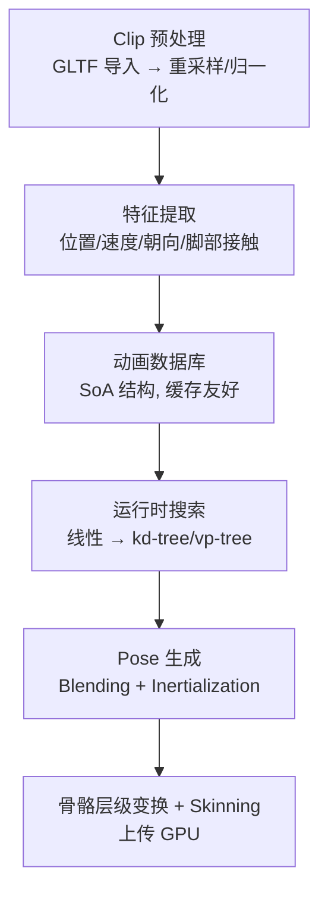

# Motion Matching 开源实现调研 — 面向 KairosEngine 动画系统

> 调研目标：为 KairosEngine（纯 Rust、wgpu 0.29 + 自研 ECS + glam 0.33）的动画系统（排期 0.3.0，与 State Machine 一起）寻找可参考的开源 motion matching 实现。筛选标准：算法完整性、工程化程度、与 Rust 技术栈的接近度、文档质量。日期：2026-09-01。

---

## 结论速览

- **首选精读**：`voxell-tech/bevy_motion_matching` —— 唯一活跃的 Rust 实现，技术栈（Bevy ECS + glam）与 KairosEngine 最接近。
- **经典算法范式**：`JLPM22/MotionMatching`（Unity，590★，文档最全）与 `nashnie/MotionMatching`（GDC2016 Clavet 的直接落地）。
- **工程化范例**：`dreaw131313/MotionMatchingByDreaw`（350★，功能最完整）与 `GuilhermeGSousa/godot-motion-matching`（Godot4/C++，230★）。
- **近常数时间变体**：`needle-mirror/com.unity.kinematica`（Unity 官方，BFC 聚类替代 kd-tree）。
- **纯 C++ 研究实现**：`Digital-Humans-23/motion-matching`（代码量小，适合抄核心算法）。
- **学习式变体**：`pau1o-hs/Learned-Motion-Matching`（PyTorch，Holden SIGGRAPH 2020 的实现）。

---

## 1. 推荐清单

### 1.1 Rust / Bevy（与 KairosEngine 技术栈最近）

#### voxell-tech/bevy_motion_matching
- **定位**：首选精读对象。唯一活跃的 Rust motion matching 实现。
- **许可证**：Apache-2.0
- **Star**：57
- **技术栈**：Bevy ECS + glam，最近提交 2025-12-28
- **参考价值**：
  - 完整落地了 motion matching 主流程：clip 预处理 → 特征提取 → 数据库构建 → 运行时搜索 → pose 输出。
  - 展示如何在 ECS 中组织动画数据库与 per-entity controller 状态。
  - 与 KairosEngine 的 hecs 风格自研 ECS + glam 0.33 结构同构，架构可直接映射。

#### bevy_animation（Bevy 官方 crate）
- **定位**：底层动画管线参考（非 motion matching 本身）。
- **参考价值**：clip 数据模型、animation graph、骨骼层级变换、skinning 上传 GPU 的完整链路，与 KairosEngine 要自建的底层动画系统一一对应。

> ⚠️ **注意**：Bevy 官方仓库 main 分支当前**没有** motion matching 示例或模块（`examples/animation/` 只有 animated_mesh、animation_graph 等；`crates/bevy_animation` 无 motion matching 模块）。历史上有过相关实现，需从 git 历史追溯。不要期待直接拿到现成代码。

### 1.2 经典算法范式（算法源头的工程落地）

#### JLPM22/MotionMatching（Unity，590★）
- **参考价值**：文档最全的实现，代码结构清晰，feature 向量定义、kd-tree 构建、搜索逻辑都是教科书式写法。适合作为**算法参考书**逐模块对照。
- **建议**：重点读 feature 提取与 distance 计算部分，翻译成 Rust。

#### nashnie/MotionMatching（Unity）
- **参考价值**：GDC2016 Simon Clavet 演讲（motion matching 概念源头）的直接落地，代码贴近论文思路，适合理解算法原始形态。

#### dreaw131313/MotionMatchingByDreaw（Unity，350★）
- **参考价值**：工程化最完整的开源实现——包含 kd-tree 加速搜索、inertialization 融合、动画数据预计算等生产级功能。适合抄"完整产品形态"。

### 1.3 引擎集成范例

#### GuilhermeGSousa/godot-motion-matching（Godot 4 / C++，230★）
- **参考价值**：展示 motion matching 如何作为游戏引擎的一等公民集成：编辑器工具链（数据可视化、调试）、运行时模块、与角色控制器/状态机的协作。KairosEngine 未来做编辑器可视化时可参考。

### 1.4 搜索加速变体

#### needle-mirror/com.unity.kinematica（Unity 官方）
- **参考价值**：用 BFC（Best-Fit Cloud）聚类结构替代 kd-tree 做近常数时间搜索，是 2D 网格聚类思路的工业级实现。适合作为"大规模数据库搜索"阶段的性能方案参考。

### 1.5 纯 C++ 研究实现

#### Digital-Humans-23/motion-matching
- **参考价值**：代码量小、依赖少、核心算法裸露（特征提取 + 搜索 + 融合），适合直接抄核心逻辑并翻译成 Rust。注意其默认数据来自 Carnegie Mellon MoCap 数据集（CMU），非生产级动画。

### 1.6 学习式变体（进阶）

#### pau1o-hs/Learned-Motion-Matching（PyTorch）
- **参考价值**：Holden et al. SIGGRAPH 2020《Learned Motion Matching》的实现。用神经网络做特征降维 + 搜索，是 motion matching 与 ML 结合的前沿方向，适合算法储备，不建议首发实现。

---

## 2. 建议论文（按阅读顺序）

| 论文 / 演讲 | 来源 | 价值 |
|---|---|---|
| **Clavet, "Motion Matching and The Road to Next-Gen Animation"** | GDC 2016 | 概念源头，必读 |
| **Holden et al., "Learned Motion Matching"** | SIGGRAPH 2020 | 学习式变体 |
| **Jonsson, "The Last of Us Part II: Animation Technology"** | GDC 2022 | 工程落地：特征选择 + inertialization + 大规模数据管理 |

---

## 3. 落地路径建议（KairosEngine）

- **搜索加速**：Rust 生态可评估 `kiddo` crate（kd-tree / vp-tree）。
- **ECS 架构建议**：动画数据库作为全局 resource；每个角色挂一个 motion matching controller 组件（当前 pose、特征、目标速度等）。
- **实施顺序**（与 0.3.0 路线图吻合）：
  1. 底层动画系统：animation clip 数据模型 → 采样 → 骨骼层级变换 → skinning 上 GPU（对应 bevy_animation 的职责）。
  2. 特征提取与数据库构建（离线/导入期）。
  3. 运行时搜索（先线性，保证正确性；再上 kd-tree/vp-tree）。
  4. pose blending + inertialization。
  5. 与 State Machine 集成（0.3.0 与动画同期排期）。

---

## 4. 已核实事实（避免重复调研）

- ❌ crates.io 上**不存在** `motion-matching` crate（精确名返回 404）。不要承诺 `cargo add motion-matching`。
- ❌ `kaosat-dev/bevy_motionmatching` 仓库**已失效**（GitHub 404，已迁移/归档）。
- ❌ Bevy 官方 main 分支**当前没有** motion matching 示例/实现，历史实现需从 git 历史追溯。
- ❌ crates.io 模糊搜索 "motion matching" 返回的是视频去噪/文本编辑等无关 crate，不可作为依据。
- ✅ `voxell-tech/bevy_motion_matching` 是**唯一活跃**的 Rust 实现（Apache-2.0，最近提交 2025-12-28）。
- ⚠️ GitHub code search API 需要认证（401）；repos 搜索 API 可用。

---

## 5. 参考资料

- [voxell-tech/bevy_motion_matching](https://github.com/voxell-tech/bevy_motion_matching)
- [JLPM22/MotionMatching](https://github.com/JLPM22/MotionMatching)
- [nashnie/MotionMatching](https://github.com/nashnie/MotionMatching)
- [dreaw131313/MotionMatchingByDreaw](https://github.com/dreaw131313/MotionMatchingByDreaw)
- [GuilhermeGSousa/godot-motion-matching](https://github.com/GuilhermeGSousa/godot-motion-matching)
- [needle-mirror/com.unity.kinematica](https://github.com/needle-mirror/com.unity.kinematica)
- [Digital-Humans-23/motion-matching](https://github.com/Digital-Humans-23/motion-matching)
- [pau1o-hs/Learned-Motion-Matching](https://github.com/pau1o-hs/Learned-Motion-Matching)
