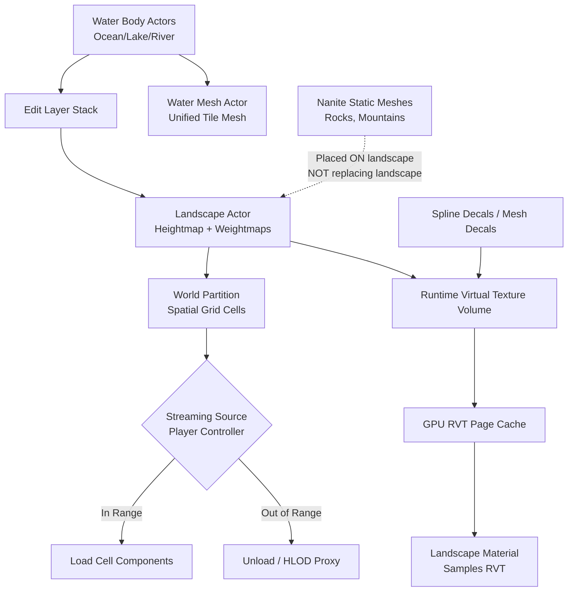

# UE5 Terrain/Landscape System Research for Large Open Worlds

> **Research date:** 2026-07-28
> **Sources:** Epic Games official documentation (UE 5.0–5.4), UE 5.4 release notes, UE source API reference, GDC/Unreal Fest talk abstracts by Epic engineers

## Executive Summary

UE5's landscape system is a **heightmap-based terrain system** built around a component/section architecture with mip-based LOD. It integrates deeply with **World Partition** (spatial streaming), **Runtime Virtual Textures** (texture blending beyond traditional weightmap limits), and the **Water plugin** (automatic terrain carving). However, it has notable gaps: **Nanite does not apply to Landscape**, and native **cave/underground support is absent**—the system remains fundamentally 2.5D heightfield.

---

## 1. Texture Blending: Beyond 4–8 Terrain Textures

### 1.1 Traditional Landscape Layer Blending (Weightmaps)

UE5's traditional approach stores **up to 8 weightmap layers** per landscape component (one weight per texture layer per vertex). This is the established "paint layers" workflow:

- **Source:** `Landscape Technical Guide` — "Layer Debug Mode" section describes visualizing individual layer weights on the Landscape.
- Each layer weight is stored as an 8-bit-per-channel texture splatted across components.
- **Limitation:** Bound by GPU texture sampler limits and weightmap memory; practical ceiling is ~4–8 distinct terrain surface types in a single material.

### 1.2 Runtime Virtual Texturing (RVT) — The Primary Scaling Solution

**RVT is the recommended approach for bypassing the 4–8 layer limit.** It decouples terrain surface shading from the material's texture sampler count:

- **Source:** `Runtime Virtual Texturing` documentation — explicitly states: *"RVT supplies an efficient way to render complex, procedurally generated, or layered materials. This makes RVT ideal for rendering complex materials for Landscapes."*
- **How it works:**
  1. A **Runtime Virtual Texture Asset** is created with a chosen material type (Base Color, Normal, Roughness, Specular, or YCoCg variants with Mask channels).
  2. A **Runtime Virtual Texture Volume** is placed over the landscape.
  3. Scene components (landscape, static meshes acting as decals, splines) **write** into the RVT via `Runtime Virtual Texture Output` material nodes.
  4. The final landscape material **samples** from the RVT via `Runtime Virtual Texture Sample` nodes.
  5. The GPU caches texel data on-demand in a **virtual texture page table**, only shading visible pages.

- **Material Types Available for RVT:**
  - `Base Color` (BC1 compressed)
  - `Base Color, Normal, Roughness, Specular` (BC3 + BC3)
  - `YCoCg Base Color, Normal, Specular` (BC3 + BC5 + BC1) — higher quality for smooth gradients
  - `YCoCg Base Color, Normal, Specular, Mask` — adds 8-bit mask channel
  - `World Height`, `Displacement`, `Mask4`

- **Blending mechanism:** Multiple primitives can write to the same RVT. Blending order is controlled by `Translucency Sort Priority` on each component. World-space normals are recommended for correct blending across primitives.

- **Streaming Virtual Texture (SVT) hybrid:** For large worlds, low-resolution RVT mips can be **baked offline** and streamed from disk (SVT), while high-res mips are generated at runtime (RVT). This avoids needing all world actors loaded just to render distant RVT pages. Set via `Streaming Levels` in the RVT Volume.

- **Source:** `Runtime Virtual Texturing` > "Streaming Virtual Texture Build" section.

### 1.3 Material Layer Blending System

UE5 provides a **Material Layer Blending** system that allows landscape materials to be organized into composable layers:

- **Source:** Implied by `Landscape Edit Layers` documentation — edit layers can have independent heightmap and weightmap alpha blending.
- Each edit layer can contribute to the final landscape material through its own set of texture layers.
- Material functions can be used to create reusable terrain material layers with procedural blending.

### 1.4 Key Technique: Decal-like Mesh Writing to RVT

Instead of baking many texture layers into the landscape material directly:

- Place static mesh planes with decal-like materials above the landscape.
- Set them to render **only to RVT** (Draw in Main Pass: `Never` or `From Virtual Texture`).
- These "mesh decals" write terrain detail into the RVT, appearing on the landscape without the landscape material needing those textures.
- **Source:** `Runtime Virtual Texturing` > "Virtual Texture Pass Type" options: `Never`, `From Virtual Texture`, `Always`.

### 1.5 What UE5 Does NOT Use for Terrain Texture Blending

| Technique | Used by UE5? | Notes |
|-----------|-------------|-------|
| Texture Arrays | No (not as primary landscape mechanism) | Available in materials generally but not the landscape blending pipeline |
| Runtime Texture Atlas | No | RVT replaces the need |
| Virtual Texturing | **Yes** | RVT + SVT are the core techniques |

---

## 2. LOD/Mesh Density for Distant Mountains

### 2.1 Landscape LOD System (Traditional, Mip-Based)

UE5 landscapes use a **hierarchical mip-based LOD system** built on component sections:

- **Source:** `Landscape Technical Guide` — "Component Sections" section.
- **Section Size** is the base LOD unit. Each component can have 1 or 4 (2×2) subsections.
- A single component can render **4 different LODs simultaneously** (one per subsection, each at different mip levels).
- LOD transitions are per-section, driven by camera distance.
- Height data is stored in **power-of-two textures** so mip levels directly correspond to LOD levels.

**Recommended configurations:**

| Overall Size (vertices) | Quads/Section | Sections/Component | Component Size | Total Components |
|------------------------|---------------|-------------------|----------------|-----------------|
| 8129 × 8129 | 127 | 4 (2×2) | 254×254 | 1024 (32×32) |
| 4033 × 4033 | 63 | 4 (2×2) | 126×126 | 1024 (32×32) |
| 2017 × 2017 | 63 | 4 (2×2) | 126×126 | 256 (16×16) |

- **Performance rule:** Epic recommends a **maximum of 1024 total components**. Each component has CPU render-thread cost; each section is a draw call.

### 2.2 Nanite and Landscape — They Do NOT Overlap

**Nanite does NOT support Landscape terrains.** This is a critical limitation:

- **Source:** `Nanite Virtualized Geometry` documentation — Nanite supports `Static Meshes`, `Instanced Static Meshes`, `Hierarchical Instanced Static Meshes`, and `Geometry Collections` only. Landscape is explicitly excluded.
- **Source:** `Nanite` > "Supported Features" > "Geometry" — *"Nanite is currently limited to rigid meshes… does not support general mesh deformation, whether it is dynamic or static."* Landscape, being a heightfield with runtime LOD, is incompatible.
- **UE 5.4 improvement:** *"support for spline mesh workflows—great for creating roads on landscapes"* (Nanite spline meshes can now be used on landscapes for roads/paths). This is a separate workflow — the Nanite mesh sits ON the landscape, it does not replace the landscape mesh.

**Implication:** For distant mountains, you either:
1. Use **traditional landscape LOD** (sections/components with mip levels).
2. Place **Nanite static meshes** (rock formations, mountain meshes) ON TOP of the landscape as decoration — these benefit from Nanite's pixel-scale detail.

### 2.3 World Partition and Terrain Streaming

World Partition is the spatial streaming system that works hand-in-hand with landscape:

- **Source:** `World Partition` documentation.
- The world is divided into a **grid of cells** (configurable cell size, e.g., 256m² in City Sample).
- Landscape components are assigned to grid cells automatically based on spatial location.
- **Streaming Sources** (typically Player Controllers) determine which cells are loaded within a configurable `Loading Range`.
- **One File Per Actor (OFPA):** Landscape components (and all other actors) are saved to individual files, enabling collaborative editing without file conflicts.

**World Partition + Landscape specifics:**
- The `wp.Runtime.ToggleDrawRuntimeHash2D` / `3D` console commands visualize grid cell loading at runtime.
- **HLODs (Hierarchical Levels of Detail):** World Partition can generate HLOD actors for distant cells. These are simplified proxy meshes that replace full detail at far distances. Generated via `WorldPartitionHLODsBuilder` commandlet.
- **Source:** `World Partition` > "Generating Hierarchical Levels of Detail (HLODs)" — HLODs are generated per World Partition cell.

### 2.4 Landscape LOD with RVT Interaction

When landscape writes to RVT, you can control how many LOD levels are used for RVT rendering:

- `Virtual Texture Num LODs` — number of LODs landscape components render into the RVT. 0 = single quad per component (optimal for GPU).
- `Virtual Texture LOD Bias` — bias applied to the auto-selected LOD.
- **Source:** `Runtime Virtual Texturing` > "Setting LOD and Mips" section.

### 2.5 Console Variables for Debugging

| Command | Purpose |
|---------|---------|
| `wp.Runtime.ToggleDrawRuntimeHash2D` | Visualize 2D streaming grid |
| `wp.Runtime.ToggleDrawRuntimeHash3D` | Visualize 3D streaming grid |
| `wp.Runtime.OverrideRuntimeSpatialHashLoadingRange` | Override loading range at runtime |
| `wp.Runtime.HLOD 0` | Show world without HLODs |

---

## 3. Ocean Integration

### 3.1 Water Plugin Architecture

The Water system is a **self-contained plugin** (`/Engine/Plugins/Experimental/Water/`) that unifies water rendering for oceans, lakes, and rivers:

- **Source:** `Water System` overview.
- **Water Mesh Actor:** All water bodies within a Water Zone are rendered as a **single unified tile mesh**, enabling seamless transitions between water body types (ocean→river, river→lake).
- **Single Layer Water shading model:** A dedicated material shading model for physically-based water surfaces.
- **Gerstner waves:** Default wave generation algorithm; also supports custom `Water Wave Assets`.

### 3.2 Water Body Types

| Type | Spline | Terrain Interaction | Notes |
|------|--------|-------------------|-------|
| **Ocean** | Closed loop, uniform height | Carves terrain below | Has Far Distance Mesh for horizon fill |
| **Lake** | Closed loop, uniform height | Carves terrain below | Similar to ocean, smaller scale |
| **River** | Open spline, variable height | Carves terrain along path | Flow-driven surface motion (flow map, not waves) |
| **Custom** | Static mesh defines shape | Manual | Pools, custom water volumes |
| **Island** | Closed loop | RAISES terrain above water | Applied AFTER all other water bodies |
| **Exclusion Volume** | N/A (brush volume) | Creates dry zones underwater | For underwater bases/caves |

### 3.3 Landscape-Terrain Integration (Automatic Carving)

Water bodies **automatically modify the landscape heightmap** via the Edit Layer system:

- **Source:** `Water Body Actors` > "Terrain" section.
- `Affects Landscape` must be enabled.
- Landscape must have **Edit Layers** enabled.
- Water carving uses **Blend Modes**:
  - `Alpha Blend` — raise AND lower terrain to match water height
  - `Min` — only lower terrain (for rivers intersecting lakes)
  - `Max` — only raise terrain
  - `Additive` — preserve underlying detail
- **Falloff modes:** `Angle` (slope-based) or `Width` (fixed distance).
- **Effects pipeline:** Blurring, Curl Noise (procedural distortion), Displacement, Smooth Blending, Terracing.
- **Weightmap painting:** Water bodies can also paint landscape weightmap layers (e.g., sand around shorelines) via `Layer Weightmap Settings`.

### 3.4 Ocean Horizon Handling

- **Far Distance Mesh:** Extends ocean beyond the spline-defined water body to fill gaps between water edge and horizon.
- Defined in the **Water Zone Actor** (`Rendering > FarDistance > Far Distance Mesh Extent`).
- Uses a simplified mesh (`Water_FarMesh` material) that matches ocean material color.
- **Source:** `Water Body Actors` > "Ocean Water Body" section.

### 3.5 Underwater Post-Processing

- Each water body has its own `Underwater Post Process Settings` with subset of standard post-process effects.
- Automatically applied when camera moves below water surface.
- **Priority** system for overlapping water bodies.
- **Blend Radius** for smooth transitions.
- **Source:** `Water Body Actors` > "Underwater Post Process Settings."

### 3.6 GPU Wave Data

- Each water body gets a `Water Body Index` into a GPU buffer storing wave parameters.
- The default `Water_Material` reads from this index via the scalar parameter `WaterBodyIndex`.
- Wave attenuation is depth-aware (`Wave Attenuation Water Depth`).

---

## 4. Caves and Underground Terrain

### 4.1 UE5 Landscape is Fundamentally a 2.5D Heightfield

UE5's Landscape system is a **heightfield** — every XY coordinate maps to exactly one Z value. There is no native support for overhangs, caves, tunnels, or multi-layered terrain:

- **Source:** `Landscape Technical Guide` — the entire architecture describes a single heightmap texture per component. The formula `(A*Quads+1, B*Quads+1)` produces a 2D grid of vertices. There is no third spatial dimension in the data structure.
- The Z range is -256 to 255.992 (16-bit), scaled by a Z scale factor.

### 4.2 Visibility Layer (Landscape Holes)

UE5 supports **landscape holes** via the Visibility layer:

- Part of the Edit Layer system.
- Paint visibility holes using the Sculpt mode's **Visibility** tool.
- These create "holes" in the landscape where the terrain is not rendered — but they are **flat cutouts**, not 3D cave interiors.
- **Source:** `Landscape Edit Layers` > "Clear Visibility Layer" context menu option removes all landscape holes.

### 4.3 Water Body Exclusion Volumes (Dry Zones Underwater)

For underwater caves or bases:

- **Water Body Exclusion Volumes** create cavities in water bodies where gameplay treats the area as dry.
- Defined as brush volumes that can be shaped.
- `Exclude All Overlapping Water Bodies` or specify individual water bodies.
- **Source:** `Water Body Actors` > "Water Body Exclusion Volume."

### 4.4 Common Cave Approaches in UE5 (Community Practice)

While not officially documented as a single Epic-recommended workflow, the following approaches are commonly used by UE5 developers based on engine capabilities:

#### Approach A: Static Mesh Caves
- Model caves as **Static Mesh Actors** (with Nanite enabled for high detail).
- Place them intersecting the landscape.
- Use the **Visibility tool** to punch holes in the landscape at cave entrances.
- For seamless blending, use **Runtime Virtual Textures** — the cave entrance mesh writes blend data into the RVT so the landscape material transitions naturally.

#### Approach B: Landscape Edit Layers + Blueprint Brushes
- The **Landmass plugin** (`/Engine/Plugins/Experimental/Landmass/`) provides Blueprint Brushes that can procedurally modify the landscape.
- `CustomBrush_Landmass` creates landmass shapes from splines with effects like erosion, curl noise, and displacement.
- While not designed for caves, these brushes can create depressions, craters, and valley-like features.
- **Source:** `Landscape Blueprint Brushes` + `Landmass` API reference.

#### Approach C: Third-Party Voxel Plugins
- The most popular community solution is the **Voxel Plugin** (third-party, available on Fab/Marketplace).
- Provides true volumetric terrain with caves, overhangs, and tunnels.
- Not built into the engine — separate from UE5's landscape system.

### 4.5 What UE5 Does NOT Have Natively

| Capability | Supported? | Notes |
|-----------|-----------|-------|
| Multi-layered heightmaps | No | Single heightfield only |
| Voxel terrain | No | Third-party plugins required |
| Native cave editing tools | No | No dedicated cave sculpting |
| Underground rendering pass | No | No built-in underground rendering mode (underwater post-process only) |
| Landscape overhangs | No | Heightfield limitation |

---

## Key Architectural Takeaways

### Data Flow: Landscape + World Partition + RVT + Water

### System Boundaries

| System | Applies to Landscape? | Purpose |
|--------|----------------------|---------|
| Nanite | ❌ No | Virtualized geometry for static meshes only |
| World Partition | ✅ Yes | Spatial streaming of landscape components |
| RVT | ✅ Yes | Texture blending beyond weightmap limits |
| HLOD | ✅ Yes | Distant landscape simplification |
| Water Plugin | ✅ Yes (via Edit Layers) | Automatic terrain carving for water bodies |
| Landmass Plugin | ✅ Yes (via Blueprint Brushes) | Procedural terrain sculpting |
| Voxel (third-party) | N/A | Community solution for 3D terrain |

---

## References

### Official Epic Documentation (Primary Sources)

1. **Landscape Technical Guide** — `https://docs.unrealengine.com/5.0/en-US/landscape-technical-guide-in-unreal-engine/`
   - Component architecture, heightmap dimensions, LOD calculation, recommended sizes.

2. **Runtime Virtual Texturing** — `https://dev.epicgames.com/documentation/en-us/unreal-engine/runtime-virtual-texturing-in-unreal-engine`
   - RVT workflow, material types, SVT hybrid, LOD/mip controls.

3. **Virtual Texturing Overview** — `https://docs.unrealengine.com/5.0/en-US/virtual-texturing-in-unreal-engine/`
   - RVT vs SVT distinction, virtual texture lightmaps.

4. **World Partition** — `https://docs.unrealengine.com/5.0/en-US/world-partition-in-unreal-engine/`
   - Grid streaming, One File Per Actor, HLOD generation, commandlets.

5. **Water System** — `https://dev.epicgames.com/documentation/en-us/unreal-engine/water-system-in-unreal-engine`
   - Plugin architecture, water body types, terrain integration.

6. **Water Body Actors** — `https://dev.epicgames.com/documentation/en-us/unreal-engine/water-body-actors-in-unreal-engine`
   - Ocean/Lake/River body types, terrain carving settings, post-processing.

7. **Nanite Virtualized Geometry** — `https://docs.unrealengine.com/5.0/en-US/nanite-virtualized-geometry-in-unreal-engine/`
   - Nanite capabilities, limitations, supported mesh types (landscape excluded).

8. **Landscape Edit Layers** — `https://dev.epicgames.com/documentation/en-us/unreal-engine/landscape-edit-layers-in-unreal-engine`
   - Non-destructive layer stack, visibility layer, collapse, alpha blending.

9. **Landscape Blueprint Brushes** — `https://dev.epicgames.com/documentation/en-us/unreal-engine/landscape-blueprint-brushes-in-unreal-engine`
   - Landmass plugin, procedural sculpting brushes.

10. **Landscape Splines** — `https://dev.epicgames.com/documentation/en-us/unreal-engine/landscape-splines-in-unreal-engine`
    - Spline-based terrain deformation for roads/paths.

11. **Creating Landscapes** — `https://dev.epicgames.com/documentation/en-us/unreal-engine/creating-landscapes-in-unreal-engine`
    - Landscape creation workflow, section size recommendations.

12. **Landmass Plugin API** — `https://dev.epicgames.com/documentation/en-us/unreal-engine/API/Plugins/Landmass`
    - Brush effects structs (Blurring, CurlNoise, Displacement, SmoothBlending, Terracing).

### Epic Release Notes

13. **UE 5.4 Release Notes** — `https://www.unrealengine.com/en-US/blog/unreal-engine-5-4-is-now-available`
    - Nanite Tessellation, Nanite spline mesh support (roads on landscapes), TSR improvements.

### Unreal Fest / GDC Talks (Reference, Content Behind Login)

14. **Unreal Fest 2024:** "Building Open Worlds with Landscape, Mass, Water, and World Partition" — `https://dev.epicgames.com/community/learning/talks-and-demos/Re5L`
15. **Unreal Fest 2023:** "Building Large Worlds with Landscape, Water, and World Partition" — `https://dev.epicgames.com/community/learning/talks-and-demos/1d19`

### Source Code Location Hints

- Landscape: `/Engine/Source/Runtime/Landscape/`
- Water Plugin: `/Engine/Plugins/Experimental/Water/`
- Landmass Plugin: `/Engine/Plugins/Experimental/Landmass/`
- World Partition: `/Engine/Source/Runtime/Engine/Private/WorldPartition/`
- Nanite: `/Engine/Source/Runtime/Renderer/Private/Nanite/`
- RVT: `/Engine/Source/Runtime/Renderer/Private/VT/`
