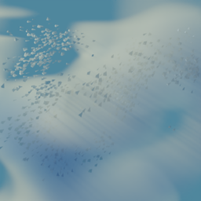

#  KairosEngine

<div align="center">

**A pure Rust game engine built from first principles — Data‑Oriented Design, ECS architecture, high performance, high flexibility, and high extensibility.**

<br>

[](https://www.rust-lang.org)
[](https://github.com/WhitePetal/KairosEngine)
[](https://wgpu.rs)
[](https://github.com/WhitePetal/KairosEngine)
[](https://github.com/WhitePetal/KairosEngine/discussions)
[](https://space.bilibili.com/232017781)

[🌐 中文文档](README-zh.md)

</div>

---

## 📋 Overview

Re-examining the game industry from a fresh perspective — **KairosEngine** is a pure Rust game engine built from scratch, pursuing **Data-Oriented Design**, **Entity Component System (ECS)**, **high performance**, **high flexibility**, and **high extensibility**.

If you have any ideas or questions, feel free to start a [Discussion](https://github.com/WhitePetal/KairosEngine/discussions) or send me a private message on [Bilibili](https://space.bilibili.com/232017781).

### Why Rust? Why start from scratch?

KairosEngine avoids runtime scripting languages entirely — your game is a Rust program compiled to native code. Every subsystem (ECS, renderer, physics, audio, editor) is hand-crafted to fit a consistent data-oriented architecture, giving you full control over memory layout, scheduling, and extensibility.

### Quick Start

```bash
cargo run                    # Launch the editor (dev profile)
cargo run --release          # Optimized build
cargo run --profile bench    # Benchmark-grade performance
```

> The dev profile optimizes your own code at `opt-level=1` (debuggable) and dependencies at `opt-level=3` for a fast inner loop.

---

## 🗺️ Version Roadmap

### 0.1.0
| Feature | Status |
|---------|--------|
| Engine GUI (editor interface) | ✅ |
| Base Graphics | ✅ |
| Base Input System | ✅ |
| Base ECS (inspired by ENTT / Flecs) | ✅ |
| Base Physics System | ✅ |
| Base Audio System | ✅ |
| Kairos Editor MCP | 🚧 |
| Kairos Editor Claw | 🚧 |
| Demo: Football Game | 📝 |

### 0.2.0
| Feature | Status |
|---------|--------|
| Project / Asset System | 🚧 |
| Terrain System | 📝 |
| Graphics Graph | 🚧 |
| Input Graph System | 📝 |
| World Scenes System | 📝 |
| Demo: Car Race Game | 📝 |

### 0.3.0
| Feature | Status |
|---------|--------|
| State Machine | 📝 |
| Animation System | 📝 |
| GI (Global Illumination) System | 📝 |
| Cinemachine System | 📝 |
| AI Agent | 📝 |
| Demo: Action Game | 📝 |

### 1.0.0
- ... (to be announced)
- Demo: ... (to be announced)

---

## 🧱 Architecture

KairosEngine is organized as a Rust workspace with four primary crates:

| Crate | Description |
|-------|-------------|
| **`kairos_engine`** | Core engine + built-in editor. The binary target. |
| **`kairos_ecs_macros`** | Procedural macros powering the ECS system. |
| **`kairos_supervisor`** | Thin watchdog process for test-harness crash monitoring. |
| **`kairos_tasks`** | Async task pool & parallel iteration primitives (foundation crate). |

### Engine Layout

```
kairos_engine/src/
├── main.rs                 # Entry point — initializes event loop & editor runtime
├── lib.rs                  # Public module tree
├── ecs/                    # Custom Entity Component System
│   ├── world.rs            # World — central ECS container
│   ├── entity.rs           # Entity handles
│   ├── component.rs        # Component trait & storage
│   ├── table.rs            # Archetype tables
│   ├── table_graph.rs      # Table transition graph
│   ├── sparse_set.rs       # Sparse set storage
│   ├── batch.rs            # Batch entity operations
│   ├── borrow.rs           # Borrow checking for ECS queries
│   └── ...
├── graphics/               # GPU rendering pipeline
│   ├── render_pipeline.rs  # wgpu render pipeline management
│   ├── shader.rs           # Shader loading & compilation
│   ├── texture.rs          # Texture encoding/decoding (SDR & HDR)
│   ├── mesh.rs             # Mesh data & GLTF import
│   ├── material.rs         # Material system
│   ├── camera.rs           # Camera/viewport management
│   ├── vertex.rs           # Vertex layout definitions
│   ├── render_state.rs     # Render state management
│   └── graphics_graph.rs   # Frame graph for render passes
├── physics/                # Physics (rapier3d)
│   ├── rigid_body.rs       # Rigid body components
│   └── collider.rs         # Collider components
├── audio/                  # Audio engine (kira + symphonia)
│   ├── audio.rs            # Audio state & playback
│   ├── background.rs       # Background music
│   └── spatial.rs          # 3D spatial audio
├── asset_loader/           # Async asset loading with dependency graph
│   ├── assets.rs           # AssetsServer & AssetsSystem trait
│   └── asset.rs            # AssetHandle & typed systems
├── kairos_editor/          # Built-in editor application
│   ├── runtime.rs          # Editor event loop & windowing
│   ├── ui/                 # egui-based editor UI
│   │   ├── inspector/      # Per-type inspectors (material, texture, mesh, shader, audio, ...)
│   │   ├── scene_window.rs # 3D scene viewport
│   │   ├── game_window.rs  # Game viewport
│   │   ├── hierarchy_window.rs
│   │   ├── project_window.rs
│   │   └── ...
│   └── asset_registry.rs   # Asset type registry
├── kairos_game.rs          # Game logic stub (what the player builds with)
├── kairos_paths.rs         # Project path management
├── kairos_settings.rs      # Editor/project settings
├── inputs.rs               # Input engine (keyboard/mouse mapping)
├── math.rs                 # Math library (vec, matrix, quaternion, color, trigonometric)
├── spatial.rs              # Spatial system (Transform, AABB, right-handed Y-up)
├── timer.rs                # Frame timing & time scale
├── types.rs                # TypeIdMap — optimized TypeId-keyed hash maps
└── log.rs                  # In-editor logging
```

---

## ✨ Key Features

### ⚙️ ECS (hecs-style, custom-built)

Designed after **hecs**, with archetype tables, sparse sets, columnar storage, and entity generation IDs. Beyond that, it adds a table transition graph (for tracking archetype changes), batched entity operations, and an explicit borrowing system for safe concurrent queries.

### 🎨 GPU Rendering

- **wgpu 0.29** — modern Vulkan / Metal / DX12 backend
- Full render pipeline management (shaders, bind groups, attachments)
- **Texture system** with SDR (8-bit) and HDR (f16/f32) encode/decode, sRGB handling, GPU compression support
- Frame graph abstraction for organizing render passes
- Camera, mesh, material, and vertex buffer management
- GLTF model import

### 🖥️ Built-in Editor

- Full egui-based editor with **dockable windows**
- **Inspector system** — type-specific editors for materials, textures, meshes, shaders, audio, code, TOML configs, and more
- **Scene viewport** (3D camera control)
- **Game viewport** (runtime preview)
- **Hierarchy panel** — entity tree browsing
- **Project file browser** with path tree
- **Console / log panel** — in-editor log output
- **Preferences & settings** — editor theme, fonts, project config
- Syntax highlighting for shaders and code assets

### 🏗️ Physics

Rigid body dynamics, colliders, joints, and CCD (continuous collision detection) via **rapier3d**, with parallel simulation support.

### 🔊 Audio

Spatial 3D audio via **kira** with **symphonia** decoding (MP3, WAV, FLAC, Ogg, MP4), background music tracks, reverb support.

### 📦 Asset System

- **Async loading** with tokio — dependency-graph-aware asset loading
- Typed asset systems: meshes, materials, textures, shaders, audio, syntax files, TOML configs
- Serialized binary asset format for fast loading
- Hot-reload ready (handle system)

### 🔬 Testing

Two-tier testing strategy:
- **Rust integration tests** — logic/data validation without GPU or engine loop
- **TOML-based runtime tests** — GPU, egui, physics, ECS scheduling, and input pathway validation via the `kairos_supervisor` watchdog

---

## 🧪 Testing

```bash
# Integration tests (logic & data, no GPU needed)
cargo test

# Runtime tests (GPU, physics, egui, etc.)
cargo run --features test-harness          # Launch test harness
```

See the [Kairos Test Harness skill](.agents/skills/kairos-test/SKILL.md) for details.

---

## 📐 Design Principles

- **Data-Oriented Design** — ECS-first architecture; components are plain data, cache-friendly memory layout
- **No scripting VM** — games are Rust programs using the engine as a library
- **GPU-first** — texture encoding, compression, and rendering are native GPU operations
- **Modular** — every subsystem owns its types; the editor is a consumer, not the core
- **Testable** — two-tier testing separates pure logic from runtime GPU interactions
- **Extensible** — easy to swap subsystems, add new component types, and extend the editor

Architecture decisions are documented as **ADRs** in [`docs/adr/`](docs/adr/).

---

## 🛠️ Dependencies

### Core Crates

| Domain | Library |
|--------|---------|
| Graphics | [wgpu](https://wgpu.rs) 0.29 |
| Editor UI | [egui](https://egui.rs) 0.35, egui-wgpu, egui-winit |
| Physics | [rapier3d](https://rapier.rs) 0.33 |
| Audio | [kira](https://github.com/tesselode/kira) 0.12, [symphonia](https://github.com/pdeljanov/Symphonia) 0.5 |
| Asset loading | [image](https://github.com/image-rs/image) (PNG), [gltf](https://github.com/gltf-rs/gltf) 1.4 |
| Math | [glam](https://github.com/bitshifter/glam-rs) 0.33, [mint](https://github.com/kvark/mint) |
| Async | [tokio](https://tokio.rs) (full), [crossbeam-channel](https://docs.rs/crossbeam-channel) |
| Serialization | [rkyv](https://github.com/rkyv/rkyv) (zero-copy), [serde](https://serde.rs), [sonic-rs](https://github.com/cloudflare/sonic-rs) |
| Windowing | [winit](https://github.com/rust-windowing/winit) 0.30 |

> Full dependency list in [`Cargo.toml`](KairosEngine/Cargo.toml).

### Thanks / Indirect Dependencies

See [Thanks.md](Thanks.md) for acknowledgments of the open-source projects that make KairosEngine possible.

---

## 📁 Resource Directory

```
res/
├── models/        # GLTF & serialized mesh assets
├── textures/      # Texture assets
├── materials/     # Material definitions
├── shaders/       # Shader sources
└── audios/        # Audio files
```

---

## 🤝 Get Involved

<p align="center">
  <a href="https://github.com/WhitePetal/KairosEngine/discussions">
    
  </a>
  <a href="https://space.bilibili.com/232017781">
    
  </a>
</p>

### Contributing

The project uses:
- [GitHub Issues](https://github.com/WhitePetal/KairosEngine/issues) for issue tracking
- Five canonical triage labels: `needs-triage`, `needs-info`, `ready-for-agent`, `ready-for-human`, `wontfix`
- Architecture Decision Records in [`docs/adr/`](docs/adr/)
- AI agents follow instructions in [`AGENTS.md`](AGENTS.md)

### AI Tools Used

KairosEngine development is assisted by:
- **DeepSeek**
- **Cursor**
- **GPT**
- **Kimi**
- **即梦**

---

## 📄 License

Licensed under either of [MIT](LICENSE-MIT) or [Apache-2.0](LICENSE-APACHE) at your option.

---

<div align="center">
  <sub>Built with 🦀 in Rust</sub>
  <br>
  
</div>
